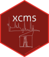
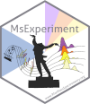
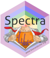
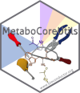

# Exploring and analyzing LC-MS data with *Spectra* and *xcms*

[](https://creativecommons.org/licenses/by-nc/4.0/)

[](https://hub.docker.com/repository/docker/jorainer/xcms_tutorials)
[](https://zenodo.org/doi/10.5281/zenodo.11185520)







This workshop provides an overview of recent developments in Bioconductor to
work with mass spectrometry data
([MsExperiment](https://github.com/RforMassSpectrometry/MsExperiment),
[Spectra](https://github.com/RforMassSpectrometry/Spectra)) and specifically
LC-MS data ([xcms](https://github.com/sneumann/xcms)) and walks through the
preprocessing of a small data set emphasizing on selection of data-dependent
settings for the individual preprocessing steps.

Covered topics are:

- Data import and representation.

- Accessing, subsetting and visualizing data.

- Centroiding of profile mode MS data.

- Chromatographic peak detection.

- Empirically determine appropriate settings for the analyzed data set.

- Evaluation of identified peaks.

- Alignment (retention time correction).

- Correspondence (grouping of chromatographic peaks across samples).

The full R code of all examples along with comprehensive descriptions is
provided in the [xcms-preprocessing.Rmd](./vignettes/xcms-preprocessing.Rmd)
file. This file can be opened with e.g. RStudio which allows execution of the
individual R commands (see section below for additionally required R
packages). The R command `rmarkdown::render("xcms-preprocessing.Rmd")` would
generate the html file
[xcms-preprocessing.html](https://jorainer.github.io/xcmsTutorials/xcms-preprocessing.html).


## Citation

This workflow (and future versions) are deposited at
[Zenodo](https://zenodo.org). To cite this version of the tutorial:

Johannes Rainer and Philippine Louil. xcmsTutorials version 1.1.0: Exploring and
analyzing LC-MS data with Spectra and xcms. Zenodo, May
13, 2024. https://doi.org/10.5281/zenodo.11185521.


## Installation

The workshop files along with an R runtime environment including all required
packages and the RStudio (Posit) editor are all bundled in a *docker*
container. After installation, this docker container can be run on the computer
and the code and examples from the workshop can be evaluated within this
environment (without the need to install any additional packages or files).

This version of the workshop uses packages from **Bioconductor release 3.19**
(May 2024) and hence bases on Bioconductor's docker container for that release
(*RELEASE_3_19*). The required steps for installation are:

- If you don't already have, install [docker](https://www.docker.com/). Find
  installation information [here](https://docs.docker.com/desktop/).
- Get the [docker image](https://hub.docker.com/r/jorainer/xcms_tutorials) of
  this tutorial e.g. from the command line with `docker pull
  jorainer/xcms_tutorials:RELEASE_3_19`.
- Start the docker container, either through the Docker Desktop, or on the
  command line with
```
  docker run \
      -e PASSWORD=bioc \
      -p 8787:8787 \
      jorainer/xcms_tutorials:RELEASE_3_19
```

- Enter `http://localhost:8787` in a web browser and log in with username
  `rstudio` and password `bioc`.
- In the RStudio server version: open any of the R-markdown (*.Rmd*) files in
  the *vignettes* folder and evaluate the R code blocks in that document.


For manual installation, an R version >= 4.4.0 is required as well as recent
versions of the packages `MsExperiment`, `Spectra` and in particular the
`xcms`. These can be installed using the code below:

```r
install.packages("BiocManager")
BiocManager::install("jorainer/xcmsTutorials",
    dependencies = TRUE, ask = FALSE, update = TRUE)
```

## Contribution

For contributions, see the [RforMassSpectrometry contributions
guideline](https://rformassspectrometry.github.io/RforMassSpectrometry/articles/RforMassSpectrometry.html#contributions).


## Code of Conduct

See the [RforMassSpectrometry Code of
Conduct](https://rformassspectrometry.github.io/RforMassSpectrometry/articles/RforMassSpectrometry.html#code-of-conduct).


## Additional documentation resources and tutorials

- Tutorial with additional examples and explanations for MS2-based
  annotations: https://jorainer.github.io/SpectraTutorials/
- Repository of the `MsCoreUtils` package:
  https://rformassspectrometry.github.io/MsCoreUtils/
- Repository of the `MetaboCoreUtils` package:
  https://rformassspectrometry.github.io/MetaboCoreUtils/
- Repository of the `Spectra` package:
  https://rformassspectrometry.github.io/Spectra/
- Repository of the `MetaboAnnotation` package:
  https://rformassspectrometry.github.io/MetaboAnnotation/
- Repository of the `CompoundDb` package:
  https://rformassspectrometry.github.io/CompoundDb/

# Acknowledgments

Thank you to [Philippine Louail](https://github.com/philouail) for fixing typos
and suggesting improvements.
