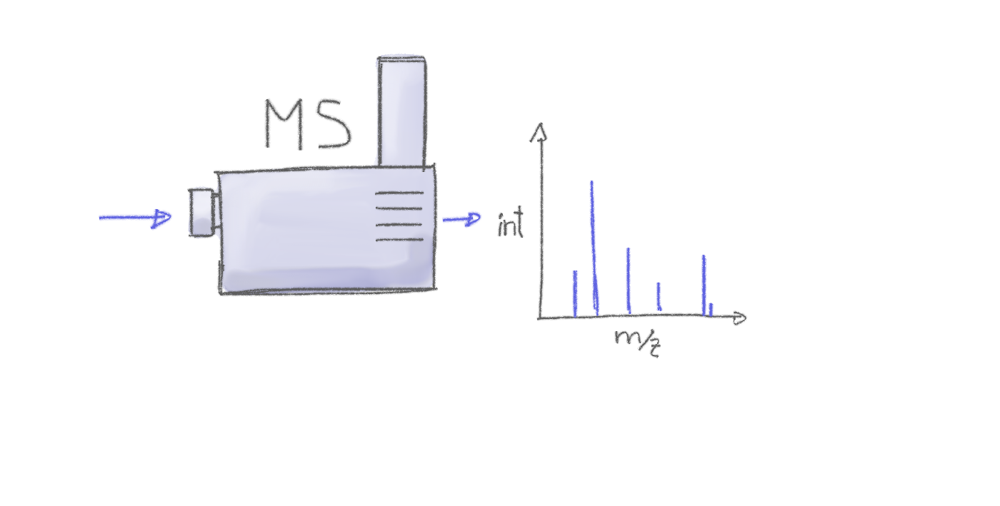
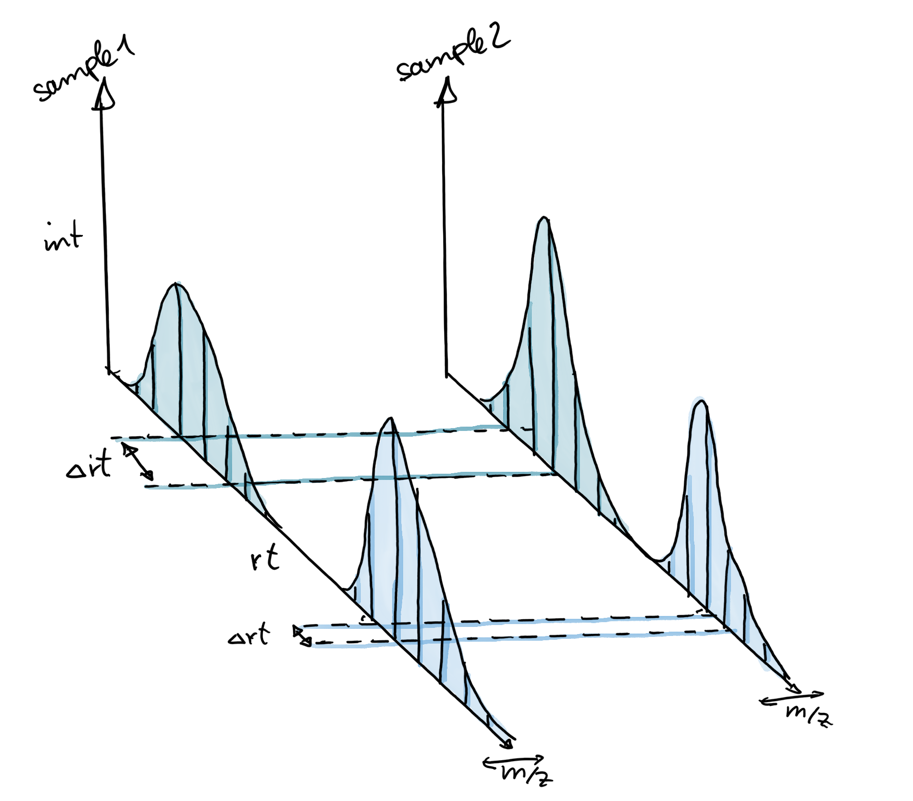

# Exploring and Analyzing LC-MS Data with Spectra and xcms

## Abstract

In this document we discuss liquid chromatography (LC) mass spectrometry
(MS) data handling and exploration using the
*[MsExperiment](https://bioconductor.org/packages/3.22/MsExperiment)*
and `r Biocpkg("Spectra")` Bioconductor packages and perform the
preprocessing of a small LC-MS data set using the
*[xcms](https://bioconductor.org/packages/3.22/xcms)* package (Louail et
al. 2025). Functionality from the
*[MetaboCoreUtils](https://bioconductor.org/packages/3.22/MetaboCoreUtils)*
and *[MsCoreUtils](https://bioconductor.org/packages/3.22/MsCoreUtils)*
packages are used for general tasks frequently performed during
metabolomics data analysis. Ultimately, the functionality from these
packages can be combined to build custom, data set-specific (and
reproducible) analysis workflows.

In the present workshop, we first focus on data import, access and
visualization which is followed by the description of a simple data
centroiding approach and finally we present an *xcms*-based LC-MS data
preprocessing that comprises chromatographic peak detection, alignment
and correspondence. Data normalization procedures, compound
identification and differential abundance analysis are not covered here.
Particular emphasis is given on deriving and defining data set-dependent
values for the most critical *xcms* preprocessing parameters.

## Introduction

Preprocessing is the first step in the analysis of *untargeted* LC-MS or
gas chromatography (GC)-MS data. The aim of the preprocessing is the
quantification of signals from ions measured in a sample, adjusting for
any potential retention time drifts between samples followed by the
matching of the quantified signal across samples within an experiment.
The resulting two-dimensional matrix with abundances of the so called
*LC-MS features* in all samples can then be further processed, e.g. by
normalizing the data to remove differences due to sample processing,
batch effects or injection order-dependent signal drifts. LC-MS features
are usually only characterized by their mass-to-charge ratio (*m/z*) and
retention time and hence need to be annotated to the actual ions and
metabolites they represent. Data normalization and annotation are not
covered by this tutorial but links to related tutorials and workshops
are provided at the end of the document.

### Mass spectrometry

Mass spectrometry allows to measure abundances of charged molecules
(ions) in a sample. Abundances are determined as ion counts for a
specific mass-to-charge ratio *m/z*. The measured signal is represented
as a spectrum: intensities along *m/z*.



Many ions will result, when measured with MS alone, in a very similar
*m/z*. Thus, making it difficult or impossible to discriminate them. MS
is therefore frequently coupled with a second technology to separate
ions prior quantification based on properties other than their mass
(e.g. based on their polarity). Common choices are gas chromatography
(GC) or liquid chromatography (LC). In a typical LC-MS setup a sample
gets injected into the system, the molecules in the sample are separated
in the LC column, get ionized and then measured (at discrete time
points) by the MS instrument (see Figure below for a simple
visualization). Molecules get thus separated on two different
dimensions, the retention time dimension (from the LC) and the
mass-to-charge dimension (from the MS) making it easier to measure and
identify molecules in more complex samples.


In such GC/LC-MS based untargeted metabolomics experiments, the data is
analyzed along the retention time dimension and *chromatographic* peaks
(which are supposed to represent the signal from ions of a certain type
of molecule) are quantified.

### Goals of this workshop

- Learn how R/*xcms* and the packages from the [RforMassSpectrometry
  initiative](https://rformassspectrometry.org) can be used to inspect,
  evaluate and analyze LC-MS data.

- Learn the basis to build reproducible analysis workflows, tailored and
  customized for individual data sets.

### Definitions and common naming convention

Naming conventions and terms used in this document are:

- *chromatographic peak*: peak containing the signal from an ion in
  retention time dimension (different from a *mass* peak that represents
  the signal along the *m/z* dimension within a spectrum).
- *chromatographic peak detection*: process in which chromatographic
  peaks are identified within a sample (file).
- *alignment*: process that adjusts for retention time differences
  (i.e. possible signal drifts from the LC) between
  measurements/samples.
- *correspondence*: grouping of chromatographic peaks (presumably from
  the same ion) across samples/files into *LC-MS features*.
- *feature* (or *LC-MS features*): entity representing signal from the
  same type of ion/molecule, characterized by its specific retention
  time and *m/z*. In *xcms*, features represent identified
  chromatographic peaks grouped across samples/files.

## Data import and exploration

The example data set of this workflow consists of two files in mzML
format with signals from pooled human serum samples measured with a
ultra high performance liquid chromatography (UHPLC) system (Agilent
1290) coupled with a Q-TOF MS (TripleTOF 5600+ AB Sciex) instrument.
Chromatographic separation was based on hydrophilic interaction liquid
chromatography (HILIC) separating metabolites depending on their
polarity. The input files contain all signals measured by the MS
instrument (so called *profile mode* data). To reduce file sizes, the
data set was restricted to an *m/z* range from 105 to 134 and retention
times from 0 to 260 seconds. Both QC pool samples were taken from a
larger experiment and were injected in the same measurement run at
different time points (injected in position 1 and 19 of the measurement
run).

In the code block below we first load all required libraries and define
the location of the mzML files, which are distributed through the
*msdata* R package. We also define a `data.frame` with the names of the
mzML files, an arbitrary sample name, the index in which the respective
sample was measured within the LC-MS run and the sample *group* of the
samples. It is generally suggested to provide all experiment-relevant
phenotypic and technical information through such a data frame. Also,
the data frame could be defined in an xls sheet that could then be
imported with the `read_xlsx` function from the *readxl* R package. This
data frame is then passed, along with the file names, to the
[`readMsExperiment()`](https://rdrr.io/pkg/MsExperiment/man/readMsExperiment.html)
call to import the data.

``` r

#' Load required libraries
library(xcms)
library(MsExperiment)
library(Spectra)

#' Define the file names.
fls <- dir(system.file("sciex", package = "msdata"), full.names = TRUE)

#' Define a data.frame with additional information on these files.
pd <- data.frame(file = basename(fls),
                 sample = c("POOL_1", "POOL_2"),
                 injection_index = c(1, 19),
                 group = "POOL")

#' Import the data of the experiment
mse <- readMsExperiment(fls, sampleData = pd)
mse
```

    ## Object of class MsExperiment 
    ##  Spectra: MS1 (1862) 
    ##  Experiment data: 2 sample(s)
    ##  Sample data links:
    ##   - spectra: 2 sample(s) to 1862 element(s).

The MS data of the experiment is now *represented* by an `MsExperiment`
object.

### Basic data access

The `MsExperiment` object manages the *linkage* between samples and
spectra. The [`length()`](https://rdrr.io/r/base/length.html) of an
`MsExperiment` is defined by the number of samples (files) within the
object.

``` r

#' Number of samples
length(mse)
```

    ## [1] 2

Subset the `MsExperiment` will restrict (all) data within the object to
the selected sample(s). To restrict to data from the second sample we
use:

``` r

#' Subset the data
mse_2 <- mse[2]
mse_2
```

    ## Object of class MsExperiment 
    ##  Spectra: MS1 (931) 
    ##  Experiment data: 1 sample(s)
    ##  Sample data links:
    ##   - spectra: 1 sample(s) to 931 element(s).

This did subset the full data, including sample information and spectra
data to those of the second file. Phenotype information can be retrieved
with the
[`sampleData()`](https://rdrr.io/pkg/MsExperiment/man/MsExperiment.html)
function from an `MsExperiment` object.

``` r

#' Extract sample information
sampleData(mse_2)
```

    ## DataFrame with 1 row and 5 columns
    ##                                           file      sample injection_index
    ##                                    <character> <character>       <numeric>
    ## 20171016_POOL_POS_3_105-134.mzML 20171016_P...      POOL_2              19
    ##                                        group spectraOrigin
    ##                                  <character>   <character>
    ## 20171016_POOL_POS_3_105-134.mzML        POOL /usr/local...

The MS data is stored as a `Spectra` object within the `MsExperiment`
and can be accessed using the
[`spectra()`](https://rdrr.io/pkg/ProtGenerics/man/protgenerics.html)
function.

``` r

#' Access the MS data
spectra(mse)
```

    ## MSn data (Spectra) with 1862 spectra in a MsBackendMzR backend:
    ##        msLevel     rtime scanIndex
    ##      <integer> <numeric> <integer>
    ## 1            1     0.280         1
    ## 2            1     0.559         2
    ## 3            1     0.838         3
    ## 4            1     1.117         4
    ## 5            1     1.396         5
    ## ...        ...       ...       ...
    ## 1858         1   258.636       927
    ## 1859         1   258.915       928
    ## 1860         1   259.194       929
    ## 1861         1   259.473       930
    ## 1862         1   259.752       931
    ##  ... 34 more variables/columns.
    ## 
    ## file(s):
    ## 20171016_POOL_POS_1_105-134.mzML
    ## 20171016_POOL_POS_3_105-134.mzML

From version 4 on, *xcms* supports the more modern and flexible
infrastructure for MS data analysis provided by the
*[Spectra](https://bioconductor.org/packages/3.22/Spectra)* package.
While it is still possible to use *xcms* together with the
*[MSnbase](https://bioconductor.org/packages/3.22/MSnbase)* package,
users are advised to switch to the newer infrastructure as it provides
more flexibility and a higher performance. Also, through additional
packages such as the
*[MsBackendRawFileReader](https://bioconductor.org/packages/3.22/MsBackendRawFileReader)*,
the new infrastructure would allow to import MS data also from other
files than mzML, mzXML or CDF files.

In the next few examples we briefly explain the `Spectra` object and
illustrate the use of such objects using some simple examples. More
information on `Spectra` objects can be found in the package’s
[documentation](https://RforMassSpectrometry.github.io/Spectra) or the
[SpectraTutorials](https://jorainer.github.io/SpectraTutorials).

The `Spectra` object contains the full MS data of the experiment. It’s
length is thus equal to the total number of spectra within the
experiment. Below we determine this number for our example data set. To
avoid nested function calls and hence improve the readability of the
code, we use the R pipe operator `|>` that allows to concatenate
consecutive calls in a more readable fashion.

``` r

#' Get the total number of spectra
spectra(mse) |>
    length()
```

    ## [1] 1862

The `Spectra` object itself is agnostic of any sample information, it
simply contains all spectra from the experiment, first all spectra from
the first file, followed by the spectra from the second. The mapping of
spectra to samples is defined in the `MsExperiment` object. To access
spectra from a specific sample we either subset the `MsExperiment` to
that particular sample (as done in the example above) or we use the
[`spectraSampleIndex()`](https://rdrr.io/pkg/MsExperiment/man/MsExperiment.html)
function that returns for each spectrum the index of the file within the
`MsExperiment` to which it belongs. Below we use
[`spectraSampleIndex()`](https://rdrr.io/pkg/MsExperiment/man/MsExperiment.html)
to determine the total number of spectra per sample.

``` r

#' Get the number of spectra per file.
spectraSampleIndex(mse) |>
    table()
```

    ## 
    ##   1   2 
    ## 931 931

Such basic data summaries can be helpful for a first initial quality
assessment to identify potentially problematic data files with e.g. a
unexpected low number of spectra.

Besides the peak data (*m/z* and intensity values) also additional
spectra variables (metadata) are available in a `Spectra` object. These
can be listed using the
[`spectraVariables()`](https://rdrr.io/pkg/ProtGenerics/man/protgenerics.html)
function that we call on our example MS data below.

``` r

#' List available spectra variables
spectra(mse) |>
    spectraVariables()
```

    ##  [1] "msLevel"                  "rtime"                   
    ##  [3] "acquisitionNum"           "scanIndex"               
    ##  [5] "dataStorage"              "dataOrigin"              
    ##  [7] "centroided"               "smoothed"                
    ##  [9] "polarity"                 "precScanNum"             
    ## [11] "precursorMz"              "precursorIntensity"      
    ## [13] "precursorCharge"          "collisionEnergy"         
    ## [15] "isolationWindowLowerMz"   "isolationWindowTargetMz" 
    ## [17] "isolationWindowUpperMz"   "peaksCount"              
    ## [19] "totIonCurrent"            "basePeakMZ"              
    ## [21] "basePeakIntensity"        "electronBeamEnergy"      
    ## [23] "ionisationEnergy"         "lowMZ"                   
    ## [25] "highMZ"                   "mergedScan"              
    ## [27] "mergedResultScanNum"      "mergedResultStartScanNum"
    ## [29] "mergedResultEndScanNum"   "injectionTime"           
    ## [31] "filterString"             "spectrumId"              
    ## [33] "ionMobilityDriftTime"     "scanWindowLowerLimit"    
    ## [35] "scanWindowUpperLimit"

Thus, for all spectra we have general information such as the MS level
(`"msLevel"`) or the retention time (`"rtime"`) available. For most of
these spectra variables dedicated accessor functions are available (such
as `msLevel`, `rtime`). In addition it is possible to access any
variable using `$` and the name of the variable (similar to accessing
the columns of a `data.frame`). As an example we extract below the
`msLevel` spectra variable and use the
[`table()`](https://rdrr.io/pkg/BiocGenerics/man/table.html) function on
the result to get an overview of the number of spectra from different MS
levels available in the object.

``` r

#' List number of spectra per MS level
spectra(mse) |>
    msLevel() |>
    table()
```

    ## 
    ##    1 
    ## 1862

The present data set contains thus 1,862 spectra, all from MS level 1.

We could also check the number of peaks per spectrum in the different
data files. The number of peaks per spectrum can be extracted with the
[`lengths()`](https://rdrr.io/r/base/lengths.html) function. Below we
extract these values, split them by file and then calculate the
quartiles of the peak counts using the
[`quantile()`](https://rdrr.io/r/stats/quantile.html) function.

``` r

#' Get the distribution of peak counts per file
spectra(mse) |>
    lengths() |>
    split(fromFile(mse)) |>
    lapply(quantile)
```

    ## $`1`
    ##     0%    25%    50%    75%   100% 
    ##  456.0 1122.5 1536.0 2089.0 3995.0 
    ## 
    ## $`2`
    ##     0%    25%    50%    75%   100% 
    ##  481.0 1101.5 1557.0 2153.5 4088.0

Thus, for the present data set, the number of spectra and also the
average number of peaks per spectra are comparable.

Individual MS spectra can be accessed by subsetting the `Spectra` object
returned by
[`spectra()`](https://rdrr.io/pkg/ProtGenerics/man/protgenerics.html).
As an example we below subset the data to the second sample, extract the
spectra from that sample and subset to the spectrum number 123.

``` r

#' Extract one spectrum from the second file
sp <- spectra(mse[2])[123]
sp
```

    ## MSn data (Spectra) with 1 spectra in a MsBackendMzR backend:
    ##     msLevel     rtime scanIndex
    ##   <integer> <numeric> <integer>
    ## 1         1    34.314       123
    ##  ... 34 more variables/columns.
    ## 
    ## file(s):
    ## 20171016_POOL_POS_3_105-134.mzML

*m/z* and intensity values can be extracted from a `Spectra` using the
[`mz()`](https://rdrr.io/pkg/ProtGenerics/man/protgenerics.html) and
[`intensity()`](https://rdrr.io/pkg/ProtGenerics/man/protgenerics.html)
functions that (always) return a list of `numeric` vectors with the
respective values:

``` r

#' Extract m/z values
mz(sp)
```

    ## NumericList of length 1
    ## [[1]] 105.95354942709 105.955001209814 ... 133.105299625013 133.106926815539

``` r

#' Extract intensity values
intensity(sp)
```

    ## NumericList of length 1
    ## [[1]] 0 282 0 141 0 0 141 0 141 0 141 0 ... 563 563 422 0 0 282 282 0 282 141 0

As an alternative, the
[`peaksData()`](https://rdrr.io/pkg/ProtGenerics/man/peaksData.html)
function could be used to extract both the *m/z* and intensity values
(as two-column numeric matrix) with a single function call.

The total ion signal of a spectrum could be calculated by simply summing
the intensities of all peaks in the spectrum. Below we perform that
operation on the spectrum extracted above.

``` r

#' Calculate total ion signal for the extracted spectrum
intensity(sp) |>
    sum()
```

    ## [1] 604912

The same operation can also be applied to the full data set. As an
example we calculate below the total ion signal for each spectrum in the
first file and determine the distribution of these using the
[`quantile()`](https://rdrr.io/r/stats/quantile.html) function.

``` r

#' Calculate the distribution of total ion signal of the first file
mse[1] |>
    spectra() |>
    intensity() |>
    sum() |>
    quantile()
```

    ##        0%       25%       50%       75%      100% 
    ##   69074.0  445575.5  697201.0  897149.5 1562795.0

We repeat the operation for the second file.

``` r

#' Repeat for the second file
mse[2] |>
    spectra() |>
    intensity() |>
    sum() |>
    quantile()
```

    ##        0%       25%       50%       75%      100% 
    ##   70414.0  404923.5  674512.0  878191.0 1679901.0

The total ion signals of the two data files is (as expected) similar.
Through the `Spectra` object we have thus the possibility to inspect and
explore the (raw) MS data of an experiment and use its functionality to
create own quality assessment functions. Alternatively, also the
*[MsQuality](https://bioconductor.org/packages/3.22/MsQuality)* package
(Naake et al. 2023) could be used to calculate core MS quality metrics
on a full experiment (`MsExperiment`) or individual data files
(`Spectra`).

### Data visualization

#### General data overview

Visualization is crucial for quality assessment of MS data. For LC-MS
data visualizing a base peak chromatogram (BPC) or total ion
chromatogram (TIC) would for example allow to evaluate the performance
of the liquid chromatography of the various samples in an experiment. To
create such a plot we below extract the BPC from our data. The BPC
extracts the maximum peak signal from each spectrum in a data file and
allows thus to plot this information (on the y-axis) against the
retention time for that spectrum. While we could also extract these
values similarly to the total ion intensity in the previous section, we
use below the
[`chromatogram()`](https://rdrr.io/pkg/ProtGenerics/man/protgenerics.html)
function that allows extraction of chromatographic data from MS data
(e.g. from an `MsExperiment` object). With parameter
`aggregationFun = "max"` we define to report the maximum signal per
spectrum (setting `aggregationFun = "sum"` would in contrast sum up all
intensities of a spectrum and hence return a TIC).

``` r

#' Extract and plot a BPC
bpc <- chromatogram(mse, aggregationFun = "max")
plot(bpc)
```


This plot shows the BPC for each of the two data files (each line
representing one sample) and provides the information at what retention
times signal was measured (thus at what retention times compounds eluted
from the LC column). We can clearly spot regions along the retention
time in which more signal/compounds eluted. Also, the BPC of the two
data files look similar, which is expected since both represent the same
sample.

In addition to a visual inspection it is, especially for larger data
sets, important to also *quantitatively* compare the data and derive
quality metrics of a data set. For our base peak signals, however,
retention times will be slightly different between the samples
preventing thus a direct comparison and evaluation of this data. An easy
solution to this is to *bin* the data along the retention time axis into
equal sized bins and aggregate the measured intensities within each bin
(per sample). Below we bin the data with a bin size of 1 second
reporting the maximal signal per bin.

``` r

#' Bin the BPC
bpc_bin <- bin(bpc, binSize = 1)
```

After binning, the two chromatograms have the same retention times (and
number of intensities) and we can thus *bind* their intensity vectors as
columns of a new numeric matrix using
[`cbind()`](https://rdrr.io/pkg/BiocGenerics/man/cbind.html):

``` r

#' Create an intensity matrix
bpc_mat <- do.call(cbind, lapply(bpc_bin, intensity))
```

We could now for example calculate the correlation between the
intensities of the two samples, which can be used as a measure for the
*similarity* of the LC-MS runs.

``` r

#' Assess similarity between the numerical vectors using a simple
#' Pearson correlation.
cor(bpc_mat[, 1], bpc_mat[, 2])
```

    ## [1] 0.9605883

We could also create a correlation matrix with the pairwise correlation
coefficients of all samples against all samples. This would be
particularly helpful for data sets with more than two samples.

``` r

#' Create a pairwise correlation matrix
cor(bpc_mat)
```

    ##           [,1]      [,2]
    ## [1,] 1.0000000 0.9605883
    ## [2,] 0.9605883 1.0000000

Such a correlation matrix could also be easily visualized as a
*heatmap* - with the additional possibility to cluster samples with
similar BPC. While for the present, two-sample data set, this is not
very informative, for larger data sets it can help to evaluate
differences between batches or to spot outlier samples (or rather
outlier LC-MS measurement runs).

``` r

#' Create a heatmap of the correlation matrix
library(pheatmap)
cor(bpc_mat) |>
    pheatmap()
```


Heatmap for similarity of the BPC of the two data files

This also exemplifies the power of an R-based analysis workflow that
allows us to combine LC-MS specific analysis methods provided by
e.g. the *xcms* package with build-in R functions or (statistical) data
analysis methods provided by any other R package.

The BPC collapsed the 3-dimensional LC-MS data (*m/z* by retention time
by intensity) into 2 dimensions (retention time by intensity). An
orthogonal visualization to this would be a *base peak spectrum* (BPS)
that collapses the data in retention time dimension. Such a
visualization could provide information on the most abundant masses (or
rather mass-to-charge values) in the data set (regardless of the
retention time in which they were measured). In contrast to the BPC it
is however not straight forward to create such a visualization: mass
peaks, even if representing signal from the same ion, will never be
identical between consecutive spectra, but will slightly differ based on
the measurement error/resolution of the instrument.

Below we plot the spectra for 2 consecutive scans.

``` r

#' Plot two consecutive spectra
plotSpectra(spectra(mse)[123:124], xlim = c(105, 130))
```


Spectra from two consecutive scan of the first file

These two spectra could now be merged by reporting for each *m/z* (or
rather for peaks with very similar *m/z* in consecutive spectra) the
maximal signal observed. In *Spectra*, the
[`combineSpectra()`](https://lgatto.github.io/MSnbase/reference/combineSpectra.html)
function allows to aggregate/combine sets of spectra into a single
spectrum. By default, this function will combine sets of spectra (that
can be defined with parameter `f`) creating an union of the peaks
present in spectra of a set. For mass peaks with a similar *m/z* value
(depending on parameter `ppm`) the peaks’ intensities are aggregated
using the function defined with parameter `intensityFun` to result in a
single value per (aggregated) peak. With the setting below we combine
all spectra from one file (by using `f = fromFile(mse)`) into a single
spectrum containing mass peaks present in any of the spectra of that
file. Mass peaks with a difference in their *m/z* that is smaller than
`ppm` (parts-per-million of the *m/z* value) are combined into one peak
for which the maximal intensity of the grouped peaks is reported. Note
that it is suggested to use a small value for `ppm` to combine MS1
spectra with
[`combineSpectra()`](https://lgatto.github.io/MSnbase/reference/combineSpectra.html).

``` r

#' Combine all spectra of one file into a single spectrum
bps <- spectra(mse) |>
    combineSpectra(f = fromFile(mse), ppm = 5, intensityFun = max)
bps
```

    ## MSn data (Spectra) with 2 spectra in a MsBackendMemory backend:
    ##     msLevel     rtime scanIndex
    ##   <integer> <numeric> <integer>
    ## 1         1     0.280         1
    ## 2         1     0.275         1
    ##  ... 34 more variables/columns.
    ## Processing:
    ##  Switch backend from MsBackendMzR to MsBackendMemory [Fri Dec 12 08:40:51 2025]
    ##  Switch backend from MsBackendMzR to MsBackendMemory [Fri Dec 12 08:40:53 2025]
    ##  Merge 2 Spectra into one [Fri Dec 12 08:40:53 2025]

`bps` is thus a `Spectra` with two spectra representing the BPS of the
two data files. Below we plot these.

``` r

#' Plot the BPS
plotSpectra(bps)
```


Base peak spectrum for each of the two samples.

These BPS thus show the most common ions present in each of the two
samples. Apparently there seems to be quite some overlap in ion content
between the two files. Also here, we can calculate similarities between
these spectra. As before, we could either bin the spectra and calculate
a correlation matrix between their intensities:

``` r

#' Bin the spectra and calculate similarity between their intensities
bps_bin <- bin(bps, binSize = 0.01)

do.call(cbind, intensity(bps_bin)) |>
    cor()
```

    ##           [,1]      [,2]
    ## [1,] 1.0000000 0.9898653
    ## [2,] 0.9898653 1.0000000

Alternatively, we can also directly calculate the similarity between the
base peak spectra using the
[`compareSpectra()`](https://rdrr.io/pkg/ProtGenerics/man/protgenerics.html)
function and one of the available peak similarity measures. Below we use
the normalized dot product to calculate the similarity between the two
spectra matching peaks using an *m/z* tolerance of 10 ppm.

``` r

#' Calculate normalized dot product similarity between the spectra
compareSpectra(bps, ppm = 10, FUN = MsCoreUtils::ndotproduct)
```

    ##           1         2
    ## 1 1.0000000 0.9803889
    ## 2 0.9803889 1.0000000

These measures thus allow us to get some general information on a data
set and evaluate similarities between the samples of an experiment.

#### Detailed data inspection

Apart from such general data overview it is also possible (and also
suggested) to explore the data in more detail. To this end we next focus
on a specific subset of the data were we expect signal for a compound
that should be present in serum samples (such as ions of the molecule
serine). With the particular LC-MS setup used for the present samples,
ions for this metabolite are expected to elute at about 180 seconds
(this retention time was determined by measuring a pure standard for
this compound on the same LC-MS setup). We thus filter below the spectra
data using the
[`filterRt()`](https://rdrr.io/pkg/ProtGenerics/man/protgenerics.html)
function extracting only spectra measured between 180 and 181 seconds.

``` r

#' Extract all spectra measured between 180 and 181 seconds
sps <- spectra(mse) |>
    filterRt(c(180, 181))
sps
```

    ## MSn data (Spectra) with 6 spectra in a MsBackendMzR backend:
    ##     msLevel     rtime scanIndex
    ##   <integer> <numeric> <integer>
    ## 1         1   180.240       646
    ## 2         1   180.519       647
    ## 3         1   180.798       648
    ## 4         1   180.235       646
    ## 5         1   180.514       647
    ## 6         1   180.793       648
    ##  ... 34 more variables/columns.
    ## 
    ## file(s):
    ## 20171016_POOL_POS_1_105-134.mzML
    ## 20171016_POOL_POS_3_105-134.mzML
    ## Processing:
    ##  Filter: select retention time [180..181] on MS level(s)  [Fri Dec 12 08:40:54 2025]

For the present data set there are 6 spectra measured within this one
second in both samples. By extracting the data as a `Spectra` object we
have however lost now the direct (inherent) association between spectra
and samples of the experiment. We could extract the name of the original
data file from which the data was imported (see example below) and use
that to determine the originating sample, but that would involve
additional R code.

``` r

#' List the original data file for each spectrum
basename(dataOrigin(sps))
```

    ## [1] "20171016_POOL_POS_1_105-134.mzML" "20171016_POOL_POS_1_105-134.mzML"
    ## [3] "20171016_POOL_POS_1_105-134.mzML" "20171016_POOL_POS_3_105-134.mzML"
    ## [5] "20171016_POOL_POS_3_105-134.mzML" "20171016_POOL_POS_3_105-134.mzML"

Alternatively, we could use the
[`filterSpectra()`](https://rdrr.io/pkg/ProtGenerics/man/filterSpectra.html)
function on the `MsExperiment` object passing the filter function (in
our case
[`filterRt()`](https://rdrr.io/pkg/ProtGenerics/man/protgenerics.html))
to that function. This filters the `Spectra` object *within* the
`MsExperiment` retaining all associations (links) between samples and
subset spectra. While some of the most commonly used filter functions,
such as
[`filterRt()`](https://rdrr.io/pkg/ProtGenerics/man/protgenerics.html)
or
[`filterMsLevel()`](https://rdrr.io/pkg/ProtGenerics/man/protgenerics.html),
are also implemented for `MsExperiment`, the
[`filterSpectra()`](https://rdrr.io/pkg/ProtGenerics/man/filterSpectra.html)
function allows to apply any of the many filter functions available for
`Spectra` objects to the data.

``` r

#' Subset the whole MsExperiment
mse_sub <- filterSpectra(mse, filter = filterRt, rt = c(180, 181))
#' Extract spectra from the subset for the first sample
spectra(mse_sub[1])
```

    ## MSn data (Spectra) with 3 spectra in a MsBackendMzR backend:
    ##     msLevel     rtime scanIndex
    ##   <integer> <numeric> <integer>
    ## 1         1   180.240       646
    ## 2         1   180.519       647
    ## 3         1   180.798       648
    ##  ... 34 more variables/columns.
    ## 
    ## file(s):
    ## 20171016_POOL_POS_1_105-134.mzML
    ## Processing:
    ##  Filter: select retention time [180..181] on MS level(s)  [Fri Dec 12 08:40:55 2025]

For the present purpose it is however not important to keep the sample
association intact and we thus proceed to plot the previously extracted
spectra.

``` r

#' Plot the spectra
plotSpectra(sps)
```


MS1 spectra measured between 180 and 181 seconds

We can immediately spot several mass peaks in the spectrum, with the
largest one at an *m/z* of about 130 and the second largest at about
106, which could represent signal for an ion of
[Serine](https://en.wikipedia.org/wiki/Serine). Below we calculate the
exact (monoisotopic) mass for serine from its chemical formula *C3H7NO3*
using the
[`calculateMass()`](https://rdrr.io/pkg/MetaboCoreUtils/man/calculateMass.html)
function from the
*[MetaboCoreUtils](https://bioconductor.org/packages/3.22/MetaboCoreUtils)*
package.

``` r

#' Calculate the (monoisotopic) mass of serine
library(MetaboCoreUtils)
mass_serine <- calculateMass("C3H7NO3")
mass_serine
```

    ##  C3H7NO3 
    ## 105.0426

The *native* serine molecule is however uncharged and can thus not be
measured by mass spectrometry. In order to be detectable, molecules need
to be ionized before being injected in an MS instrument. While different
ions can (and will) be generated for a molecule, one of the most
commonly generated ions in positive polarity is the *\[M+H\]+* ion
(protonated ion). To calculate the *m/z* values for specific
ions/adducts of molecules, we can use the
[`mass2mz()`](https://rdrr.io/pkg/MetaboCoreUtils/man/mass2mz.html)
function, also from the *MetaboCoreUtils* package. Below we calculate
the *m/z* for the *\[M+H\]+* ion of serine providing the monoisotopic
mass of that molecule and specifying the adduct we are interested in.
Also other types of adducts are supported. These could be listed with
the `adductNames` function
([`adductNames()`](https://rdrr.io/pkg/MetaboCoreUtils/man/adductNames.html)
for all positively charged and `adductNames("negative")` for all
negatively charge ions).

``` r

#' Calculate the m/z for the [M+H]+ ion of serine
serine_mz <- mass2mz(mass_serine, "[M+H]+")
serine_mz
```

    ##           [M+H]+
    ## C3H7NO3 106.0499

The [`mass2mz()`](https://rdrr.io/pkg/MetaboCoreUtils/man/mass2mz.html)
function **always** returns a `matrix` with columns reporting the *m/z*
for the requested adduct(s) of the molecule(s) which are available in
the rows. Since we requested a single ion we reduce this `matrix` to a
single `numeric` value.

``` r

serine_mz <- serine_mz[1, 1]
```

We can now use this information to subset the MS data to the signal
recorded for all ions with that particular *m/z*. We use again the
[`chromatogram()`](https://rdrr.io/pkg/ProtGenerics/man/protgenerics.html)
function and provide the *m/z* range of interest with the `mz` parameter
of that function. Note that alternatively we could also first filter the
data set by *m/z* using the
[`filterMzRange()`](https://rdrr.io/pkg/ProtGenerics/man/protgenerics.html)
function and then extract the chromatogram.

``` r

#' Extract a full RT chromatogram for ions with an m/z similar than serine
serine_chr <- chromatogram(mse, mz = serine_mz + c(-0.005, 0.005))
plot(serine_chr)
```


Ion trace for an ion of serine

A strong signal is visible around a retention time of 180 seconds which
very likely represents signal for the *\[M+H\]+* ion of serine. Note
that, if the retention time of a molecule for a specific LC-MS setup is
not known beforehand, extracting such chromatograms for the *m/z* of
interest and the full retention time range can help determining its
likely retention time.

The object returned by the
[`chromatogram()`](https://rdrr.io/pkg/ProtGenerics/man/protgenerics.html)
function arranges the individual `MChromatogram` objects (each
representing the chromatographic data consisting of pairs of retention
time and intensity values of one sample) in a two-dimensional array,
columns being samples (files) and rows data slices (i.e., *m/z* - rt
ranges). Note that this type of data representation, defined in the
*[MSnbase](https://bioconductor.org/packages/3.22/MSnbase)* package, is
likely to be replaced in future with a more efficient and flexible data
structure similar to `Spectra`.

Data from the individual chromatograms can be accessed using the
[`intensity()`](https://rdrr.io/pkg/ProtGenerics/man/protgenerics.html)
and [`rtime()`](https://rdrr.io/pkg/ProtGenerics/man/protgenerics.html)
functions (similar to the
[`mz()`](https://rdrr.io/pkg/ProtGenerics/man/protgenerics.html) and
[`intensity()`](https://rdrr.io/pkg/ProtGenerics/man/protgenerics.html)
functions for a `Spectra` object).

``` r

#' Get intensity values for the chromatogram of the first sample
intensity(serine_chr[1, 1]) |>
    head()
```

    ## [1]  NA  NA 132  NA  NA  NA

``` r

#' Get the respective retention times of the first sample
rtime(serine_chr[1, 1]) |>
    head()
```

    ## [1] 0.280 0.559 0.838 1.117 1.396 1.675

Note that an `NA` is reported if in the *m/z* range from which the
chromatographic data was extracted no intensity was measured at the
given retention time (i.e. in a spectrum).

At last we further focus on the tentative signal of serine extracting
the ion chromatogram restricting on the retention time range containing
its signal. While we could also pass the retention time and *m/z* range
with parameters `rt` and `mz` to the
[`chromatogram()`](https://rdrr.io/pkg/ProtGenerics/man/protgenerics.html)
function we instead filter the whole experiment by retention time and
*m/z* before calling
[`chromatogram()`](https://rdrr.io/pkg/ProtGenerics/man/protgenerics.html)
on the such created data subset. With the example code below we thus
create an extracted ion chromatogram (EIC, sometimes also referred to as
XIC) for the *\[M+H\]+* ion of serine.

``` r

#' Create an EIC for serine
mse |>
    filterRt(rt = c(175, 189)) |>
    filterMzRange(mz = serine_mz + c(-0.005, 0.005)) |>
    chromatogram() |>
    plot()
```


Extracted ion chromatogram for serine.

The area of such a chromatographic peak is supposed to be proportional
to the amount of the corresponding ion in the respective sample and
identification and quantification of such peaks is one of the goals of
the LC-MS data preprocessing.

While we inspected here the signal measured for ions of serine, this
workflow could (and should) also be repeated for other potentially
present ions (or internal standards) to evaluate the LC-MS data of an
experiment.

## Centroiding of profile MS data

MS instruments allow to export data in profile or centroid mode. Profile
data contains the signal for all discrete *m/z* values (and retention
times) for which the instrument collected data (Smith et al. 2014). MS
instruments continuously sample and record signals, therefore a mass
peak for a single ion in one spectrum will consist of multiple
intensities at discrete *m/z* values. The process to reduce this
distribution of signals to a single representative mass peak (the
centroid) is called centroiding. This process results in much smaller
file sizes, with only little information loss. *xcms*, specifically the
*centWave* chromatographic peak detection algorithm, was designed for
centroided data, thus, prior to data analysis, profile data, such as the
example data used here, has to be centroided.

Below we inspect the profile data for one of the spectra extracted above
and focus on the mass peak for serine.

``` r

#' Visualize the profile-mode mass peak for [M+H]+ of serine
sps[1] |>
    filterMzRange(c(106.02, 106.07)) |>
    plotSpectra(lwd = 2)
abline(v = serine_mz, col = "#ff000080", lty = 3)
```

![Profile-mode mass peak for the \[M+H\]+ ion of serine. The theoretical
\*m/z\* of that ion is indicated with a dotted red
line.](xcms-preprocessing_files/figure-html/unnamed-chunk-33-1.png)

Profile-mode mass peak for the \[M+H\]+ ion of serine. The theoretical
*m/z* of that ion is indicated with a dotted red line.

Instead of a single peak, several mass peaks were recorded by the MS
instrument with an *m/z* very close to the theoretical *m/z* for the
*\[M+H\]+* ion of serine (indicated with a red dotted line).

We can also visualize this information differently: the
[`plot()`](https://rdrr.io/r/base/plot.html) function for `MsExperiment`
generates a two-dimensional visualization of the three-dimensional LC-MS
data: peaks are drawn at their respective location in the
two-dimensional *m/z* *vs* retention time plane with their intensity
being color coded. Below we subset the data to the *m/z* - retention
time region containing signal for serine and visualize the full MS data
measured for that region in both data files.

``` r

#' Visualize the full MS data for a small m/z - rt area
mse |>
    filterRt(rt = c(175, 189)) |>
    filterMzRange(mz = c(106.02, 106.07)) |>
    plot()
```


Profile data for Serine.

The lower panel of the plot shows all mass peaks measured by the
instrument: each point represents one mass peak with its intensity being
color coded (blue representing low, yellow high intensity). Each column
of data points represents data from the same spectrum. The upper panel
of the plot shows a chromatographic visualization of the data from the
lower panel, i.e., for each retention time (spectrum) the sum of
intensities within the *m/z* range is shown.

Note that, while it would be possible to create such a plot for the full
MS data of an experiment, this type of visualization works best for
small *m/z* - retention time regions.

Next, we *smooth* the data in each spectrum using a Savitzky-Golay
filter, which usually improves data quality by reducing noise.
Subsequently we perform the centroiding of the data based on a simple
peak-picking strategy that reports the maximum signal for each mass peak
in each spectrum. Finally, we replace the spectra in the data
(`MsExperiment`) object with the centroided spectra and visualize the
result repeating the visualization from above.

``` r

#' Smooth and centroid the spectra data
sps_cent <- spectra(mse) |>
    smooth(method = "SavitzkyGolay", halfWindowSize = 6L) |>
    pickPeaks(halfWindowSize = 2L)

#' Replace spectra in the original data object
spectra(mse) <- sps_cent

#' Plot the centroided data for Serine
mse |>
    filterRt(rt = c(175, 189)) |>
    filterMzRange(mz = c(106.02, 106.07)) |>
    plot()
```


Centroided data for Serine.

The impact of the centroiding is clearly visible: each signal for an ion
in a spectrum was reduced to a single data point. For more advanced
centroiding options, that can also fine-tune the *m/z* value of the
reported centroid, see the documentation of the
[`pickPeaks()`](https://lgatto.github.io/MSnbase/reference/pickPeaks-method.html)
function or the centroiding vignette of the
*[MSnbase](https://bioconductor.org/packages/3.22/MSnbase)* package.

While we could now simply proceed with the data analysis, we below save
the centroided MS data to mzML files to also illustrate how the
*Spectra* package can be used to export MS data.

We use the [`export()`](https://rdrr.io/pkg/Spectra/man/Spectra.html)
function for data export of the centroided `Spectra` object. Parameter
`backend` allows to specify the MS data backend that should be used for
the export, and that will also define the data format (use
`backend = MsBackendMzR()` to export data in mzML format). Parameter
`file` defines, for each spectrum, the name of the file to which its
data should be exported.

``` r

#' Export the centroided data to new mzML files.
export(spectra(mse), backend = MsBackendMzR(),
       file = basename(dataOrigin(spectra(mse))))
```

We can then import the centroided data again from the newly generated
mzML files and proceed with the analysis.

``` r

#' Re-import the centroided data.
fls <- basename(fls)

#' Read the centroided data.
mse <- readMsExperiment(fls, sampleData = pd)
```

Thus, with few lines of R code we performed MS data centroiding in R
which gives us possibly more, and better, control over the process and
enable also (parallel) batch processing.

## Preprocessing of LC-MS data

Preprocessing of (untargeted) LC-MS data aims at detecting and
quantifying the signal from ions generated from all molecules present in
a sample. It consists of the following 3 steps: chromatographic peak
detection, retention time alignment and correspondence (also called peak
grouping). The resulting matrix of feature abundances can then be used
as an input in downstream analyses including data normalization,
identification of features of interest and annotation of features to
metabolites. In the following sections we perform such preprocessing of
our test data set, adapting the settings for the preprocessing
algorithms to our data.

### Chromatographic peak detection

Chromatographic peak detection aims to identify peaks along the
retention time axis that represent the signal from individual compounds’
ions. This involves identifying and quantifying such signals as shown in
the sketch below.


Chromatographic peak detection

Such peak detection can be performed with the
*[xcms](https://bioconductor.org/packages/3.22/xcms)* package using its
[`findChromPeaks()`](https://rdrr.io/pkg/xcms/man/findChromPeaks.html)
function. Several peak detection algorithms are available that can be
selected and configured with their respective parameter objects:

- `MatchedFilterParam` to perform peak detection as described in the
  original *xcms* article (Smith et al. 2006),
- `CentWaveParam` to perform a continuous wavelet transformation
  (CWT)-based peak detection (Tautenhahn et al. 2008) and
- `MassifquantParam` to perform a Kalman filter-based peak detection
  (Conley et al. 2014).

Additional peak detection algorithms for direct injection data are also
available in *xcms*, but not discussed here.

In our example we use the *centWave* algorithm that performs peak
detection in two steps: first it identifies *regions of interest* in the
*m/z* - retention time space and subsequently detects peaks in these
regions using a continuous wavelet transform (see the original
publication (Tautenhahn et al. 2008) for more details). The algorithm
can be configured with several parameters (see
[`?CentWaveParam`](https://rdrr.io/pkg/xcms/man/findChromPeaks-centWave.html)),
with the most important being `peakwidth` and `ppm`. `peakwidth` defines
the minimal and maximal expected width of the peak in retention time
dimension and depends thus on the setup of the employed LC-MS system
making this parameter highly data set dependent. `ppm` on the other hand
depends on the precision of the MS instrument. In this section we
describe how settings for these parameters can be empirically determined
for a data set.

Generally, it is strongly discouraged to blindly use the default
parameters for any of the peak detection algorithms. To illustrate this
we below extract the EIC for serine and run a *centWave*-based peak
detection on that data using *centWave*’s default settings.

``` r

#' Get the EIC for serine in all files
serine_chr <- chromatogram(mse, rt = c(164, 200),
                           mz = serine_mz + c(-0.005, 0.005),
                           aggregationFun = "max")

#' Get default centWave parameters
cwp <- CentWaveParam()

#' "dry-run" peak detection on the EIC.
res <- findChromPeaks(serine_chr, param = cwp)
chromPeaks(res)
```

    ##      mz mzmin mzmax rt rtmin rtmax into intb maxo sn row column

The peak matrix returned by
[`chromPeaks()`](https://rdrr.io/pkg/xcms/man/XCMSnExp-class.html) is
empty, thus, with the default settings *centWave* failed to identify any
chromatographic peak in the EIC for serine. The default values for the
parameters are shown below:

``` r

#' Default centWave parameters
cwp
```

    ## Object of class:  CentWaveParam 
    ##  Parameters:
    ##  - ppm: [1] 25
    ##  - peakwidth: [1] 20 50
    ##  - snthresh: [1] 10
    ##  - prefilter: [1]   3 100
    ##  - mzCenterFun: [1] "wMean"
    ##  - integrate: [1] 1
    ##  - mzdiff: [1] -0.001
    ##  - fitgauss: [1] FALSE
    ##  - noise: [1] 0
    ##  - verboseColumns: [1] FALSE
    ##  - roiList: list()
    ##  - firstBaselineCheck: [1] TRUE
    ##  - roiScales: numeric(0)
    ##  - extendLengthMSW: [1] FALSE
    ##  - verboseBetaColumns: [1] FALSE

Particularly the setting for `peakwidth` does not fit our data. The
default for this parameter expects chromatographic peaks between 20 and
50 seconds wide. When we plot the extracted ion chromatogram (EIC) for
serine we can however see that these values are way too large for our
UHPLC-based data set (see below).

``` r

#' Plot the EIC
plot(serine_chr)
```


Extracted ion chromatogram for serine.

For serine, the chromatographic peak is about 5 seconds wide. We thus
adapt the `peakwidth` for the present data set and repeat the peak
detection using these settings. In general, the lower and upper peak
width should be set to include most of the expected chromatographic peak
widths. A good rule of thumb is to set it to about half to about twice
the average expected peak width. For the present data set we thus set
`peakwidth = c(2, 10)`. In addition, by setting `integrate = 2`, we
select a different peak boundary estimation algorithm. This works
particularly well for non-gaussian peak shapes and ensures that also
signal from the peak’s tail is integrated (eventually re-run the code
with the default `integrate = 1` to compare the two approaches).

``` r

#' Adapt centWave parameters
cwp <- CentWaveParam(peakwidth = c(2, 10), integrate = 2)

#' Run peak detection on the EIC
serine_chr <- findChromPeaks(serine_chr, param = cwp)

#' Plot the data and higlight identified peak area
plot(serine_chr)
```


EIC for Serine with detected chromatographic peak

Acceptable values for parameter `peakwidth` can thus be derived through
visual inspection of EICs for ions known to be present in the sample
(e.g. of internal standards). Ideally, this should be done for several
compounds/ions. *Tip*: ensure that the EIC contains also enough signal
left and right of the actual chromatographic peak to allow *centWave* to
properly estimate the background noise. Alternatively, or in addition,
reduce the value for the `snthresh` parameter for peak detection
performed on EICs.

With our data set-specific `peakwidth` we were able to detect the peak
for serine (highlighted in grey in the plot above). We can now use the
[`chromPeaks()`](https://rdrr.io/pkg/xcms/man/XCMSnExp-class.html)
function to extract the information on identified chromatographic peaks
from our object.

``` r

#' Extract identified chromatographic peaks from the EIC
chromPeaks(serine_chr)
```

    ##             mz    mzmin    mzmax      rt   rtmin  rtmax     into     intb
    ## mzmin 106.0499 106.0449 106.0549 181.072 178.282 187.21 70373.61 70042.87
    ##           maxo  sn row column
    ## mzmin 38517.76 609   1      2

The result is returned as a `matrix` with each row representing one
identified chromatographic peak. The retention time ranges of the peaks
are provided in columns `"rtmin"` and `"rtmax"`, the integrated peak
area (i.e., the *abundance* of the ion) in column `"into"`, the maximal
signal of the peak in column `"maxo"` and the signal to noise ratio in
column`"sn"`. With our adapted settings we were thus able to identify a
chromatographic peak for the serine ion in each of the two samples.

The second important parameter for *centWave* is `ppm` which is used in
the initial definition of the *regions of interest* (ROI) in which the
actual peak detection is then performed. To define these ROI, the
algorithm evaluates for each mass peak in a spectrum whether a mass peak
with a similar *m/z* (and a reasonably high intensity) is also found in
the subsequent spectrum. For this, only mass peaks with a difference in
their *m/z* smaller than `ppm` in consecutive scans are considered. To
illustrate this, we plot again the full MS data for the data subset
containing signal for serine.

``` r

#' Restrict to data containing signal from serine
srn <- mse |>
    filterRt(rt = c(179, 186)) |>
    filterMzRange(mz = c(106.04, 106.07))

#' Plot the data
plot(srn)
```


We can observe some scattering of the data points around an *m/z* of
105.05 in the lower panel of the above plot. This scattering also
decreases with increasing signal intensity (as for many MS instruments
the precision of the signal increases with the intensity). To quantify
the observed differences in *m/z* values for the signal of serine we
restrict the data to a *bona fide* region with signal for the serine
ion. Below we first subset the data to the first file and then restrict
the *m/z* range to values between 106.045 and 106.055.

``` r

#' Reduce the data set to signal of the [M+H]+ ion of serine
srn_1 <- srn[1] |>
    filterMzRange(c(106.045, 106.055)) |>
    spectra()
```

This restricted the MS data to spectra with a single mass peak per
spectrum (presumably representing signal from the serine ion).

``` r

lengths(srn_1)
```

    ##  [1] 1 2 1 1 1 1 1 1 1 1 1 1 1 1 1 1 1 1 1 1 1 1 1 1 1

We next extract the *m/z* values of the peaks from the consecutive scans
and calculate the absolute difference between them.

``` r

#' Calculate the difference in m/z values between scans
mz_diff <- srn_1 |>
    mz() |>
    unlist() |>
    diff() |>
    abs()
mz_diff
```

    ##                                     mz           mz           mz           mz 
    ## 2.904861e-03 4.357321e-03 2.904891e-03 1.179878e-04 1.452442e-03 0.000000e+00 
    ##           mz           mz           mz           mz           mz           mz 
    ## 1.684509e-05 0.000000e+00 0.000000e+00 7.233670e-05 0.000000e+00 0.000000e+00 
    ##           mz           mz           mz           mz           mz           mz 
    ## 7.624200e-07 1.452441e-03 1.452441e-03 1.358206e-03 0.000000e+00 0.000000e+00 
    ##           mz           mz           mz           mz           mz           mz 
    ## 1.425717e-03 0.000000e+00 1.452441e-03 1.480143e-03 0.000000e+00 0.000000e+00 
    ##           mz 
    ## 1.493783e-03

We can also express these differences in ppm (parts per million) of the
average *m/z* of the peaks.

``` r

#' Differences in m/z values expressed as ppm
mz_diff * 1e6 / mean(unlist(mz(srn_1)))
```

    ##                                     mz           mz           mz           mz 
    ## 27.391410160 41.087396603 27.391691523  1.112566483 13.695817196  0.000000000 
    ##           mz           mz           mz           mz           mz           mz 
    ##  0.158840954  0.000000000  0.000000000  0.682099561  0.000000000  0.000000000 
    ##           mz           mz           mz           mz           mz           mz 
    ##  0.007189246 13.695808133 13.695808133 12.807212147  0.000000000  0.000000000 
    ##           mz           mz           mz           mz           mz           mz 
    ## 13.443812242  0.000000000 13.695807986 13.957023433  0.000000000  0.000000000 
    ##           mz 
    ## 14.085643094

The difference in *m/z* values for the serine data is thus between 0 and
27 ppm. The maximum value could then be used for centWave’s `ppm`
parameter. Ideally, this should be evaluated for several ions and could
be set to a value that allows to capture the full chromatographic peaks
for most of the tested ions. Also, the value for this parameter is
generally much higher then the instrument precision (for the present
instrument that would have been 5 ppm). The value should thus be set to
a value that allows/accepts some variance.

We can next perform the peak detection on the full data set using our
settings for the `ppm` and `peakwidth` parameters.

``` r

#' Perform peak detection on the full data set
cwp <- CentWaveParam(peakwidth = c(2, 10), ppm = 30, integrate = 2)
mse <- findChromPeaks(mse, param = cwp)
```

The results form the chromatographic peak detection were added by the
[`findChromPeaks()`](https://rdrr.io/pkg/xcms/man/findChromPeaks.html)
to our `mse` variable which now is an `XcmsExperiment` object that, by
extending the `MsExperiment` class inherits all of its functionality and
properties, but in addition contains also all *xcms* preprocessing
results.

``` r

mse
```

    ## Object of class XcmsExperiment 
    ##  Spectra: MS1 (1862) 
    ##  Experiment data: 2 sample(s)
    ##  Sample data links:
    ##   - spectra: 2 sample(s) to 1862 element(s).
    ##  xcms results:
    ##   - chromatographic peaks: 644 in MS level(s): 1

We can extract the results from the peak detection step (as above) with
the [`chromPeaks()`](https://rdrr.io/pkg/xcms/man/XCMSnExp-class.html)
function. The optional parameters `rt` and `mz` would allow to extract
peak detection results for a specified *m/z* - retention time region. In
our example we extract all chromatographic peaks between an *m/z* range
from 106 to 108 and a retention time from 150 to 190.

``` r

#' Access the peak detection results from a specific m/z - rt area
chromPeaks(mse, mz = c(106, 108), rt = c(150, 190))
```

    ##             mz    mzmin    mzmax      rt   rtmin   rtmax       into       intb
    ## CP133 106.0625 106.0606 106.0636 173.264 171.869 174.380   516.3588   509.4463
    ## CP146 107.0653 107.0652 107.0653 173.543 171.032 179.682 11318.2801 11309.9091
    ## CP157 107.0532 107.0522 107.0537 181.356 179.682 183.309  2905.1158  2901.7678
    ## CP167 106.0506 106.0505 106.0506 181.356 178.845 187.773 74181.7823 73905.2115
    ## CP469 106.0633 106.0609 106.0652 172.701 170.748 174.654   559.5491   553.7921
    ## CP477 107.0656 107.0655 107.0657 172.980 169.632 178.003 11372.6845 11166.3372
    ## CP492 107.0538 107.0510 107.0540 181.072 178.840 183.304  3155.0100  3149.2053
    ## CP512 106.0496 106.0494 106.0508 181.072 178.282 187.210 70373.6099 70109.3562
    ##             maxo   sn sample
    ## CP133   426.6084   35      1
    ## CP146  4936.6783 4936      1
    ## CP157  1628.9510  186      1
    ## CP167 37664.9371  685      1
    ## CP469   381.6084   54      2
    ## CP477  4569.1399   79      2
    ## CP492  2297.7972  230      2
    ## CP512 38517.7622  830      2

Again, each row in this matrix contains one identified chromatographic
peak with columns `"mz"`, `"mzmin"`, `"mzmax"`, `"rt"`, `"rtmin"` and
`"rtmax"` defining it’s *position* (and size) in the *m/z* - rt plane
and `"into"` and `"maxo"` its (integrated and maximum) intensity. Column
`"sample"` indicates in which of our samples (data files) the peak was
identified.

The chromatographic peak table above contains pairs of peaks with
similar retention times and a difference in *m/z* values of about one.
Together with the observed differences in intensities, this could
indicate that one of the peaks represents the carbon 13 isotope and one
the monoisotopic compound. This is frequently observed in untargeted
metabolomics.

As a general overview of the peak detection results it can also be
helpful to determine (and eventually) plot the number of identified
chromatographic peaks per sample. Below we count the number of peaks per
sample.

``` r

#' Count peaks per file
chromPeaks(mse)[, "sample"] |>
    table()
```

    ## 
    ##   1   2 
    ## 323 321

About the same number of peaks was identified, which is to be expected
since both files contain measurements from the same sample (the QC
pool).

As an additional visual quality assessment, we can also plot the
location of the identified chromatographic peaks in the *m/z* -
retention time space for each data file using the
[`plotChromPeaks()`](https://rdrr.io/pkg/xcms/man/plotChromPeaks.html)
function.

``` r

#' Plot the location of peaks in the m/z - rt plane
par(mfrow = c(1, 2))
plotChromPeaks(mse, 1)
plotChromPeaks(mse, 2)
```


Location of the identified chromatographic peaks in the *m/z* - rt
space.

Again, similar pattern are expected to be present for the two data
files.

After chromatographic peak detection it is generally a good idea to
visually inspect individual chromatographic peaks and evaluate the
performance of the peak detection step. This could be done by plotting
EICs of known compounds/ions in the data or by randomly selecting
chromatographic peaks. *m/z* - retention time regions for random peaks
could be defined using the example code below.

``` r

#' Select 4 random peaks
npeaks <- nrow(chromPeaks(mse))
idx <- sample(seq_len(npeaks), 4)

#' Extract m/z-rt regions for 4 random peaks
mz_rt <- chromPeaks(mse)[idx, c("rtmin", "rtmax", "mzmin", "mzmax")]

#' Expand the rt range by 10 seconds on both sides
mz_rt[, "rtmin"] <- mz_rt[, "rtmin"] - 10
mz_rt[, "rtmax"] <- mz_rt[, "rtmax"] + 10
#' Expand the m/z range by 0.005 on both sides
mz_rt[, "mzmin"] <- mz_rt[, "mzmin"] - 0.005
mz_rt[, "mzmax"] <- mz_rt[, "mzmax"] + 0.005

#' Display the randomly selected regions
mz_rt
```

    ##         rtmin   rtmax    mzmin    mzmax
    ## CP110 141.781 167.919 118.0812 118.0915
    ## CP158 170.798 193.309 108.0477 108.0606
    ## CP064  64.217  88.960 117.0796 117.0912
    ## CP483 167.444 191.072 129.6296 129.6445

For our example we however manually define *m/z* - retention time
regions (similarly as it could be done for known compounds). Below we
extract the EICs for these regions with the
[`chromatogram()`](https://rdrr.io/pkg/ProtGenerics/man/protgenerics.html)
function and subsequently plot them. Identified chromatographic peaks
within the plotted regions will by default be highlighted in a
semitransparent grey color.

``` r

#' Define m/z - retention time regions for EICs
mz_rt <- rbind(c(106.045, 106.055, 165, 195),
               c(132.096, 132.107, 135, 160),
               c(125.981, 125.991, 195, 215),
               c(105.468, 105.478, 190, 215))

#' Extract the EICs
eics <- chromatogram(mse, mz = mz_rt[, 1:2], rt = mz_rt[, 3:4], )
#' Plot the EICs
plot(eics)
```


While the peak detection worked nicely for the signals in the upper row,
it failed to define chromatographic peaks containing the full signal in
the lower row. In both cases, the signal was split into separate
chromatographic peaks within the same sample. This is a common problem
with *centWave* on such noisy and broad signals. We could either try to
adapt the *centWave* settings and repeat the chromatographic peak
detection or use the
[`refineChromPeaks()`](https://rdrr.io/pkg/xcms/man/refineChromPeaks.html)
function that allows to post-process peak detection results and fix such
problems (see also the documentation of the
[`refineChromPeaks()`](https://rdrr.io/pkg/xcms/man/refineChromPeaks.html)
function for all possible refinement options).

To fuse the wrongly split peaks in the second row, we use the
`MergeNeighboringPeaksParam` algorithm that merges chromatographic peaks
that are overlapping on the *m/z* and retention time dimension for which
the signal between them is higher than a certain value. We specify
`expandRt = 4` to expand the retention time width of each peak by 4
seconds on each side and set `minProp = 0.75`. All chromatographic peaks
with a distance tail-to-head in retention time dimension that is less
than `2 * expandRt` and for which the intensity between them is higher
than 75% of the lower (apex) intensity of the two peaks are thus merged.
We below apply these settings on the EICs and evaluate the result of
this post-processing.

``` r

#' Define the setting for the peak refinement
mpp <- MergeNeighboringPeaksParam(expandRt = 4, minProp = 0.75)

#' Perform the peak refinement on the EICs
eics <- refineChromPeaks(eics, param = mpp)

#' Plot the result
plot(eics)
```


The peak post-processing was able to merge the signal for the
neighboring peaks in the lower panel, while keeping the peaks for the
different isomers present in the top right plot separate. We next apply
this same peak refinement on the full data set.

``` r

#' Perform peak refinement on the full data set
mse <- refineChromPeaks(mse, param = mpp)
```

The number of peaks per sample after peak refinement is shown below.

``` r

chromPeaks(mse)[, "sample"] |>
    table()
```

    ## 
    ##   1   2 
    ## 297 292

Also,
[`refineChromPeaks()`](https://rdrr.io/pkg/xcms/man/refineChromPeaks.html)
adds information on the peak refinement to the object’s
[`chromPeakData()`](https://rdrr.io/pkg/xcms/man/XCMSnExp-class.html)
data frame which provides additional metadata information for each
chromatographic peak:

``` r

chromPeakData(mse)
```

    ## DataFrame with 589 rows and 3 columns
    ##        ms_level is_filled    merged
    ##       <integer> <logical> <logical>
    ## CP001         1     FALSE     FALSE
    ## CP002         1     FALSE     FALSE
    ## CP003         1     FALSE     FALSE
    ## CP004         1     FALSE     FALSE
    ## CP005         1     FALSE     FALSE
    ## ...         ...       ...       ...
    ## CP669         1     FALSE      TRUE
    ## CP670         1     FALSE      TRUE
    ## CP671         1     FALSE      TRUE
    ## CP672         1     FALSE      TRUE
    ## CP673         1     FALSE      TRUE

And the number of merged peaks is thus:

``` r

sum(chromPeakData(mse)$merged)
```

    ## [1] 29

### Retention time alignment

While chromatography helps to better discriminate between analytes it is
also affected by variances that lead to shifts in retention times
between measurement runs. Such differences can usually already be seen
in a base peak chromatogram or total ion chromatogram. We thus extract
and plot below the BPC for our data set. In the
[`chromatogram()`](https://rdrr.io/pkg/ProtGenerics/man/protgenerics.html)
call, we set the optional parameter `chromPeaks = "none"` to avoid the
additional extraction of all identified chromatographic peaks.

``` r

#' Extract base peak chromatograms
bpc_raw <- chromatogram(mse, aggregationFun = "max", chromPeaks = "none")
plot(bpc_raw, peakType = "none")
```


BPC of all files.

Both samples were measured with the same setup in the same measurement
run, but still small drifts of the signal are visible. These were also
already visible in the EIC for serine, that we plot again below.

``` r

#' Plot EIC of serine
plot(serine_chr, xlim = c(175, 190))
grid()
```


For the serine signal, there seems to be a retention time shift of about
1 second between the two samples. The alignment step aims to minimize
these retention time differences between all samples within an
experiment (see below for an illustration).



Alignment

In *xcms*, the alignment can be performed with the
[`adjustRtime()`](https://rdrr.io/pkg/xcms/man/adjustRtime.html)
function and one of the available alignment algorithms, that can be
selected, and configured, with the respective parameter objects:

- `PeakGroupsParam`: the *peakGroups* (Louail et al. 2025) method aligns
  samples based on the retention times of a set of so called *anchor
  peaks* (or housekeeping peaks) in the different samples of an
  experiment. These peaks are supposed to represent signal from ions
  expected to be present in most of the samples of an experiment and the
  method aligns these samples by minimizing the between-sample retention
  time differences observed for these peaks.

- `ObiwarpParam`: *obiwarp* (Prince and Marcotte 2006) performs
  retention time adjustment based on the full *m/z* - retention time
  data. See the documentation for `ObiwarpParam` or the *xcms*
  [vignette](https://bioconductor.org/packages/release/bioc/vignettes/xcms/inst/doc/xcms.html)
  for more information.

While, by default, retention time shifts are estimated on the full data
set, it would also be possible to estimate them on a subset of samples,
such as repeatedly measured QC samples (e.g. sample pools) and adjust
the full experiment based on these. See the alignment section in the
*xcms*
[vignette](https://bioconductor.org/packages/release/bioc/vignettes/xcms/inst/doc/xcms.html)
for more information on this subset-based alignment. Note that such a
subset-based alignment requires the samples to be organized in the order
in which they were measured. Also, recently, functionality was added to
*xcms* to perform the alignment on pre-selected signals (e.g. retention
times of internal standards) or to align a data set against an external
reference.

For our example we use the *peakGroups* method that, as mentioned above,
aligns samples based on the retention times of *anchor peaks*. To define
these, we need to first run an initial correspondence analysis and group
chromatographic peaks across samples. Below we use the *peakDensity*
method for correspondence (details about this method and explanations on
the choices of its parameters are provided in the next section). In
brief, parameter `sampleGroups` defines to which sample group of the
experiment individual samples belong to, and parameter `minFraction`
specifies the proportion of samples (of one of the sample groups defined
in `sampleGroups`) in which a chromatographic peak needs to be detected
to group them into an LC-MS feature. Chromatographic peaks will be
grouped to features if their difference in *m/z* and retention times is
below the defined thresholds and if in at least `minFraction * 100`
percent of samples of at least one sample group a chromatographic peak
was detected. For our example we use the sample group definition in the
`sampleData` of our `mse` variable and set `minFraction = 1` requiring
thus a chromatographic peak to be identified in all (100%) of available
samples to define a feature. Generally, if correspondence is performed
on more heterogeneous samples, `minFraction` values between 0.6 and 0.8
could be used instead. Since the aim of this initial correspondence is
to define some (presumably well separated) groups of chromatographic
peaks across the samples, its settings does not need to be fully
optimized.

``` r

#' Define the settings for the initial peak grouping - details for
#' choices in the next section.
pdp <- PeakDensityParam(sampleGroups = sampleData(mse)$group, bw = 1.8,
                        minFraction = 1, binSize = 0.01, ppm = 10)
mse <- groupChromPeaks(mse, pdp)
```

This step now grouped chromatographic peaks across samples and defined
so called LC-MS features (or simply features). We can thus now run the
alignment using the *peakGroups* algorithm that aligns the data by
minimizing differences in retention times of *anchor peaks*
(i.e. selected features with chromatographic peaks detected in most
samples). The main parameter to define these anchor peaks is
`minFraction`. Similar to the definition above, `minFraction` refers to
the proportion of samples in which a chromatographic peak needs to be
present, only, here we don’t consider the different sample groups, but
the whole data set. By setting `minFraction = 1` we base the alignment
on features with peaks identified in 100% of the samples in the data
set. For alignments that are based on repeatedly measured samples
(e.g. also for subset-based alignment on sample pools) values `>= 0.9`
can be used. Otherwise, values between 0.7 and 0.9 might be more
advisable to ensure that a reasonable set of features are selected.

To evaluate anchor peaks that would be selected based on the defined
settings, we can also use the
[`adjustRtimePeakGroups()`](https://rdrr.io/pkg/xcms/man/adjustRtime.html)
method:

``` r

#' Get the anchor peaks that would be selected
pgm <- adjustRtimePeakGroups(mse, PeakGroupsParam(minFraction = 1))
head(pgm)
```

    ##       20171016_POOL_POS_1_105-134.mzML 20171016_POOL_POS_3_105-134.mzML
    ## FT136                           22.601                           24.270
    ## FT163                           25.391                           25.665
    ## FT030                           25.670                           25.665
    ## FT212                           26.507                           26.502
    ## FT056                           26.786                           27.060
    ## FT162                           28.739                           28.734

Ideally, if possible, the anchor peaks should span most of the retention
time range to allow alignment of the full LC runs. Below evaluate the
distribution of retention times of the anchor peaks in the first sample.

``` r

#' Evaluate distribution of anchor peaks' rt in the first sample
quantile(pgm[, 1])
```

    ##      0%     25%     50%     75%    100% 
    ##  22.601 155.408 180.240 194.190 259.478

Anchor peaks cover thus most of the retention time range.

After having identified the features that should be used as anchor peaks
(based on the `minFraction` parameter) the algorithm minimizes the
observed between-sample retention time differences for these. Parameter
`span` defines the degree of smoothing of the loess function that is
used to allow different regions along the retention time axis to be
adjusted by a different factor. A value close to 0 will most likely
cause overfitting, while a value of 1 would cause all retention times of
a sample to be shifted by a constant value. Values between 0.4 and 0.6
seem to be reasonable for most experiments.

``` r

#' Define settings for the alignment
pgp <- PeakGroupsParam(minFraction = 1, span = 0.6)
mse <- adjustRtime(mse, param = pgp)
```

After an alignment it is suggested to evaluate its results using the
[`plotAdjustedRtime()`](https://rdrr.io/pkg/xcms/man/plotAdjustedRtime.html)
function. This function plots the differences between adjusted and raw
retention times for each sample on the y-axis along the adjusted
retention times on the x-axis (each line hence representing the
retention time adjustment of one sample/file). Points indicate the
position of individual hook peaks along the retention time axis, with a
dotted line connecting the peaks belonging to the same feature (for
which the algorithm minimized the difference in retention times).

``` r

#' Plot the difference between raw and adjusted retention times
plotAdjustedRtime(mse)
grid()
```


Alignment results: differences between raw and adjusted retention times
for each sample.

As a rule of thumb, the differences between raw and adjusted retention
times in the plot above should be reasonable. Also, if possible, anchor
peaks (indicated with black points in the plot above) should be present
along a wide span of the retention time range, to avoid the need for
extrapolation (which usually results in a too strong adjustment). For
our example, the largest adjustments are between 1 and 2 seconds, which
is reasonable given that the two samples were measured during the same
measurement run. Also, features used for the alignment (i.e. anchor
peaks) are spread across the full retention time range.

To evaluate the impact of the alignment we next also plot the BPC before
and after alignment. In a similar way as before, we set
`chromPeaks = "none"` in the
[`chromatogram()`](https://rdrr.io/pkg/ProtGenerics/man/protgenerics.html)
call to tell the function to **not** include any identified
chromatographic peaks in the returned chromatographic data.

``` r

par(mfrow = c(2, 1))

#' Plot the raw base peak chromatogram
plot(bpc_raw)
grid()

#' Plot the BPC after alignment
chromatogram(mse, aggregationFun = "max", chromPeaks = "none") |>
    plot()
grid()
```


BPC before (top) and after (bottom) alignment.

The base peak chromatograms are nicely aligned after retention time
adjustment. In addition to this general assessment, the alignment result
should also be evaluated for selected compounds (or internal standards).
We thus below plot the EIC for the *\[M+H\]+* ion for serine before and
after alignment.

``` r

par(mfrow = c(1, 2), mar = c(4, 4.5, 1, 0.5))

#' EIC before alignment
plot(serine_chr)
grid()
#' EIC after alignment
serine_chr_adj <- chromatogram(mse, rt = c(164, 200),
                               mz = serine_mz + c(-0.01, 0.01),
                               aggregationFun = "max")
plot(serine_chr_adj)
grid()
```


EIC for Serine before (left) and after (right) alignment

The serine peaks are also nicely aligned after retention time
adjustment. Again, it is advisable to evaluate the impact of the
alignment on several EICs, ideally also spread along the retention time
range.

Note that
[`adjustRtime()`](https://rdrr.io/pkg/xcms/man/adjustRtime.html), in
addition to the retention times of the individual (MS1) spectra of all
files, adjusted also the retention times of the identified
chromatographic peaks, as well as retention times of possibly present
MS2 spectra. The adjusted retention times are stored as a new spectra
variable `"rtime_adjusted"` in the result object’s `Spectra`. The
[`rtime()`](https://rdrr.io/pkg/ProtGenerics/man/protgenerics.html)
function on the result object will by default return these (adjusted)
values.

### Correspondence

The final step of the LC-MS preprocessing with *xcms* is the
correspondence analysis, in which chromatographic peaks from the same
types of ions (compounds) are grouped across samples to form the so
called *LC-MS features*.


Correspondence

In *xcms*, correspondence is performed using the
[`groupChromPeaks()`](https://rdrr.io/pkg/xcms/man/groupChromPeaks.html)
function. The correspondence algorithm can be selected and configured
with the respective parameter objects:

- `NearestPeaksParam`: performs peak grouping based on the proximity of
  chromatographic peaks from different samples in the *m/z* - retention
  time space, similar to the original correspondence method of *mzMine*
  (Katajamaa et al. 2006).

- `PeakDensityParam`: performs a simple and fast correspondence analysis
  based on the density of chromatographic peaks (from different samples)
  along the retention time axis within slices of small *m/z* ranges
  (Louail et al. 2025).

Both methods group chromatographic peaks from different samples with
similar *m/z* and retention times into features. For our example we use
the *peak density* method. This algorithm iterates through small slices
along the *m/z* dimension and groups, within each slice, chromatographic
peaks with similar retention times. The grouping depends on the
distribution (density) of chromatographic peaks from all samples along
the retention time axis. Peaks with similar retention time will result
in a higher peak density at a certain retention time and are thus
grouped together. The grouping depends on the *smoothness* of the
density curve and can be configured with parameter `bw`.

An illustration showing how chromatographic peaks within a small *m/z*
range are grouped by the *peakDensity* method is shown in the sketch
below.


peak density

Settings for this algorithm can be best tested and optimized using the
[`plotChromPeakDensity()`](https://rdrr.io/pkg/xcms/man/plotChromPeakDensity.html)
function on extracted chromatograms. We below extract a chromatogram for
a *m/z* slice containing signal for a *\[M+H\]+* ion of serine and
evaluate the result from a *peakDensity* correspondence analysis using
that function. We use the default settings (`bw = 30`) and use again the
sample group assignment defined in
[`sampleData()`](https://rdrr.io/pkg/MsExperiment/man/MsExperiment.html).

``` r

#' Extract a chromatogram for a m/z range containing serine
chr_1 <- chromatogram(mse, mz = serine_mz + c(-0.005, 0.005))

#' Default parameters for peak density; bw = 30
pdp <- PeakDensityParam(sampleGroups = sampleData(mse)$group, bw = 30)

#' Test these settings on the extracted slice
plotChromPeakDensity(chr_1, param = pdp)
```


The upper panel in the plot shows the chromatographic data for the
selected *m/z* slice with the identified peaks highlighted in grey. The
lower panel plots the retention time of identified chromatographic peaks
on the x-axis against the index of the sample in which the peak was
identified. Each chromatographic peak is thus represented with a point
in that plot (x-axis value being its retention time and the y-axis value
the sample in which it was identified). In our example there was one
chromatographic peak identified in each sample at a retention time of
about 180 seconds and these two peaks are thus shown. The black solid
line represents the density estimation (i.e. distribution or retention
times) of the identified chromatographic peaks along the retention time
axis. The smoothness of this curve (which is created with the base R
[`density()`](https://rdrr.io/r/stats/density.html) function) is
configured with the parameter `bw`. The *peakDensity* algorithm assigns
all chromatographic peaks within the same *peak* of this density
estimation curve to the same feature. Chromatographic peaks assigned to
the same feature are indicated with a grey rectangle in the lower panel
of the plot. In the present example, because retention times of the two
chromatographic peaks are very similar, this rectangle is very narrow
and looks thus more like a vertical line. Based on this result, the
default settings (`bw = 30`) seemed to correctly define features. It is
however advisable to evaluate settings on multiple slices, ideally with
signal from more than one compound being present. Such slices could be
identified in e.g. a plot created with the
[`plotChromPeaks()`](https://rdrr.io/pkg/xcms/man/plotChromPeaks.html)
function (see example in the chromatographic peak detection section).

In our example we extract a chromatogram for an *m/z* slice containing
signal for known isomers betaine and valine (\[M+H\]+ *m/z* 118.08625).

``` r

#' Plot the chromatogram for an m/z slice containing betaine and valine
mzr <- 118.08625 + c(-0.005, 0.005)
chr_2 <- chromatogram(mse, mz = mzr, aggregationFun = "max")

#' Correspondence in that slice using default settings
plotChromPeakDensity(chr_2, param = pdp)
```


Correspondence analysis with default settings on an *m/z* slice
containing signal from multiple ions.

This slice contains signal from several ions resulting in multiple
chromatographic peaks along the retention time axis. With the default
settings, in particular with `bw = 30`, all these peaks were however
assigned to the same feature (indicated with the grey rectangle). Signal
from different ions would thus be treated as a single entity. We repeat
the analysis below with a strongly reduced value for parameter `bw`.

``` r

#' Reducing the bandwidth
pdp <- PeakDensityParam(sampleGroups = sampleData(mse)$group, bw = 1.8)
plotChromPeakDensity(chr_2, param = pdp)
```


Correspondence analysis with reduced bw setting on a *m/z* slice
containing signal from multiple ions.

Setting `bw = 1.8` strongly reduced the smoothness of the density curve
resulting in a higher number of density *peaks* and hence a nice
grouping of (aligned) chromatographic peaks into separate features. Note
that the height of the peaks of the density curve are not relevant for
the grouping.

By having defined a `bw` appropriate for our data set, we proceed and
perform the correspondence analysis on the full data set. Other
parameters of *peakDensity* are `binSize` and `minFraction`. The
`minFraction` parameter (already discussed above) defines the proportion
of samples within at least one sample group in which chromatographic
peaks need to be identified in order to define a feature.

`binSize` defines the *m/z* widths of the slices along the *m/z*
dimension the algorithm will iterate through. This parameter thus
translates into the maximal acceptable difference in *m/z* values for
peaks to be considered representing signal from the same ion. The value
depends on the resolution (and noise) of the instrument, and should not
be set to a too small value, but also not too large (to avoid peaks from
different ions, with slightly different *m/z* but similar retention
times, to be grouped into the same feature). Note that by default a
**constant** *m/z* width is used, which might however not reflect the
*m/z*-dependent measurement error of some instruments (such as TOF
instruments). To address this, the parameter `ppm` was recently added
that allows to generate *m/z*-dependent bin sizes: the width of the
*m/z* slices increases by `ppm` of the bin’s *m/z* along the *m/z* axis.

For our correspondence analysis we set the maximal acceptable difference
of chrom peaks’ *m/z* values with `binSize = 0.01` and `ppm = 10`, hence
grouping chromatographic peaks with similar retention time and with a
difference of their *m/z* values that is smaller than 0.01 + 10 ppm of
their *m/z* values. By setting `minFraction = 0.4` we in addition
require for a feature that a chromatographic peak was detected in `>=`
40% of samples of at least one sample group.

``` r

#' Set in addition parameter ppm to a value of 10
pdp <- PeakDensityParam(sampleGroups = sampleData(mse)$group, bw = 1.8,
                        minFraction = 0.4, binSize = 0.01, ppm = 10)

#' Perform the correspondence analysis on the full data
mse <- groupChromPeaks(mse, param = pdp)
mse
```

    ## Object of class XcmsExperiment 
    ##  Spectra: MS1 (1862) 
    ##  Experiment data: 2 sample(s)
    ##  Sample data links:
    ##   - spectra: 2 sample(s) to 1862 element(s).
    ##  xcms results:
    ##   - chromatographic peaks: 589 in MS level(s): 1 
    ##   - adjusted retention times
    ##   - correspondence results: 357 features in MS level(s): 1

The present data set is restricted to a quite narrow *m/z* range, thus,
the parameter `ppm` does not have a strong impact. For *real* data sets,
this parameter results in an *m/z*-dependent *m/z* width of detected
features. For `binSize = 0.01` and `ppm = 10` and a data set with an
*m/z* range from 0 to 1000, the width of the *m/z* bins would linearly
increase, along the *m/z* axis, from an initial size of 0.01 up to a
value of 0.02 (the static size of 0.01 plus 10 ppm of the maximal *m/z*
of 1000 which results in the maximal bin size of 0.02). See also [*this
github
issue*](https://github.com/sneumann/xcms/issues/711#issuecomment-1893389759)
for an example and discussion.

Over 300 features were identified in our example data set. Again, it is
suggested to evaluate the results on selected compounds/ions. We
therefore extract below the chromatogram for the *m/z* range containing
signals for betaine and valine. After a correspondence analysis also
feature definitions are extracted by the
[`chromatogram()`](https://rdrr.io/pkg/ProtGenerics/man/protgenerics.html)
call and we can show the results from the actual correspondence analysis
(based also on the settings that were used) by setting
`simulate = FALSE` in the
[`plotChromPeakDensity()`](https://rdrr.io/pkg/xcms/man/plotChromPeakDensity.html)
call.

``` r

#' Extract chromatogram including signal for betaine and valine
chr_2 <- chromatogram(mse, mz = 118.08625 + c(-0.005, 0.005),
                      aggregationFun = "max")
#' Setting simulate = FALSE to show the actual correspondence results
plotChromPeakDensity(chr_2, simulate = FALSE)
```


Result of correspondence on an *m/z* slice containing the isomers valine
and betaine.

We evaluate the results also on a different slice containing signal for
ions from isomers leucine and isoleucine (\[M+H\]+ *m/z* 132.10191).

``` r

#' Extract chromatogram with signal for isomers leucine and isoleucine
chr_3 <- chromatogram(mse, mz = 132.10191 + c(-0.005, 0.005),
                      aggregationFun = "max")
plotChromPeakDensity(chr_3, simulate = FALSE)
```


Result of correspondence on an *m/z* slice containing the isomers
leucine and isoleucine.

Despite being very close, chromatographic peaks of the two isomers were
successfully grouped into separate features. Even the partially
overlapping signal from a third ion eluting at about the same time and
hence partially overlapping with the peak at a retention time of 152
seconds was grouped into its own, separate, feature. It is at the
discretion of the data analysts to define how fine or coarse the feature
grouping should be. Especially for larger experiments, with more samples
and also larger variation in retention time it might not always be
possible to completely separate all closely eluting ions from each other
and sometimes it might be acceptable to group them into a single feature
(keeping in mind that this feature would then however potentially
represent signal from multiple different ions/compounds).

Similar to the peak detection and alignment results, also the results
from the correspondence analysis were added to the `XcmsExperiment`
object. These can be extracted with the
[`featureDefinitions()`](https://rdrr.io/pkg/xcms/man/XCMSnExp-class.html)
function, that extracts the *definition* of the LC-MS features and the
[`featureValues()`](https://rdrr.io/pkg/xcms/man/XCMSnExp-peak-grouping-results.html)
function that extracts the numerical matrix with the feature abundances
(in all samples). Below we extract the definition of the features and
display the first 6 rows.

``` r

#' Definition of the features
featureDefinitions(mse) |>
    head()
```

    ##          mzmed    mzmin    mzmax     rtmed     rtmin     rtmax npeaks POOL
    ## FT001 105.0418 105.0417 105.0418 167.68958 167.50191 167.87725      2    2
    ## FT002 105.0415 105.0415 105.0415 157.72336 157.72336 157.72336      1    1
    ## FT003 105.0697 105.0691 105.0703  31.80810  31.67412  31.94208      2    2
    ## FT004 105.1103 105.1100 105.1105  63.75036  63.45657  64.04414      2    2
    ## FT005 105.4734 105.4732 105.4736 201.57632 201.37059 201.78204      2    2
    ## FT006 105.7166 105.7160 105.7172 181.21537 181.08482 181.34592      2    2
    ##        peakidx ms_level
    ## FT001 115, 393        1
    ## FT002      114        1
    ## FT003  21, 317        1
    ## FT004  49, 348        1
    ## FT005 261, 573        1
    ## FT006 138, 440        1

Each row defines one feature and provides information on it’s *m/z*
(column `"mzmed"`) and retention time (column `"rtmed"`). The *-min* and
*-max* columns list the minimum and maximum rt or *m/z* value of the
chromatographic peaks assigned to the feature. Additional columns list
the number of chromatographic peaks that were assigned to the feature
and the MS level. Column `"peakidx"` provides the indices of the
chromatographic peaks in the
[`chromPeaks()`](https://rdrr.io/pkg/xcms/man/XCMSnExp-class.html)
matrix that were assigned to the feature - but generally users will not
need or extract that information.

The feature abundance matrix, which is the final result of the *xcms*
preprocessing, can be extracted with the
[`featureValues()`](https://rdrr.io/pkg/xcms/man/XCMSnExp-peak-grouping-results.html)
function. By default, with parameter `method = "maxint"`, it returns for
each feature the integrated peak signal of the chromatographic peak with
the highest signal per sample. Note that this has only an effect for
features with more than one chromatographic peak per sample (i.e., if
multiple chromatographic peaks in the **same** sample were grouped into
the feature because of their closeness in retention time and *m/z*
value). Setting `method = "sum"` would in contrast sum the abundances of
such chromatographic peaks. Note that `method = "sum"` is only suggested
if, like in our example, neighboring and overlapping peaks per sample
were merged to avoid an overestimation of the feature abundance. Below
we extract the feature abundances and show the first 6 rows.

``` r

#' Get abundances for the first 6 features
featureValues(mse, method = "sum") |>
    head()
```

    ##       20171016_POOL_POS_1_105-134.mzML 20171016_POOL_POS_3_105-134.mzML
    ## FT001                        3202.7445                        2285.2830
    ## FT002                        3605.3915                               NA
    ## FT003                         744.8752                        1057.4312
    ## FT004                       18126.4603                       19369.4039
    ## FT005                       23243.6129                       31960.3709
    ## FT006                         671.5842                         617.7545

We could now use this feature matrix for any downstream analysis. Such
feature matrix might however, as can also be seen in the second row
above (feature *FT002*), contain missing values. These represent
features for which no chromatographic peak was identified in one (or
more) sample(s). While a number of imputation methods exist to deal with
missing values, it might be more advisable to instead *rescue* signal.
*xcms* provides such *gap filling* which is explained in the next
section.

### Gap filling

Missing values in feature matrices from an *xcms*-based preprocessing
represent cases in which, in a particular sample, no chromatographic
peak was identified in the *m/z* - retention time region of the feature.
This could either represent a truly missing value (because the
ion/compound was not present in that sample) or a failure of the peak
detection algorithm to identify a peak (either because the measured
signal was too noisy, or too low, or a combination of both).

To illustrate this we below define *m/z* - retention time regions
containing signal of features with missing values, extract their EICs
and plot them (using a different color for each sample). Note: these
regions were identified by first visually inspecting EICs for all
features with at least one missing value.

``` r

#' Define m/z - rt regions for selected examples with missing peaks
mz_rt <- rbind(c(109.661, 109.664, 192, 200),
               c(109.993, 109.998, 200, 215),
               c(125.586, 125.591, 195, 215),
               c(130.959, 130.961, 197, 201))

#' Extract their EICs and plot them
chrs <- chromatogram(mse, mz = mz_rt[, 1:2], rt = mz_rt[, 3:4])
plot(chrs, col = c("red", "blue"), lwd = 2)
```


Examples of features for which a peak was only identified in one sample.

Indeed, for all these feature, chromatographic peak detection failed to
identify a peak in one of the two samples (detected chromatographic
peaks are indicated with a grey background color in the plot above). For
the features in the upper panel, the signal was most likely too low,
while for the bottom left feature the signal was likely too noisy, and
for the bottom right too sparse (i.e. to few data points to properly
detect a peak). In all cases, however, signal from (presumably) the same
ion was measured in both samples. Thus, reporting a missing value would
not be correct for these.

The aim of the *gap filling* is now to *rescue* signal for such features
by integrating the intensities measured within the feature’s *m/z* -
retention time area in the sample(s) in which no chromatographic peak
was detected. In *xcms* this can be done with the
[`fillChromPeaks()`](https://rdrr.io/pkg/xcms/man/fillChromPeaks.html)
function and the `ChromPeakAreaParam` parameter to configure the gap
filling. Below we perform gap filling showing also the number of missing
values before and after running
[`fillChromPeaks()`](https://rdrr.io/pkg/xcms/man/fillChromPeaks.html).

``` r

#' Number of missing values
sum(is.na(featureValues(mse)))
```

    ## [1] 133

``` r

#' Perform gap filling
mse <- fillChromPeaks(mse, param = ChromPeakAreaParam())

#' Number of missing values after gap filling
sum(is.na(featureValues(mse)))
```

    ## [1] 25

With
[`fillChromPeaks()`](https://rdrr.io/pkg/xcms/man/fillChromPeaks.html)
we could thus *rescue* signal for all but 26 features. Also for the 4
example features from above a signal was filled-in. Below we visualize
the gap-filled chromatographic peaks for these.

``` r

#' Extract their EICs and plot them
chrs <- chromatogram(mse, mz = mz_rt[, 1:2], rt = mz_rt[, 3:4])
plot(chrs, col = c("red", "blue"), lwd = 2)
```


Features with filled-in signal.

In contrast, we identify and plot the EICs for features for which no
signal could be filled-in (i.e. which still have missing values in one
of the two samples).

``` r

#' Identify rows (features) with at least one missing value across samples
any_na <- featureValues(mse) |>
    rowSums() |>
    is.na()
#' Get the feature IDs for these
fts <- rownames(featureValues(mse))[any_na]

#' Extract the m/z - rt regions for these features
mz_rt <- featureArea(mse, features = fts)

#' Expand the retention time by 1 second on both sides
mz_rt[, "rtmin"] <- mz_rt[, "rtmin"] - 1
mz_rt[, "rtmax"] <- mz_rt[, "rtmax"] + 1

chrs_na <- chromatogram(mse, mz = mz_rt[, c("mzmin", "mzmax")],
                        rt = mz_rt[, c("rtmin", "rtmax")])

plot(chrs_na, col = c("red", "blue"), lwd = 2)
```


Features with missing values even after gap-filling.

For these features indeed signal was measured only in one of the two
samples.

An alternative way to confirm if gap-filling was able to correctly
rescue signals is to plot, for features with at least one missing value,
the average detected against the average filled-in signal. Ideally, this
should be done on QC samples or other repeatedly measured samples were
no difference in feature abundances between samples is expected.

The code below extracts first only the detected feature values (by
setting `filled = FALSE` in the
[`featureValues()`](https://rdrr.io/pkg/xcms/man/XCMSnExp-peak-grouping-results.html)
call), then the detected **and** filled-in signal. For the latter, the
detected signal is subsequently replaced with `NA` to create a data
matrix with only filled-in values. Finally, after calculating the row
averages for both matrices (excluding missing values), these values are
plotted against each other.

``` r

#' Get only detected signal
vals_detect <- featureValues(mse, filled = FALSE)

#' Get detected and filled-in signal
vals_filled <- featureValues(mse)

#' Replace detected signal with NA
vals_filled[!is.na(vals_detect)] <- NA

#' Identify features with at least one filled peak
has_filled <- is.na(rowSums(vals_detect))

#' Calculate row averages
avg_detect <- rowMeans(vals_detect, na.rm = TRUE)
avg_filled <- rowMeans(vals_filled, na.rm = TRUE)

#' Restrict to features with at least one filled peak
avg_detect <- avg_detect[has_filled]
avg_filled <- avg_filled[has_filled]

#' plot the values against each other (in log2 scale)
plot(log2(avg_detect), log2(avg_filled),
     xlim = range(log2(c(avg_detect, avg_filled)), na.rm = TRUE),
     ylim = range(log2(c(avg_detect, avg_filled)), na.rm = TRUE),
     pch = 21, bg = "#00000080")
grid()
abline(0, 1)
```


Detected (x-axis) against filled (y-axis) signal. The black solid line
represents the identity line.

As expected, detected signal is generally higher than filled-in signal.
For the biggest part (in particular for higher intensities), filled-in
and detected feature values are similar suggesting that the gap filling
step indeed rescued signal.

We could also calculate statistics on these values. Below we fit a
linear regression line to the data and summarize its result.

``` r

#' fit a linear regression line to the data
l <- lm(log2(avg_filled) ~ log2(avg_detect))
summary(l)
```

    ## 
    ## Call:
    ## lm(formula = log2(avg_filled) ~ log2(avg_detect))
    ## 
    ## Residuals:
    ##     Min      1Q  Median      3Q     Max 
    ## -4.4598 -0.3337  0.2518  0.7176  1.6402 
    ## 
    ## Coefficients:
    ##                  Estimate Std. Error t value Pr(>|t|)    
    ## (Intercept)      -1.34738    0.48180  -2.797  0.00613 ** 
    ## log2(avg_detect)  1.01347    0.04751  21.333  < 2e-16 ***
    ## ---
    ## Signif. codes:  0 '***' 0.001 '**' 0.01 '*' 0.05 '.' 0.1 ' ' 1
    ## 
    ## Residual standard error: 1.114 on 106 degrees of freedom
    ##   (25 observations deleted due to missingness)
    ## Multiple R-squared:  0.8111, Adjusted R-squared:  0.8093 
    ## F-statistic: 455.1 on 1 and 106 DF,  p-value: < 2.2e-16

With a value of 1.007, the slope of the line is thus very close to the
slope of the identity line and the two sets of values are also highly
correlated (R squared of 0.81).

### Preprocessing result

The *xcms* preprocessing results are all stored within an
`XcmsExperiment` object. This includes the identified chromatographic
peaks, the alignment results as well as the correspondence results. In
addition, to guarantee reproducibility, this result object keeps track
of all performed processing steps and contains also the individual
parameter objects used in the various preprocessing steps. These can be
extracted with the
[`processHistory()`](https://rdrr.io/pkg/xcms/man/XCMSnExp-class.html)
function:

``` r

#' Process history
processHistory(mse)
```

    ## [[1]]
    ## Object of class "XProcessHistory"
    ##  type: Peak detection 
    ##  date: Fri Dec 12 08:41:06 2025 
    ##  info:  
    ##  fileIndex: 1,2 
    ##  Parameter class: CentWaveParam 
    ##  MS level(s) 1 
    ## 
    ## [[2]]
    ## Object of class "XProcessHistory"
    ##  type: Peak refinement 
    ##  date: Fri Dec 12 08:41:08 2025 
    ##  info:  
    ##  fileIndex: 1,2 
    ##  Parameter class: MergeNeighboringPeaksParam 
    ##  MS level(s) 1 
    ## 
    ## [[3]]
    ## Object of class "XProcessHistory"
    ##  type: Peak grouping 
    ##  date: Fri Dec 12 08:41:10 2025 
    ##  info:  
    ##  fileIndex: 1,2 
    ##  Parameter class: PeakDensityParam 
    ##  MS level(s) 1 
    ## 
    ## [[4]]
    ## Object of class "XProcessHistory"
    ##  type: Retention time correction 
    ##  date: Fri Dec 12 08:41:10 2025 
    ##  info:  
    ##  fileIndex: 1,2 
    ##  Parameter class: PeakGroupsParam 
    ##  MS level(s) 1 
    ## 
    ## [[5]]
    ## Object of class "XProcessHistory"
    ##  type: Peak grouping 
    ##  date: Fri Dec 12 08:41:14 2025 
    ##  info:  
    ##  fileIndex: 1,2 
    ##  Parameter class: PeakDensityParam 
    ##  MS level(s) 1 
    ## 
    ## [[6]]
    ## Object of class "XProcessHistory"
    ##  type: Missing peak filling 
    ##  date: Fri Dec 12 08:41:16 2025 
    ##  info:  
    ##  fileIndex: 1,2 
    ##  Parameter class: ChromPeakAreaParam 
    ##  MS level(s) 1

An individual parameter object can be extracted as follows:

``` r

#' Peak detection parameters
processHistory(mse)[[1]]@param
```

    ## Object of class:  CentWaveParam 
    ##  Parameters:
    ##  - ppm: [1] 30
    ##  - peakwidth: [1]  2 10
    ##  - snthresh: [1] 10
    ##  - prefilter: [1]   3 100
    ##  - mzCenterFun: [1] "wMean"
    ##  - integrate: [1] 2
    ##  - mzdiff: [1] -0.001
    ##  - fitgauss: [1] FALSE
    ##  - noise: [1] 0
    ##  - verboseColumns: [1] FALSE
    ##  - roiList: list()
    ##  - firstBaselineCheck: [1] TRUE
    ##  - roiScales: numeric(0)
    ##  - extendLengthMSW: [1] FALSE
    ##  - verboseBetaColumns: [1] FALSE

Thus, the used preprocessing algorithms along with all their settings
are reported along with the preprocessing results.

As described above, values for the individual features can be extracted
from the result object with the
[`featureValues()`](https://rdrr.io/pkg/xcms/man/XCMSnExp-peak-grouping-results.html)
function and the definition of the features (which could be used for an
initial annotation of the features based on their *m/z* and/or retention
times) using the
[`featureDefinitions()`](https://rdrr.io/pkg/xcms/man/XCMSnExp-class.html)
function. In addition, the `XcmsExperiment` result object, through the
internal `Spectra` object, keeps a *link* to the full MS data used for
the analysis. For downstream analyses, that don’t need access to this MS
data anymore, the preprocessing results could be represented equally
well using a `SummarizedExperiment` object, which is Bioconductor’s
standard container for large-scale omics data. *xcms* provides with the
[`quantify()`](https://rdrr.io/pkg/ProtGenerics/man/protgenerics.html)
function a convenience function to extract all results from an
`XcmsExperiment` result object and return it as a
`SummarizedExperiment`. This function takes the same parameters than
[`featureValues()`](https://rdrr.io/pkg/xcms/man/XCMSnExp-peak-grouping-results.html),
which is also internally used to extract the feature value matrix.

``` r

#' Extract results as a SummarizedExperiment
library(SummarizedExperiment)
res <- quantify(mse, method = "sum")
```

The sample annotations can now be accessed with the
[`colData()`](https://rdrr.io/pkg/SummarizedExperiment/man/SummarizedExperiment-class.html)
function and the feature definitions (i.e. annotation for individual
rows/features) with the
[`rowData()`](https://rdrr.io/pkg/SummarizedExperiment/man/SummarizedExperiment-class.html)
function:

``` r

#' Get sample annotations
colData(res)
```

    ## DataFrame with 2 rows and 5 columns
    ##                                           file      sample injection_index
    ##                                    <character> <character>       <numeric>
    ## 20171016_POOL_POS_1_105-134.mzML 20171016_P...      POOL_1               1
    ## 20171016_POOL_POS_3_105-134.mzML 20171016_P...      POOL_2              19
    ##                                        group spectraOrigin
    ##                                  <character>   <character>
    ## 20171016_POOL_POS_1_105-134.mzML        POOL /__w/xcmsT...
    ## 20171016_POOL_POS_3_105-134.mzML        POOL /__w/xcmsT...

``` r

#' Get feature annotations
rowData(res)
```

    ## DataFrame with 357 rows and 9 columns
    ##           mzmed     mzmin     mzmax     rtmed     rtmin     rtmax    npeaks
    ##       <numeric> <numeric> <numeric> <numeric> <numeric> <numeric> <numeric>
    ## FT001   105.042   105.042   105.042  167.6896  167.5019  167.8773         2
    ## FT002   105.042   105.042   105.042  157.7234  157.7234  157.7234         1
    ## FT003   105.070   105.069   105.070   31.8081   31.6741   31.9421         2
    ## FT004   105.110   105.110   105.111   63.7504   63.4566   64.0441         2
    ## FT005   105.473   105.473   105.474  201.5763  201.3706  201.7820         2
    ## ...         ...       ...       ...       ...       ...       ...       ...
    ## FT353   133.929   133.929   133.929  193.3516   193.322  193.3808         2
    ## FT354   133.956   133.956   133.956  199.0666   198.990  199.1432         2
    ## FT355   133.960   133.960   133.961   30.8309    30.821   30.8409         2
    ## FT356   133.973   133.973   133.973  206.8718   206.405  207.3387         2
    ## FT357   133.973   133.973   133.973  200.2561   200.256  200.2561         1
    ##            POOL  ms_level
    ##       <numeric> <integer>
    ## FT001         2         1
    ## FT002         1         1
    ## FT003         2         1
    ## FT004         2         1
    ## FT005         2         1
    ## ...         ...       ...
    ## FT353         2         1
    ## FT354         2         1
    ## FT355         2         1
    ## FT356         2         1
    ## FT357         1         1

The feature values are stored as an *assay* within the object. To access
that we simply use the
[`assay()`](https://rdrr.io/pkg/SummarizedExperiment/man/SummarizedExperiment-class.html)
function.

``` r

#' Get feature values
assay(res) |>
    head()
```

    ##       20171016_POOL_POS_1_105-134.mzML 20171016_POOL_POS_3_105-134.mzML
    ## FT001                        3202.7445                        2285.2830
    ## FT002                        3605.3915                        3191.7385
    ## FT003                         744.8752                        1057.4312
    ## FT004                       18126.4603                       19369.4039
    ## FT005                       23243.6129                       31960.3709
    ## FT006                         671.5842                         617.7545

`SummarizedExperiment` objects allow also to have multiple
*assay*-matrices. We could for example, in addition to the full feature
value matrix, also add a second assay with only the signals from
detected chromatographic peaks (i.e. without the gap-filled data).

``` r

#' Assign a new assay to the SummarizedExperiment result object
assay(res, "raw_detected") <- featureValues(mse, method = "sum",
                                            filled = FALSE)
```

The `SummarizedExperiment` can be subset by rows and/or columns. Such
subset operations will correctly subset row- and column data as well as
all present assay matrices keeping the structure of the data sub set
intact.

``` r

#' Subset to the first 10 features
res[1:10, ]
```

    ## class: SummarizedExperiment 
    ## dim: 10 2 
    ## metadata(6): '' '' ... '' ''
    ## assays(2): raw raw_detected
    ## rownames(10): FT001 FT002 ... FT009 FT010
    ## rowData names(9): mzmed mzmin ... POOL ms_level
    ## colnames(2): 20171016_POOL_POS_1_105-134.mzML
    ##   20171016_POOL_POS_3_105-134.mzML
    ## colData names(5): file sample injection_index group spectraOrigin

### What next?

After preprocessing, the data could be normalized or scaled to remove
any technical variances from the data. While a simple e.g. median
scaling could be done with a few lines of R code also more advanced (but
not always needed) normalization algorithms are available in
e.g. Bioconductor’s
*[preprocessCore](https://bioconductor.org/packages/3.22/preprocessCore)*
package.

Differential abundance analysis could be performed using the
*[limma](https://bioconductor.org/packages/3.22/limma)* package or with
any of the other packages or methods available in R.

As mentioned above, many chromatographic peaks (and subsequently also
features) in untargeted metabolomics data sets will represent isotopes
or also different ions/adducts of the same compound. The
*[CAMERA](https://bioconductor.org/packages/3.22/CAMERA)* package aimed
to identify and group such features in a data set. A similar feature
grouping (compounding) can also be done for preprocessing results from
newer versions of *xcms* using the
*[MsFeatures](https://bioconductor.org/packages/3.22/MsFeatures)*
package. This package enables grouping of features through a variety of
different methods. See also the [feature grouping
vignette](https://sneumann.github.io/xcms/articles/LC-MS-feature-grouping.html)
in *xcms* for more details.

Finally, the
*[MetaboAnnotation](https://bioconductor.org/packages/3.22/MetaboAnnotation)*
package provides functions to assist in the annotation of features from
LC-MS as well as LC-MS/MS experiments. These allow to either perform an
initial annotation based on *m/z* values or through a combination of
*m/z* and retention time values. In addition, also annotations based on
fragment spectra (if available) are supported (with or without
considering in addition the features’ retention times. More information
is provided in the [MetaboAnnotation
vignette](https://rformassspectrometry.github.io/MetaboAnnotation/articles/MetaboAnnotation.html)
or [MetaboAnnotation
tutorial](https://jorainer.github.io/MetaboAnnotationTutorials/articles/annotation-use-cases.html).

For more information on general MS data analysis in R or spectra
similarity calculations can be found in the [RforMassSpectrometry
book](https://rformassspectrometry.github.io/book/) or in the various
workshops/tutorials at
[SpectraTutorials](https://jorainer.github.io/SpectraTutorials).

## Final words

- `xcms` is not a single, monolithic software, but part of a package
  ecosystem.
- Use the infrastructure provided by the RforMassSpectrometry package
  ecosystem to inspect, explore and summarize the data.
- Unleash the power of R!
  - Create own visualization/summarization functions if needed.
  - Combine functionalities from different packages.
  - Create customized (and reproducible) analysis workflows.
- Don’t use default settings for *xcms* preprocessing algorithms.

## Appendix

### Additional analyses performed on chromatographic or spectra data of preprocessing results

While we used the basic functionality from *xcms* to perform the
preprocessing of an LC-MS experiment, more functionality and
visualization options would be available in the infrastructure provided
through the *xcms*, *Spectra*, *MsCoreUtils*, *MetaboCoreUtils* and
other related Bioconductor packages. It would for example be easily
possible to extract specific information for selected chromatographic
peaks or LC-MS features from an *xcms* result object and perform some
additional visualizations or analyses on them. AS an example we below
first identify chromatographic peaks that would match the *m/z* of
serine.

``` r

#' Extract chromatographic peaks matching the m/z of the [M+H]+ of serine
serine_pks <- chromPeaks(mse, mz = serine_mz, ppm = 20)
serine_pks
```

    ##             mz    mzmin    mzmax       rt    rtmin    rtmax     into     intb
    ## CP167 106.0506 106.0505 106.0506 181.0848 178.5814 187.4950 74181.78 73905.21
    ## CP512 106.0496 106.0494 106.0508 181.3459 178.5474 187.4925 70373.61 70109.36
    ##           maxo  sn sample
    ## CP167 37664.94 685      1
    ## CP512 38517.76 830      2

The
[`chromPeakChromatograms()`](https://rdrr.io/pkg/xcms/man/chromPeakChromatograms.html)
function can then be used to extract the EIC of a specific
chromatographic peak in a sample.

``` r

#' Extract EIC for the signal in the second sample
serine_eic_2 <- chromPeakChromatograms(mse, peaks = rownames(serine_pks)[2])
```

We can also extract the full MS1 scan (spectrum) at the apex position of
that chromatographic peak using the
[`chromPeakSpectra()`](https://rdrr.io/pkg/xcms/man/chromPeakSpectra.html)
function with parameters `msLevel = 1` and `method = "closest_rt"`.

``` r

# Extract the full MS1 scan for the chrom peak at apex position
serine_ms1_2 <- chromPeakSpectra(mse, msLevel = 1, method = "closest_rt",
                                 peaks = rownames(serine_pks)[2])
```

For LC-MS/MS data, this function would also allow to extract all MS2
spectra from the data set with their precursor m/z (and retention time)
within the chromatographic peak’s *m/z* and retention time width by
using parameters `msLevel = 2` and `method = "all"`.

Below we plot the EIC and the MS1 scan for the selected chromatographic
peak.

``` r

par(mfrow = c(1, 2))

#' Plot the EIC
plot(serine_eic_2)
#' Indicate the retention time of the full scan MS1 spectrum
abline(v = rtime(serine_ms1_2), lty = 2)
#' Plot the full scan MS1 spectrum
plotSpectra(serine_ms1_2)
#' Indicate the theoretical m/z of the
points(serine_mz, y = -300, pch = 2, col = "red")
```

![EIC for the \[M+H\]+ ion of serine in one sample and full scan MS1
spectrum at the EIC's apex
position.](xcms-preprocessing_files/figure-html/unnamed-chunk-67-1.png)

EIC for the \[M+H\]+ ion of serine in one sample and full scan MS1
spectrum at the EIC’s apex position.

Similar information can also be extracted for LC-MS features using the
[`featureChromatograms()`](https://rdrr.io/pkg/xcms/man/featureChromatograms.html)
and
[`featureSpectra()`](https://rdrr.io/pkg/xcms/man/featureSpectra.html)
functions but these functions will return chromatograms and spectra for
**all** samples in the experiment (not just for a single sample). Also,
importantly, while the `chromPeakChromatogram()` extracts the EIC
specific for the selected sample, i.e. using the exact *m/z* and
retention time ranges of the chromatographic peak in that sample,
`featureChrommatograms()` will instead integrate the signal from the
*m/z* and retention time area of the **feature**, i.e. will use a single
area and integrate the signal from that same area in each sample. This
*m/z* - retention time area might however be larger than the respective
ranges for a single chromatographic peak in one sample. This *m/z* -
retention time area for features can also be extracted (and evaluated)
using the
[`featureArea()`](https://rdrr.io/pkg/xcms/man/XcmsExperiment.html)
function:

``` r

#' Extract the m/z - retention time area for features
featureArea(mse) |>
    head()
```

    ##          mzmin    mzmax     rtmin     rtmax
    ## FT001 105.0389 105.0448 162.48680 173.03646
    ## FT002 105.0403 105.0434 154.65033 161.36642
    ## FT003 105.0680 105.0727  30.56318  34.46556
    ## FT004 105.1098 105.1114  61.19807  72.20464
    ## FT005 105.4717 105.4747 198.86525 211.48482
    ## FT006 105.7141 105.7183 179.69288 182.74128

Additional analyses could now be performed on the full scan MS1 spectrum
containing a mass peak for the \[M+H\]+ ion of serine. One possibility
would be to identify potential isotope peaks of the monoisotopic mass
peak of serine. The `isotopologues` function from the
*[MetaboCoreUtils](https://bioconductor.org/packages/3.22/MetaboCoreUtils)*
allows for example to identify and group potential isotope peaks in MS1
spectrum data without any assumptions on the chemical formula of the
compound of interest.

``` r

#' Extract the mass peak data from the MS1 spectrum containing
#' the signal from an ion of serine
pd <- peaksData(serine_ms1_2)[[1]]
head(pd)
```

    ##            mz intensity
    ## [1,] 105.0338  97.01923
    ## [2,] 105.7157 574.78322
    ## [3,] 105.7288 137.45455
    ## [4,] 105.8477 208.91608
    ## [5,] 105.9348 239.67133
    ## [6,] 105.9537 196.95804

``` r

#' Identify mass peaks that could represent isotopes of the mass peak
#' of the [M+H]+ ion of serine
iso_idx <- isotopologues(pd, seedMz = serine_mz)
iso_idx
```

    ## [[1]]
    ## [1]  8 14

The function thus identified two peaks that, based on their *m/z* values
and differences in intensity, could represent isotopologues. We below
highlight these mass peaks in the full MS1 spectrum.

``` r

#' Set the color for each mass peak to a transparent black color
cols <- rep("#00000040", lengths(serine_ms1_2)[1])
#' Use a red color for the identified isotopologues
cols[iso_idx[[1]]] <- "#ff0000ff"
#' Plot the data
plotSpectra(serine_ms1_2, col = cols, lwd = 2)
```

![Full scan spectrum at apex position of the signal for the \[M+H\]+ ion
for serine. Isotopologues are indicated in
red.](xcms-preprocessing_files/figure-html/unnamed-chunk-70-1.png)

Full scan spectrum at apex position of the signal for the \[M+H\]+ ion
for serine. Isotopologues are indicated in red.

While in the example above we were specifically looking for potential
isotopes of a single, selected, mass peak (by setting `seedMz` to the
*m/z* value of that peak), we could also use
[`isotopologues()`](https://rdrr.io/pkg/MetaboCoreUtils/man/isotopologues.html)
without specifying `seedMz` to identify all potential isotope groups in
a spectrum.

``` r

#' Identify all potential isotope peaks in the MS1 spectrum
iso_idx <- isotopologues(pd)
iso_idx
```

    ## [[1]]
    ## [1]  3 17
    ## 
    ## [[2]]
    ## [1]  8 14
    ## 
    ## [[3]]
    ## [1] 34 40 43
    ## 
    ## [[4]]
    ## [1] 42 50
    ## 
    ## [[5]]
    ## [1] 66 74
    ## 
    ## [[6]]
    ## [1] 78 85 88
    ## 
    ## [[7]]
    ## [1] 100 104
    ## 
    ## [[8]]
    ## [1] 109 121

We can also highlight these in the spectrum plot.

``` r

#' Define a color for all mass peaks and set it to transparent black
cols <- rep("#00000040", lengths(serine_ms1_2)[1])
#' Use a different color for each isotope group
iso_cols <- rainbow(length(iso_idx))
for (i in seq_along(iso_idx))
    cols[iso_idx[[i]]] <- iso_cols[i]
plotSpectra(serine_ms1_2, col = cols, lwd = 2)
```


MS1 spectrum with potential isotope groups highlighted in different
colors.

Note that such isotopologue identification is not limited to data from a
MS1 spectrum. We could also identify features representing signal from
potential isotopes. For this we below create a `matrix` with the
features’ *m/z* values and the maximum intensity of the feature in one
of the samples and apply the
[`isotopologues()`](https://rdrr.io/pkg/MetaboCoreUtils/man/isotopologues.html)
function on it.

``` r

#' Define a matrix with the m/z and intensity values for each feature.
#' As intensity we use the highest measured intensity in the first
#' sample
pd <- cbind(
    mz = featureDefinitions(mse)$mzmed,
    intensity = featureValues(mse, value = "maxo")[, 1]
)
#' Ensure the matrix to be sorted by m/z value
pd <- pd[order(pd[, "mz"]), ]

#' Identify potential isotope groups
iso_idx <- isotopologues(pd)

head(iso_idx)
```

    ## [[1]]
    ##       FT015 
    ##     9    15 
    ## 
    ## [[2]]
    ##       FT012 
    ##    10    12 
    ## 
    ## [[3]]
    ##       FT023 FT046 
    ##    13    23    46 
    ## 
    ## [[4]]
    ##       FT035 
    ##    24    35 
    ## 
    ## [[5]]
    ##       FT040 FT060 FT069 
    ##    29    40    60    69 
    ## 
    ## [[6]]
    ##       FT061 FT087 
    ##    31    61    87

We thus identified potential isotopologues, but, because we ignored the
retention times of the features in this simple approach, the list will
contain also many false positives. The features of the isotope group
below for example all have different retention times and can thus not
represent signal from isotopes of the same compound.

``` r

#' Show a false positive finding
featureDefinitions(mse)[iso_idx[[3]], ]
```

    ##          mzmed    mzmin    mzmax    rtmed    rtmin    rtmax npeaks POOL
    ## FT013 107.0654 107.0653 107.0656 173.2621 173.2108 173.3134      2    2
    ## FT023 109.0634 109.0632 109.0636 161.6905 161.6466 161.7343      2    2
    ## FT046 111.0601 111.0601 111.0601 181.0848 181.0848 181.0848      1    1
    ##        peakidx ms_level
    ## FT013 132, 429        1
    ## FT023  76, 374        1
    ## FT046      140        1

Others however could be real isotopes:

``` r

featureDefinitions(mse)[iso_idx[[2]], ]
```

    ##          mzmed    mzmin    mzmax    rtmed    rtmin    rtmax npeaks POOL
    ## FT010 106.0501 106.0496 106.0506 181.2154 181.0848 181.3459      2    2
    ## FT012 107.0535 107.0532 107.0538 181.2154 181.0848 181.3459      2    2
    ##        peakidx ms_level
    ## FT010 153, 461        1
    ## FT012 143, 444        1

### Additional visualizations

Visualization is key to understand the signal measured by an MS
instrument and also to evaluate the performance (and quality) of the
preprocessing. However, LC-MS data is particularly difficult to
visualize because of its 3-dimensional nature. Focusing on specific
*m/z* - retention time ranges (EICs) can help, but provides only
information on small subsets of the whole data. In this section we
present an alternative approach to visualize the whole chromatographic
peak space from an LC-MS experiment.

We below subset the data to the first sample and visualize the
identified chromatographic peaks in the *m/z* - retention time plane
using the
[`plotChromPeaks()`](https://rdrr.io/pkg/xcms/man/plotChromPeaks.html)
function that we used already before.

``` r

#' Plot identified chromatographic peaks in the first sample
mse_1 <- mse[1]
plotChromPeaks(mse_1)
```


Position of identified chromatographic peaks in the first sample.

While this plot provides information on the region in which peaks were
identified and on the retention time widths of the peaks, it does not
allow to investigate peak shapes or intensities. Such information would
be provided (for a single ion) by an extracted ion chromatogram. We thus
below extract ion chromatograms for every identified chromatographic
peak in the first sample. With parameter `expandRt = 4` we increase for
each chromatographic peak the region from which the data will be
extracted by 4 seconds on either side.

``` r

#' Extract EICs for each identified chromatographic peak
chrs_all <- chromPeakChromatograms(mse_1, expandRt = 4)
```

While we could now simply proceed and plot each of the 356 EICs
separately, we instead use below the
[`plotChromatogramsOverlay()`](https://rdrr.io/pkg/xcms/man/plotChromatogramsOverlay.html)
function that allows to plot multiple EICs into the same plot hence
providing an overview of the full set of identified chromatographic
peaks. By setting parameter `stacked` to a value different then `0` it
is possible to *stack* the chromatograms along the y-axis hence
providing a simple 3-dimensional impression of the data. For easier
visualization we in addition increase the transparency of the colors for
the individual lines (parameter `col`), and the identified
chromatographic peaks (parameter `peakCol` and `peakBg` for the
foreground and background color, respectively).

``` r

#' Create a stacked EIC plot
plotChromatogramsOverlay(chrs_all, stacked = 1, bty = "n",
                         col = "#00000020", peakCol = "#00000020",
                         peakBg = "#00000020")
```


All identified chromatographic peaks in one sample shown as a pseudo
3-dimensional plot.

This plot thus provides a general overview of the detected signal
(chromatographic peaks) of a data file. We can immediately spot some
very high intensity peaks, regions with higher number of ions and also
signal from potential contaminants.

Instead of the full data range we can also zoom into a region and
extract EICs from that for a closer inspection of the data. Below we
define an area from a *m/z* value from 113 to 119 and a retention time
from 125 to 145 seconds.

``` r

#' Plot location of all peaks and highlight region of interest
plotChromPeaks(mse_1)
rect(125, 113, 145, 119, lty = 3, border = "#ff000080", lwd = 2)
```


Selected region from which EICs should be extracted and plotted.

With the *m/z* ranges from the chromatographic peaks in that region
defined, we can next extract ion chromatograms for the data slices
defined by these *m/z* ranges and the selected (fixed) retention time
range.

``` r

#' Extract chrom peaks from that region
pks <- chromPeaks(mse_1, mz = c(113, 119), rt = c(125, 145))

#' Extract EICs for the m/z slices of the chromatographic peaks
#' and the full retention time window of the area
chrs_sub <- chromatogram(mse_1, mz = pks[, c("mzmin", "mzmax")],
                         rt = cbind(rep(125, nrow(pks)),
                                    rep(145, nrow(pks))))
```

We can now plot the EICs from that region again using the
[`plotChromatogramsOverlay()`](https://rdrr.io/pkg/xcms/man/plotChromatogramsOverlay.html)
function. Next to plotting the data, this function also silently returns
the y-positions of the individual EICs in the plot. We assign that below
to a variable `y` and use this information to draw the *m/z* for the
EICs along the y-axis.

``` r

#' Plot the EICs of the selected area
y <- plotChromatogramsOverlay(chrs_sub, stacked = 1, bty = "n",
                              col = "#00000020", peakCol = "#00000020",
                              peakBg = "#00000020")

#' Draw horizonal lines
abline(h = y[[1]], col = "#00000020", lty = 3)
#' Add m/z values of the EICs to the plot
mzs <- format(rowMeans(mz(chrs_sub)), digits = 5)
text(x = rep(126, length(mzs)), y = y[[1]],
     labels = paste0("m/z = ", mzs), pos = 1)
```


EICs from a selected *m/z* - retention time region.

Some of the EICs seem to represent signals from isotopes (e.g. the EIC
at 114.07 and 115.07). In fact, we can again use the
[`isotopologues()`](https://rdrr.io/pkg/MetaboCoreUtils/man/isotopologues.html)
function from the
*[MetaboCoreUtils](https://bioconductor.org/packages/3.22/MetaboCoreUtils)*
to check whether pairs of *m/z* and intensity values would match signal
expected for isotopes.

``` r

#' Order the extracted chromatographic peaks by m/z
pks <- pks[order(pks[, "mz"]), ]

#' Test which signals could come from isotopes
isotopologues(pks[, c("mz", "into")])
```

    ## [[1]]
    ##       CP053 
    ##     2     3 
    ## 
    ## [[2]]
    ##       CP054 
    ##     4     5

Pairs of chromatographic peaks have been identified as being potential
isotopologues.

### Bonus material - peak detection fun

In this section we apply the lessons learned from previous sections, in
particular how to adapt peak detection setting on a rather noisy
*chromatographic* data. Below we load the example data from a text file.

``` r

cdata <- read.table(
    system.file("txt", "chromatogram.txt", package = "xcmsTutorials"),
    sep = "\t", header = TRUE)
head(cdata)
```

    ##    rt intensity
    ## 1 100         0
    ## 2 110         0
    ## 3 120         1
    ## 4 130         2
    ## 5 140         4
    ## 6 150         6

Our data has two columns, one with *retention times* and one with
*intensities*. We can now create a `Chromatogram` object from that and
plot the data.

``` r

library(MSnbase)
chr <- Chromatogram(rtime = cdata$rt, intensity = cdata$intensity)
par(mar = c(2, 2, 0, 0))
plot(chr)
```


There are two peaks present in the data, with the signal from the latter
being particularly noisy. The goal is now to perform the peak detection
and to identify the two peaks. A first try with the default settings for
*centWave* clearly shows that we have to tune the parameters (note that
the setting of `sn = 0` is required for the present data set as there
are not enough *background* data points for the algorithm to estimate
the noise level properly).

Which parameter would you now adapt to the data? What would be your
choices? Go ahead and try different settings or setting combination to
see if you can succeed in detecting the two peaks. Eventually you might
even try a different peak detection algorithm
(e.g. `MatchedFilterParam`).

``` r

xchr <- findChromPeaks(chr, param = CentWaveParam(sn = 0))
par(mar = c(2, 2, 0, 0))
plot(xchr)
```


With the default parameters centWave clearly failed to identify the two
large peaks, defining only smaller fragments of them as potential peaks.
Especially the second peak with its peculiar tri-forked shape seems to
cause troubles. This would be even for a hydrophilic liquid interaction
chromatography (HILIC), known to potentially result in noisy odd-shaped
peaks, a rather unusual peak shape. In fact, the signal we were
analyzing here is not of chromatographic origin:


Our example data represents a panorama picture featuring mountains from
the Dolomites, the
[*Paternkofel*](https://en.wikipedia.org/wiki/Paternkofel) (left peak,
colored red) and the famous [*Drei
Zinnen*](https://en.wikipedia.org/wiki/Tre_Cime_di_Lavaredo) (right
tri-forked peak colored green).

## Session information

``` r

sessionInfo()
```

    ## R version 4.5.2 (2025-10-31)
    ## Platform: x86_64-pc-linux-gnu
    ## Running under: Ubuntu 24.04.3 LTS
    ## 
    ## Matrix products: default
    ## BLAS:   /usr/lib/x86_64-linux-gnu/openblas-pthread/libblas.so.3 
    ## LAPACK: /usr/lib/x86_64-linux-gnu/openblas-pthread/libopenblasp-r0.3.26.so;  LAPACK version 3.12.0
    ## 
    ## locale:
    ##  [1] LC_CTYPE=en_US.UTF-8       LC_NUMERIC=C              
    ##  [3] LC_TIME=en_US.UTF-8        LC_COLLATE=en_US.UTF-8    
    ##  [5] LC_MONETARY=en_US.UTF-8    LC_MESSAGES=en_US.UTF-8   
    ##  [7] LC_PAPER=en_US.UTF-8       LC_NAME=C                 
    ##  [9] LC_ADDRESS=C               LC_TELEPHONE=C            
    ## [11] LC_MEASUREMENT=en_US.UTF-8 LC_IDENTIFICATION=C       
    ## 
    ## time zone: Etc/UTC
    ## tzcode source: system (glibc)
    ## 
    ## attached base packages:
    ## [1] stats4    stats     graphics  grDevices utils     datasets  methods  
    ## [8] base     
    ## 
    ## other attached packages:
    ##  [1] RColorBrewer_1.1-3          png_0.1-8                  
    ##  [3] MSnbase_2.36.0              mzR_2.44.0                 
    ##  [5] Rcpp_1.1.0                  SummarizedExperiment_1.40.0
    ##  [7] Biobase_2.70.0              GenomicRanges_1.62.1       
    ##  [9] Seqinfo_1.0.0               IRanges_2.44.0             
    ## [11] MatrixGenerics_1.22.0       matrixStats_1.5.0          
    ## [13] MetaboCoreUtils_1.18.1      pheatmap_1.0.13            
    ## [15] Spectra_1.20.0              S4Vectors_0.48.0           
    ## [17] BiocGenerics_0.56.0         generics_0.1.4             
    ## [19] MsExperiment_1.12.0         ProtGenerics_1.42.0        
    ## [21] xcms_4.8.0                  BiocParallel_1.44.0        
    ## [23] rmarkdown_2.30              knitr_1.50                 
    ## [25] BiocStyle_2.38.0           
    ## 
    ## loaded via a namespace (and not attached):
    ##  [1] DBI_1.2.3                   rlang_1.1.6                
    ##  [3] magrittr_2.0.4              clue_0.3-66                
    ##  [5] MassSpecWavelet_1.76.0      compiler_4.5.2             
    ##  [7] systemfonts_1.3.1           vctrs_0.6.5                
    ##  [9] reshape2_1.4.5              stringr_1.6.0              
    ## [11] crayon_1.5.3                pkgconfig_2.0.3            
    ## [13] fastmap_1.2.0               XVector_0.50.0             
    ## [15] preprocessCore_1.72.0       ragg_1.5.0                 
    ## [17] purrr_1.2.0                 xfun_0.54                  
    ## [19] MultiAssayExperiment_1.36.1 cachem_1.1.0               
    ## [21] jsonlite_2.0.0              progress_1.2.3             
    ## [23] DelayedArray_0.36.0         prettyunits_1.2.0          
    ## [25] parallel_4.5.2              cluster_2.1.8.1            
    ## [27] R6_2.6.1                    bslib_0.9.0                
    ## [29] stringi_1.8.7               limma_3.66.0               
    ## [31] jquerylib_0.1.4             iterators_1.0.14           
    ## [33] bookdown_0.46               BiocBaseUtils_1.12.0       
    ## [35] Matrix_1.7-4                igraph_2.2.1               
    ## [37] tidyselect_1.2.1            abind_1.4-8                
    ## [39] yaml_2.3.12                 doParallel_1.0.17          
    ## [41] codetools_0.2-20            affy_1.88.0                
    ## [43] lattice_0.22-7              tibble_3.3.0               
    ## [45] plyr_1.8.9                  S7_0.2.1                   
    ## [47] evaluate_1.0.5              desc_1.4.3                 
    ## [49] pillar_1.11.1               affyio_1.80.0              
    ## [51] BiocManager_1.30.27         foreach_1.5.2              
    ## [53] MALDIquant_1.22.3           ncdf4_1.24                 
    ## [55] hms_1.1.4                   ggplot2_4.0.1              
    ## [57] scales_1.4.0                glue_1.8.0                 
    ## [59] MsFeatures_1.18.0           lazyeval_0.2.2             
    ## [61] tools_4.5.2                 mzID_1.48.0                
    ## [63] data.table_1.17.8           QFeatures_1.20.0           
    ## [65] vsn_3.78.0                  fs_1.6.6                   
    ## [67] XML_3.99-0.20               grid_4.5.2                 
    ## [69] impute_1.84.0               tidyr_1.3.1                
    ## [71] MsCoreUtils_1.22.1          PSMatch_1.14.0             
    ## [73] cli_3.6.5                   textshaping_1.0.4          
    ## [75] S4Arrays_1.10.1             dplyr_1.1.4                
    ## [77] AnnotationFilter_1.34.0     pcaMethods_2.2.0           
    ## [79] gtable_0.3.6                sass_0.4.10                
    ## [81] digest_0.6.39               SparseArray_1.10.6         
    ## [83] htmlwidgets_1.6.4           farver_2.1.2               
    ## [85] htmltools_0.5.9             pkgdown_2.2.0              
    ## [87] lifecycle_1.0.4             statmod_1.5.1              
    ## [89] MASS_7.3-65

## Acknowledgments

Thank you to [Philippine Louail](https://github.com/philouail) for
fixing typos and suggesting improvements.

## References

Conley, Christopher J, Rob Smith, Ralf J O Torgrip, Ryan M Taylor, Ralf
Tautenhahn, and John T Prince. 2014. “Massifquant: open-source Kalman
filter-based XC-MS isotope trace feature detection.” *Bioinformatics* 30
(18): 2636–43.

Katajamaa, Mikko, Jarkko Miettinen, and Matej Oresic. 2006. “MZmine:
toolbox for processing and visualization of mass spectrometry based
molecular profile data.” *Bioinformatics* 22 (5): 634–36.

Louail, Philippine, Carl Brunius, Mar Garcia-Aloy, et al. 2025. “Xcms in
Peak Form: Now Anchoring a Complete Metabolomics Data Preprocessing and
Analysis Software Ecosystem.” *Analytical Chemistry*, ahead of print,
December. <https://doi.org/10.1021/acs.analchem.5c04338>.

Naake, Thomas, Johannes Rainer, and Wolfgang Huber. 2023. “MsQuality -
an Interoperable Open-Source Package for the Calculation of Standardized
Quality Metrics of Mass Spectrometry Data.” *Bioinformatics (Oxford,
England)*, October, btad618.
<https://doi.org/10.1093/bioinformatics/btad618>.

Prince, John T, and Edward M Marcotte. 2006. “Chromatographic alignment
of ESI-LC-MS proteomics data sets by ordered bijective interpolated
warping.” *Analytical Chemistry* 78 (17): 6140–52.

Smith, Colin A, Elizabeth J Want, Grace O’Maille, Ruben Abagyan, and
Gary Siuzdak. 2006. “XCMS: processing mass spectrometry data for
metabolite profiling using nonlinear peak alignment, matching, and
identification.” *Analytical Chemistry* 78 (3): 779–87.

Smith, Rob, Andrew D Mathis, Dan Ventura, and John T Prince. 2014.
“Proteomics, lipidomics, metabolomics: a mass spectrometry tutorial from
a computer scientist’s point of view.” *BMC Bioinformatics* 15 Suppl 7
(Suppl 7): S9.

Tautenhahn, Ralf, Christoph Böttcher, and Steffen Neumann. 2008. “Highly
sensitive feature detection for high resolution LC/MS.” *BMC
Bioinformatics* 9 (1): 504.
