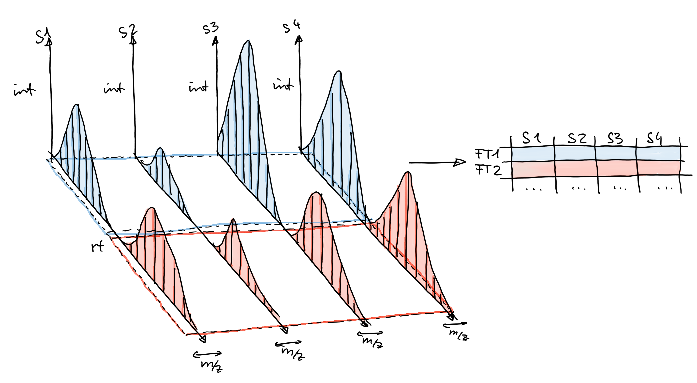

```{r style, message = FALSE, echo = FALSE, warning = FALSE, results = "asis"}
library("BiocStyle")
library("knitr")
library("rmarkdown")
library("xcms")
register(SerialParam())
set.seed(123)
opts_chunk$set(message = FALSE, error = FALSE, warning = FALSE,
               cache = FALSE, fig.width = 10, fig.height = 7)
```

# Abstract

In this document we discuss liquid chromatography (LC) mass spectrometry (MS)
data handling and exploration using the `r Biocpkg("MsExperiment")` and `r
Biocpkg("Spectra")` Bioconductor packages and perform the preprocessing of a
small LC-MS data set using the `r Biocpkg("xcms")` package. Functionality from
the `r Biocpkg("MetaboCoreUtils")` and `r Biocpkg("MsCoreUtils")` packages are
used for general tasks frequently performed during metabolomics data
analysis. Ultimately, the functionality from these packages can be combined to
build custom, data set-specific (and reproducible) analysis workflows.

In the present workshop, we first focus on data import, access and visualization
which is followed by the description of a simple data centroiding approach and
finally we present an *xcms*-based LC-MS data preprocessing that comprises
chromatographic peak detection, alignment and correspondence. Data normalization
procedures, compound identification and differential abundance analysis are not
covered here. Particular emphasis is given on deriving and defining data
set-dependent values for the most critical *xcms* preprocessing parameters.


# Introduction

Preprocessing is the first step in the analysis of *untargeted* LC-MS or gas
chromatography (GC)-MS data. The aim of the preprocessing is the quantification
of signals from ions measured in a sample, adjusting for any potential retention
time drifts between samples followed by the matching of the quantified signal
across samples within an experiment. The resulting two-dimensional matrix with
abundances of the so called *LC-MS features* in all samples can then be further
processed, e.g. by normalizing the data to remove differences due to sample
processing, batch effects or injection order-dependent signal drifts. LC-MS
features are usually only characterized by their mass-to-charge ration (*m/z*)
and retention time and hence need to be annotated to the actual ions and
metabolites they represent. Data normalization and annotation are not covered in
here but links to related tutorials and workshops are provided at the
end of the document.


## Mass spectrometry

Mass spectrometry allows to measure abundances of charged molecules (ions) in a
sample. Abundances are determined as ion counts for a specific mass-to-charge
ratio *m/z*. The measured signal is represented as a spectrum: intensities along
*m/z*.


Many ions will result, when measured with MS alone, in a very similar
*m/z*. Thus, making it difficult or impossible to discriminate them. MS is
therefore frequently coupled with a second technology to separate them prior
quantification based on properties other than their mass (e.g. based on their
polarity). Common choices are gas chromatography (GC) or liquid chromatography
(LC). In a typical LC-MS setup a sample gets injected into the system, the
molecules in the sample are separated in the LC column, get ionized and then
measured (at discrete time points) by the MS instrument (see Figure below for a
simple visualization). Molecules get thus separated on two different dimensions,
the retention time dimension (from the LC) and the mass-to-charge dimension
(from the MS) making it easier to measure and identify molecules in more complex
samples.


In such GC/LC-MS based untargeted metabolomics experiments, the data is analyzed
along the retention time dimension and *chromatographic* peaks (which are
supposed to represent the signal from ions of a certain type of molecule) are
quantified.


## Definitions and common naming convention

Naming conventions and terms used in this document are:

- *chromatographic peak*: peak containing the signal from an ion in retention
  time dimension (different from a *mass* peak that represents the signal along
  the *m/z* dimension within a spectrum).
- *chromatographic peak detection*: process in which chromatographic peaks are
  identified within a sample (file).
- *alignment*: process that adjusts for retention time differences
  (i.e. possible signal drifts from the LC) between measurements/files.
- *correspondence*: grouping of chromatographic peaks (presumably from the same
  ion) across samples/files.
- *feature* (or *LC-MS features*): entity representing signal from the same type
  of ion/molecule, characterized by its specific retention time and *m/z*. In
  *xcms*, features represent identified chromatographic peaks grouped across
  samples/files.


## Goals of this workshop

- Learn how R/*xcms* and the packages from the RforMassSpectrometry initiative
  can be used to inspect, evaluate and analyze LC-MS data.

- Learn the basis to build reproducible analysis workflows, tailored and
  customized for individual data sets.


# Data import and exploration

The example data set of this workflow consists of two files in mzML format with
signals from pooled human serum samples measured with a ultra high performance
liquid chromatography (UHPLC) system (Agilent 1290) coupled with a Q-TOF MS
(TripleTOF 5600+ AB Sciex) instrument. Chromatographic separation was based on
hydrophilic interaction liquid chromatography (HILIC) separating metabolites
depending on their polarity. The input files contain all signals measured by the
MS instrument (so called *profile mode* data). To reduce file sizes, the data
set was restricted to an *m/z* range from 105 to 134 and retention times from 0
to 260 seconds. Both QC pool samples were taken from a larger experiment and
were injected in the same measurement run at different time points (injected in
position 1 and 19 of the measurement run).

In the code block below we first load all required libraries and define the
location of the mzML files, which are distributed through the *msdata* R
package. We also define a `data.frame` with the names of the mzML files, an
arbitrary sample name, the index in which the respective sample was measured
within the LC-MS run and the sample *group* of the samples. It is generally
suggested to provide all experiment-relevant phenotypic and technical
information through such a data frame. Also, the data frame could be defined in
an xls sheet that could then be imported with the `read_xlsx` function from the
*readxl* R package. This data frame is then passed, along with the file names,
to the `readMsExperiment` call to import the data.

```{r load-data}
library(xcms)
library(MsExperiment)
library(Spectra)

#' Define the file names.
fls <- dir(system.file("sciex", package = "msdata"), full.names = TRUE)

#' Define a data.frame with additional information on these files.
pd <- data.frame(file = basename(fls),
                 sample = c("POOL_1", "POOL_2"),
                 injection_index = c(1, 19),
                 group = "POOL")

#' Import the data of the experiment
data <- readMsExperiment(fls, sampleData = pd)
data
```

The MS data of the experiment is now *represented* by an `MsExperiment` object.


## Basic data access

The `MsExperiment` object manages the *linkage* between samples and spectra.
The `length` of an `MsExperiment` is defined by the number of samples (files)
within the object.

```{r general-access}
length(data)

```

Subset the `MsExperiment` will restrict (all) data within the object to the
selected sample(s). To restrict to data from the second sample we use:

```{r}
#' Subset the data
data_2 <- data[2]
data_2
```

This did subset the full data, including sample information and spectra data
to those of the second file. Phenotype information can be retrieved with the
`sampleData` function from an `MsExperiment` object.

```{r}
#' Extract sample information
sampleData(data_2)
```

The MS data is stored as a `Spectra` object within the `MsExperiment` and can be
accessed using the `spectra` function.

```{r show-fData}
#' Access the MS data
spectra(data)

```

From version 4 on, *xcms* uses the more modern and flexible infrastructure for
MS data analysis provided by the `r Biocpkg("Spectra")` package. While it is
still possible and supported to use *xcms* together with the `r
Biocpkg("MSnbase")` package, users are advised to switch to this new
infrastructure as it provides more flexibility and a higher performance. Also,
through additional packages such as the `r Biocpkg("MsBackendRawFileReader")`,
the new infrastructure would allow to import MS data from other files than mzML,
mzXML or CDF files.

In the next few examples we briefly explain the `Spectra` object and illustrate
the use of such objects using some simple examples. More information on
`Spectra` objects can be found in the package's
[documentation](https://RforMassSpectrometry.github.io/Spectra) or the
[SpectraTutorials](https://jorainer.github.io/SpectraTutorials).

The `Spectra` object contains the full MS data of the experiment. It's length is
thus equal to the total number of spectra within the experiment. Below we
determine this number for our example data set. To avoid nested function calls
and hence improve the readability of the code, we use the R pipe operator `|>`
that allows to concatenate consecutive calls in a more readable fashion.

```{r}
#' Get the total number of spectra
spectra(data) |>
    length()
```

The `Spectra` object itself is agnostic of any sample information, it simply
contains all spectra from the experiment, first all spectra from the first file,
followed by the spectra from the second. The mapping of spectra to samples is
provided by the `MsExperiment` object. To access spectra from a specific sample
we either subset the `MsExperiment` to that particular sample (as done in the
example above) or we use the `fromFile` function that returns for each spectrum
the index of the file within the `MsExperiment` to which it belongs. Below we
use that function to determine the total number of spectra for each sample.

```{r}
#' Get the number of spectra per file.
fromFile(data) |>
    table()
```

Such basic data summaries can be helpful for a first initial quality assessment
to potentially identify problematic data files with e.g. a unexpected low number
of spectra.

Besides the peak data (*m/z* and intensity values) also additional spectra
variables (metadata) are available in a `Spectra` object. These can be listed
using the `spectraVariables` function that we call on our example MS data below.

```{r}
#' List available spectra variables
spectra(data) |>
    spectraVariables()
```

Thus, for all spectra we have general information such as the MS level
(`"msLevel"`) or the retention time (`"rtime"`) available. For most of these
spectra variables dedicated accessor functions are available (such as `msLevel`,
`rtime`) and in addition it is possible to access any variable using `$` and the
name of the variable (like accessing the columns of a `data.frame`). As an
example we extract below the `msLevel` spectra variable and use the `table`
function on the result to get an overview of the number of spectra from
different MS levels available in the object.

```{r}
#' List number of spectra per MS level
spectra(data) |>
    msLevel() |>
    table()
```

The present data set contains thus 1,862 spectra, all from MS level 1.

We could also check the number of peaks per spectrum in the different data
files. The number of peaks per spectrum can be extracted with the `lengths`
function. Below we extract these values, split them by file and then calculate
the quartiles of the peak counts using the `quantile` function.

```{r}
#' Get the distribution of peak counts per file
spectra(data) |>
    lengths() |>
    split(fromFile(data)) |>
    lapply(quantile)

```

Thus, for the present data set, the number of spectra and also the average
number of peaks per spectra are comparable.

Individual MS spectra can be accessed by subsetting the `Spectra` object
returned by `spectra`. As an example we below subset the data to the second
sample, extract the spectra from that sample and subset to the spectrum number
123.

```{r}
#' Extract one spectrum from the second file
sp <- spectra(data[2])[123]
sp
```

*m/z* and intensity values can be extracted from a `Spectra` using the `mz` and
`intensity` functions that (always) return a list of `numeric` vectors with the
respective values:

```{r}
#' Extract m/z values
mz(sp)

#' Extract intensity values
intensity(sp)
```

As an alternative, the `peaksData` function could be used to extract both the
*m/z* and intensity (as numeric matrices) with a single function call.

The total ion signal of a spectrum could be calculated by simply summing the
intensities of all peaks in the spectrum. Below we perform that operation on the
spectrum extracted above.

```{r}
#' Calculate total ion signal for the extracted spectrum
intensity(sp) |>
    sum()
```

The same operation can also be applied to the full data set. As an example we
calculate below the total ion signal for each spectrum in the first file and
determine the distribution of these using the `quantiles` function.

```{r}
#' Calculate the distribution of total ion signal of the first file
spectra(data[1]) |>
    intensity() |>
    sum() |>
    quantile()
```

We repeat the operation for the second file.

```{r}
#' Repeat for the second file
spectra(data[2]) |>
    intensity() |>
    sum() |>
    quantile()
```

The total ion signals of the two data files is (as expected) similar. Through
the `Spectra` object we have thus the possibility to inspect and explore the
(raw) MS data of an experiment and use its functionality to create own quality
assessment functions. Alternatively, also the `r Biocpkg("MsQuality")` package
could be to calculate core MS quality metrics on a full experiment
(`MsExperiment`) or individual data files (`Spectra`).


## Data visualization

### General data overview

Visualization is crucial for quality assessment of MS data. For LC-MS data
visualizing a base peak chromatogram (BPC) or total ion chromatogram (TIC) would
for example allow to evaluate the performance of the liquid chromatography of
the various samples in an experiment. To create such a plot we below extract the
BPC from our data. The BPC extracts the maximum peak signal from each spectrum
in a data file and allows thus to plot this information (on the y-axis) against
the retention time for that spectrum. While we could also extract these values
similarly to the total ion intensity in the previous section, we use below the
`chromatogram` function that allows extraction of chromatographic data from MS
data. With parameter `aggregationFun = "max"` we define to report the maximum
signal per spectrum (setting `aggregationFun = "sum"` would in contrast sum up
all intensities of a spectrum and hence create a TIC).

```{r}
#' Extract and plot a BPC
bpc <- chromatogram(data, aggregationFun = "max")
plot(bpc)
```

This plot shows the BPC for each of the two data files (each line representing
one sample) and provides the information at what retention times signal was
measured (thus at what retention times compounds eluted from the LC column). We
can clearly spot regions along the retention time in which more compounds
eluted. Also, the BPC of the two data files look similar, which is expected
since both represent the same sample pool.

The BPC collapsed the 3-dimensional LC-MS data (*m/z* by retention time by
intensity) into 2 dimensions (retention time by intensity). An orthogonal
visualization to this would be a *base peak spectrum* (BPS) that collapses the
data in retention time dimension. Such a visualization could provide information
on the most abundant masses (or rather mass-to-charge values) in the data set
(regardless of the retention time in which they were measured). In contrast to
the BPC it is however not straight forward to create such a visualization: mass
peaks, even if representing signal from the same ion, will never be identical
between consecutive spectra, but will slightly differ based on the measurement
error/resolution of the instrument.

Below we plot the spectra for 2 consecutive scans.

```{r, fig.cap = "Spectra from two consecutive scan of the first file"}
#' Plot two consecutive spectra
plotSpectra(spectra(data)[123:124], xlim = c(105, 130))
```

These two spectra could now be merged by reporting for each *m/z* (or rather for
peaks with very similar *m/z* in consecutive spectra) the maximal signal
observed. In *Spectra*, the `combineSpectra` function allows to
aggregate/combine sets of spectra into a single spectrum. By default, this
function will combine sets of spectra (that can be defined with parameter `f`)
creating an union of the peaks present in spectra of a set. For mass peaks with
a similar *m/z* value (depending on parameter `ppm`) the peaks' intensities are
aggregated using the function defined with parameter `intensityFun` and only one
peak is reported. With the setting below we combine all spectra from one file
(by using `f = fromFile(data)`) into a single spectrum containing mass peaks
present in any of the spectra of that file. Mass peaks with a difference in
their *m/z* that is smaller than `ppm` (parts-per-million of the *m/z* value)
are combined into one peak for which the maximal intensity of the grouped peaks
is reported. Note that we set `ppm` to a rather small value because the present
data is in profile mode.

```{r}
#' Combine all spectra of one file into a single spectrum
bps <- spectra(data) |>
    combineSpectra(f = fromFile(data), ppm = 5, intensityFun = max)
bps
```

`bps` is thus a `Spectra` with two spectra representing the BPS of the two data
files. Below we plot these.

```{r, fig.cap = "Base peak spectrum for each of the two samples."}
#' Plot the BPS
plotSpectra(bps)
```

These BPS thus show the most common ions present in each of the two
samples. Apparently there is quite some overlap in ion content between the two
files.


### Detailed data inspection

Apart from such general data overview it is also possible (and also suggested)
to explore the data in more detail. To this end we next focus on a specific
subset of the data were we expect signal for a compound that should be present
in serum samples (such as ions of the molecule serine). With the particular
LC-MS setup used for the present samples, ions for this metabolite are expected
to elute at about 180 seconds (this retention time was determined by measuring a
pure standard for this compound on the same LC-MS setup). We thus filter below
the spectra data using the `filterRt` function extracting only spectra measured
between 180 and 181 seconds.

```{r}
#' Extract all spectra measured between 180 and 181 seconds
sps <- spectra(data) |>
    filterRt(c(180, 181))
sps
```

For the present data set there are `r length(sps)` spectra measured within this
one second in both samples. By extracting the data as a `Spectra` object we
have however lost now the direct (inherent) association between spectra and
samples of the experiment. We could extract the name of the original data file
from which the data was imported (see example below) and use that to determine
the originating sample, but that would involve additional R code.

```{r}
basename(dataOrigin(sps))
```

Alternatively, we could use the `filterRt` function also directly on the
`MsExperiment` which would subset the whole `MsExperiment` keeping hence the
link between samples and spectra. Note however that only few filter and subset
functions are at present available for `MsExperiment` objects while more are
available for `Spectra` objects.

```{r}
#' Subset the whole MsExperiment
data_sub <- filterRt(data, rt = c(180, 181))
#' Extract spectra from the subset for the first sample
spectra(data_sub[1])
```

For the present purpose it is however not important to keep the sample
association intact and we thus proceed to plot the previously extracted spectra.

```{r, fig.cap = "MS1 spectra measured between 180 and 181 seconds"}
#' Plot the spectra
plotSpectra(sps)
```

We can immediately spot several mass peaks in the spectrum, with the largest one
at an *m/z* of about 130 and the second largest at about 106, which
could represent signal for an ion of
[Serine](https://en.wikipedia.org/wiki/Serine). Below we calculate the exact
(monoisotopic) mass for serine from its chemical formula *C3H7NO3* using the
`calculateMass` function from the `r Biocpkg("MetaboCoreUtils")` package.

```{r}
#' Calculate the (monoisotopic) mass of serine
library(MetaboCoreUtils)
mass_serine <- calculateMass("C3H7NO3")
mass_serine
```

The *native* serine molecule is however uncharged and can thus not be measured
by mass spectrometry. In order to be detectable, molecules need to be ionized
before being injected in an MS instrument. While different ions can (and will)
be generated for a molecule, one of the most commonly generated ions in positive
polarity is the *[M+H]+* ion (protonated ion). To calculate the *m/z* values for
specific ions/adducts of molecules, we can use the `mass2mz` function, also from
the *MetaboCoreUtils* package. Below we calculate the *m/z* for the *[M+H]+* ion
of serine providing the monoisotopic mass of that molecule and specifying the
adduct we are interested in. Also other types of adducts are supported. These
could be listed with the `adductNames` function (`adductNames()` for all
positively charged and `adductNames("negative")` for all negatively charge
ions).

```{r}
#' Calculate the m/z for the [M+H]+ ion of serine
serine_mz <- mass2mz(mass_serine, "[M+H]+")
serine_mz
```

The `mass2mz` function **always** returns a `matrix` with columns reporting the
*m/z* for the requested adduct(s) of the molecule(s) which are available in the
rows. Since we requested a single ion we reduce this `matrix` to a single
`numeric` value.

```{r}
serine_mz <- serine_mz[1, 1]
```

We can now use this information to subset the MS data to the signal recorded for
all ions with that particular *m/z*. We use again the `chromatogram` function
and provide the *m/z* range of interest with the `mz` parameter of that
function. Note that it would also be possible to first filter the data set by
*m/z* using the `filterMzRange` function and then extract the chromatogram.

```{r, fig.cap = "Ion trace for an ion of serine"}
#' Extract a full RT chromatogram for ions with an m/z similar than serine
serine_chr <- chromatogram(data, mz = serine_mz + c(-0.05, 0.05))
plot(serine_chr)
```

A strong signal is visible around a retention time of 180 seconds which very
likely represents signal for the *[M+H]+* ion of serine. Note that, if the
retention time of a molecule for a specific LC-MS setup is not known beforehand,
extracting such chromatograms for the *m/z* of interest and the full retention
time range can help determining its likely retention time.

The object returned by the `chromatogram` function arranges the individual
`MChromatogram` objects (each representing the chromatographic data consisting
of pairs of retention time and intensity values of one sample) in a
two-dimensional array, columns being samples (files) and rows data slices (i.e.,
*m/z* - rt ranges). Note that this type of data representation, defined in the
`r Biocpkg("MSnbase")` package, is likely to be replaced in future with a more
efficient and flexible data structure similar to `Spectra`. Data from the
individual chromatograms can be accessed using the `intensity` and `rtime`
functions (similar to the `mz` and `intensity` functions for a `Spectra`
object).

```{r chromatogram}
#' Get intensity values for the chromatogram of the first sample
intensity(serine_chr[1, 1]) |>
    head()

#' Get the respective retention times of the first sample
rtime(serine_chr[1, 1]) |>
    head()
```

Note that an `NA` is reported if in the *m/z* range from which the
chromatographic data was extracted no intensity was measured at the given
retention time.

At last we further focus on the tentative signal of serine extracting the ion
chromatogram restricting on the retention time range containing its
signal. While we could also pass the retention time and *m/z* range with
parameters `rt` and `mz` to the `chromatogram` function we instead filter the
whole experiment by retention time and *m/z* before calling `chromatogram` on
the such created data subset. With the example code below we thus create an
extracted ion chromatogram (EIC, sometimes also referred to as XIC) for the
*[M+H]+* ion of serine.

```{r, fig.cap = "Extracted ion chromatogram for serine."}
#' Create an EIC for serine
data |>
    filterRt(rt = c(175, 189)) |>
    filterMz(mz = serine_mz + c(-0.05, 0.05)) |>
    chromatogram() |>
plot()
```

The area of such a chromatographic peak is supposed to be proportional to the
amount of the corresponding ion in the respective sample and identification and
quantification of such peaks is one of the goals of the LC-MS data
preprocessing.

While we inspected here the signal measured for ions of serine, this workflow
could (and should) also be repeated for other potentially present ions (or
internal standards) to evaluate the LC-MS data of an experiment.


# Centroiding of profile MS data

MS instruments allow to export data in profile or centroid mode. Profile data
contains the signal for all discrete *m/z* values (and retention times) for
which the instrument collected data [@Smith:2014di]. MS instruments continuously
sample and record signals, therefore a mass peak for a single ion in one
spectrum will consist of multiple intensities at discrete *m/z* values. The
process to reduce this distribution of signals to a single representative mass
peak (the centroid) is called centroiding. This process results in much smaller
file sizes, with only little information loss. *xcms*, specifically the
*centWave* chromatographic peak detection algorithm, was designed for centroided
data, thus, prior to data analysis, profile data, such as the example data used
here, should be centroided.

Below we inspect the profile data for one of the spectra extracted above and
focus on the mass peak for serine.

```{r, fig.cap = "Profile-mode mass peak for the [M+H]+ ion of serine. The theoretical *m/z* of that ion is indicated with a dotted red line."}
#' Visualize the profile-mode mass peak for [M+H]+ of serine
sps[1] |>
    filterMzRange(c(106.02, 106.07)) |>
    plotSpectra()
abline(v = serine_mz, col = "#ff000080", lty = 3)
```

Instead of a single peak, several mass peaks were recorded by the MS instrument
with an *m/z* very close to the theoretical *m/z* for the *[M+H]+* ion of serine
(indicated with a red dotted line).

We can also visualize this information differently: the `plot` function for
`MsExperiment` generates a two-dimensional visualization of the
three-dimensional LC-MS data: peaks are drawn at their respective location in
the two-dimensional *m/z* *vs* retention time plane with their intensity being
color coded. Below we subset the data to the *m/z* - retention time region
containing signal for serine and visualize the full MS data measured for that
region in both data files.

```{r serine-profile-mode-data, fig.cap = "Profile data for Serine."}
#' Visualize the full MS data for a small m/z - rt area
data |>
    filterRt(rt = c(175, 189)) |>
    filterMz(mz = c(106.02, 106.07)) |>
    plot()
```

The lower panel of the plot shows all mass peaks measured by the instrument:
each point represents one mass peak with its intensity being color coded (blue
representing low, yellow high intensity). Each column of data points represents
data from the same spectrum. The upper panel of the plot shows a chromatographic
visualization of the data from the lower panel, i.e., for each retention time
(spectrum) the sum of intensities is shown.

Note that, while it would be possible to create such a plot for the full MS data
of an experiment, this type of visualization works best for small *m/z* -
retention time regions.

Next, we *smooth* the data in each spectrum using a Savitzky-Golay filter, which
usually improves data quality by reducing noise. Subsequently we perform the
centroiding of the data based on a simple peak-picking strategy that reports the
maximum signal for each mass peak in each spectrum. Finally, we replace the
spectra in data (`MsExperiment`) object with the centroided spectra and
visualize the result repeating the visualization from above.

```{r centroiding, fig.cap = "Centroided data for Serine."}
#' Smooth and centroid the spectra data
sps_cent <- spectra(data) |>
    smooth(method = "SavitzkyGolay", halfWindowSize = 6L) |>
    pickPeaks(halfWindowSize = 2L)

#' Replace spectra
spectra(data) <- sps_cent

#' Plot the centroided data for Serine
data |>
filterRt(rt = c(175, 189)) |>
filterMz(mz = c(106.02, 106.07)) |>
plot()
```

The impact of the centroiding is clearly visible: each signal for an ion in a
spectrum was reduced to a single data point. For more advanced centroiding
options, that can also fine-tune the *m/z* value of the reported centroid, see
the documentation of the `pickPeaks` function or the centroiding vignette of the
`r Biocpkg("MSnbase")` package.

While we could now simply proceed with the data analysis, we below save the
centroided MS data to mzML files to also illustrate how the *Spectra* package
can be used to export MS data.

```{r export-centroided-prepare, echo = FALSE, results = "hide"}
#' Silently removing exported mzML files if they do already exist.
lapply(basename(unique(dataOrigin(spectra(data)))), function (z) {
    if (file.exists(z))
        file.remove(z)
})
```

We use the `export` function for data export of the centroided `Spectra`
object. Parameter `backend` allows to specify the MS data backend that should be
used for the export, and that will also define the data format (use
`backend = MsBackendMzR()` to export data in mzML format). Parameter `file`
defines, for each spectrum, the name of the file to which its data should be
exported.

```{r export-centroided}
#' Export the centroided data to new mzML files.
export(spectra(data), backend = MsBackendMzR(),
       file = basename(dataOrigin(spectra(data))))

```

We can then import the centroided data again from the newly generated mzML files
and proceed with the analysis.

```{r}
#' Re-import the centroided data.
fls <- basename(fls)

#' Read the centroided data.
data <- readMsExperiment(fls, sampleData = pd)
```

Thus, with few lines of R code we performed MS data centroiding in R which gives
us possibly more, and better, control over the process and would also allow
(parallel) batch processing.


# Preprocessing of LC-MS data

Preprocessing of (untargeted) LC-MS data aims at detecting and quantifying the
signal from ions generated from all molecules present in a sample. It consists
of the following 3 steps: chromatographic peak detection, retention time
alignment and correspondence (also called peak grouping). The resulting matrix
of feature abundances can then be used as an input in downstream analyses
including data normalization, identification of features of interest and
annotation of features to metabolites.


## Chromatographic peak detection

Chromatographic peak detection aims to identify peaks along the retention time
axis that represent the signal from individual compounds' ions. This involves
identifying and quantifying such signals as shown in the sketch below.


Such peak detection can be performed with the *xcms* package using its
`findChromPeaks` function. Several peak detection algorithms are available that
can be selected and configured with their specific parameter objects:

- `MatchedFilterParam` to perform peak detection as described in the original
  *xcms* article [@Smith:2006ic],
- `CentWaveParam` to perform a continuous wavelet transformation (CWT)-based
  peak detection [@Tautenhahn:2008fx] and
- `MassifquantParam` to perform a Kalman filter-based peak detection
  [@Conley:2014ha].

Additional peak detection algorithms for direct injection data are also
available in *xcms*, but not discussed here.

In our example we use the *centWave* algorithm that performs peak detection in
two steps: first it identifies *regions of interest* in the *m/z* - retention
time space and subsequently detects peaks in these regions using a continuous
wavelet transform (see the original publication [@Tautenhahn:2008fx] for more
details). The algorithm can be configured with several parameters (see
`?CentWaveParam`), with the most important being `peakwidth` and
`ppm`. `peakwidth` defines the minimal and maximal expected width of the peak in
retention time dimension and depends thus on the setup of the employed LC-MS
system making this parameter highly data set dependent. `ppm` on the other hand
depends on the precision of the MS instrument. In this section we describe how
settings for these parameters can be empirically determined for a data set.

Generally, it is strongly discouraged to blindly use the default parameters for
any of the peak detection algorithms. To illustrate this we below extract the
EIC for serine and run a *centWave*-based peak detection on that data using
*centWave*'s default settings.

```{r centWave-default}
#' Get the EIC for serine in all files
serine_chr <- chromatogram(data, rt = c(164, 200),
                           mz = serine_mz + c(-0.05, 0.05),
                           aggregationFun = "max")

#' Get default centWave parameters
cwp <- CentWaveParam()

#' "dry-run" peak detection on the EIC.
res <- findChromPeaks(serine_chr, param = cwp)
chromPeaks(res)
```

The peak matrix returned by `chromPeaks` is empty, thus, with the default
settings *centWave* failed to identify any chromatographic peak in the EIC for
serine. These default values are shown below.

```{r centWave-default-parameters}
cwp
```

Particularly the settings for `peakwidth` does not fit our data. The default for
this parameter expects chromatographic peaks between 20 and 50 seconds
wide. When we plot the extracted ion chromatogram (EIC) for serine we can
however see that these values are too large for the present data set (see
below).

```{r, fig.cap = "Extracted ion chromatogram for serine."}
plot(serine_chr)
```

For serine, the chromatographic peak is about 5 seconds wide. We thus adapt the
`peakwidth` for the present data set and repeat the peak detection using these
settings. In general, the lower and upper peak width should be set to include
most of the chromatographic peak widths. For the present data set we set the
values to 2 to 10 seconds, i.e., to about half and two times the expected peak
width. In addition, by setting `integrate = 2`, we select a different peak
boundary estimation algorithm. This works particularly well for non-gaussian
peak shapes and ensures that also signal from the peak's tail is integrated
(eventually re-run the code with the default `integrate = 1` to compare the two
approaches).

```{r centWave-adapted, fig.cap = "EIC for Serine with detected chromatographic peak", results = "hide"}
cwp <- CentWaveParam(peakwidth = c(2, 10), integrate = 2)

#' Run peak detection on the EIC
serine_chr <- findChromPeaks(serine_chr, param = cwp)

#' Plot the data and higlight identified peak area
plot(serine_chr)
```

Acceptable values for parameter `peakwidth` can thus be derived through visual
inspection of EICs for ions known to be present in the sample (e.g. of internal
standards). Ideally, this should be done for several compounds/ions. Tip:
ensure that the EIC contains also enough signal left and right of the actual
chromatographic peak to allow *centWave* to properly estimate the background
noise. Alternatively, reduce the value for the `snthresh` parameter.

With our data set-specific `peakwidth` we were able to detect the peak for
serine (highlighted in grey in the plot above). We can now use the `chromPeaks`
function to extract the information on identified chromatographic peaks from our
object.

```{r chromPeaks-chromatogram}
#' Extract identified chromatographic peaks from the EIC
chromPeaks(serine_chr)
```

The result is returned as a `matrix` with each row representing one identified
chromatographic peak. The retention time ranges of the peaks are provided in
columns `"rtmin"` and `"rtmax"`, the integrated peak area (i.e., the *abundance*
of the ion) in column `"into"`, the maximal signal of the peak in column
`"maxo"` and the signal to noise ratio in column`"sn"`. With our adapted
settings we were thus able to identify a chromatographic peak for the serine ion
in each of the two samples.

The second important parameter for *centWave* is `ppm` which is used in the
initial definition of the *regions of interest* (ROI) in which the actual peak
detection is then performed. To define these ROI, the algorithm evaluates for
each mass peak in a spectrum whether a mass peak with a similar *m/z* (and a
reasonably high intensity) is also found in the subsequent spectrum. For this,
only mass peaks with a difference in their *m/z* smaller than `ppm` in
consecutive scans are considered. To illustrate this, we plot again the full
MS data for the data subset containing signal for serine.

```{r Serine-mz-scattering-plot}
#' Restrict to data containing signal from serine
srn <- data |>
    filterRt(rt = c(179, 186)) |>
    filterMz(mz = c(106.04, 106.07))

#' Plot the data
plot(srn)
```

We can observe some scattering of the data points around an *m/z* of 105.05 in
the lower panel of the above plot. This scattering also decreases with
increasing signal intensity (as for many MS instruments the precision of the
signal increases with the intensity). To quantify the observed differences in
*m/z* values for the signal of serine we restrict the data to a *bona fide*
region with signal for the serine ion. Below we first subset the data to the
first file and then restrict the *m/z* range to values between 106.045 and
106.055.

```{r}
#' Reduce the data set to signal of the [M+H]+ ion of serine
srn_1 <- srn[1] |>
    filterMzRange(c(106.045, 106.055)) |>
    spectra()
```

This restricted the MS data to spectra with a single mass peak per spectrum
(presumably representing signal from the serine ion).

```{r}
lengths(srn_1)
```

We next extract the *m/z* values of the peaks from the consecutive scans and
calculate the absolute difference between them.

```{r}
#' Calculate the difference in m/z values between scans
mz_diff <- srn_1 |>
    mz() |>
    unlist() |>
    diff() |>
    abs()
mz_diff
```

We can also express these differences in ppm (parts per million) of the average
*m/z* of the peaks.

```{r}
#' Differences in m/z values expressed as ppm
mz_diff * 1e6 / mean(unlist(mz(srn_1)))
```

The difference in *m/z* values for the serine data is thus between 0 and 27
ppm. The maximum value could then be used for centWave's `ppm`
parameter. Ideally, this should be evaluated for several ions and could be set
to a value that allows to capture the full chromatographic peaks for most of the
tested ions. We can next perform the peak detection on the full data set using
our settings for the `ppm` and `peakwidth` parameters.

```{r findPeaks-centWave}
#' Perform peak detection on the full data set
cwp <- CentWaveParam(peakwidth = c(2, 10), ppm = 30, integrate = 2)
data <- findChromPeaks(data, param = cwp)
```

The results form the chromatographic peak detection were added by the
`findChromPeaks` to our `data` variable which now is an `XcmsExperiment` object
that, by extending the `MsExperiment` class inherits all of its functionality
and properties, but in addition contains also all *xcms* preprocessing results.

```{r}
data
```

We can extract the results from the peak detection step (as above) with the
`chromPeaks` function. The optional parameters `rt` and `mz` would allow to
extract peak detection results for a specified *m/z* - retention time region. In
our example we extract all chromatographic peaks between an *m/z* range from 106
to 108 and a retention time from 150 to 190.

```{r}
#' Access the peak detection results from a specific m/z - rt area
chromPeaks(data, mz = c(106, 108), rt = c(150, 190))
```

Again, each row in this matrix contains one identified chromatographic peak with
columns `"mz"`, `"mzmin"`, `"mzmax"`, `"rt"`, `"rtmin"` and `"rtmax"` defining
it's *position* (and size) in the *m/z* - rt plane and `"into"` and `"maxo"` its
(integrated and maximum) intensity. Column `"sample"` indicates in which of our
samples (data files) the peak was identified.

The chromatographic peak table above contains pairs of peaks with similar
retention times and a difference in *m/z* values of about one. Together with the
observed differences in intensities, this could indicate that one of the peaks
represents the carbon 13 isotope and one the monoisotopic *main* peak. This is
frequently observed in untargeted metabolomics.

As a general overview of the peak detection results it can also be helpful to
determine (and eventually) plot the number of identified chromatographic peaks
per sample. Below we count the number of peaks per sample.

```{r}
#' Count peaks per file
chromPeaks(data)[, "sample"] |>
    table()
```

About the same number of peaks was identified, which is to be expected since
both files contain measurements from the same sample (the QC pool).

As an additional visual quality assessment, we can also plot the location of the
identified chromatographic peaks in the *m/z* - retention time space for each
data file using the `plotChromPeaks` function.

```{r plotChromPeaks, fig.cap = "Location of the identified chromatographic peaks in the *m/z* - rt space."}
#' Plot the location of peaks in the m/z - rt plane
par(mfrow = c(1, 2))
plotChromPeaks(data, 1)
plotChromPeaks(data, 2)
```

Again, similar pattern are expected to be present for the two data files.

After chromatographic peak detection it is generally a good idea to visually
inspect individual chromatographic peaks and evaluate the performance of the
peak detection step. This could be done by plotting EICs of known compounds/ions
in the data or by randomly select chromatographic peaks. *m/z* - retention time
regions for random peaks could be defined using the example code below.

```{r}
#' Select 4 random peaks
idx <- sample(seq_len(nrow(chromPeaks(data))), 4)

#' Extract m/z-rt regions for 4 random peaks
mz_rt <- chromPeaks(data)[idx, c("rtmin", "rtmax", "mzmin", "mzmax")]

#' Expand the rt range by 10 seconds on both sides
mz_rt[, "rtmin"] <- mz_rt[, "rtmin"] - 10
mz_rt[, "rtmax"] <- mz_rt[, "rtmax"] + 10
#' Expand the m/z range by 0.005 on both sides
mz_rt[, "mzmin"] <- mz_rt[, "mzmin"] - 0.005
mz_rt[, "mzmax"] <- mz_rt[, "mzmax"] + 0.005

```

For our example we however manually define *m/z* - retention time regions
(similarly as it could be done for known compounds). Below we extract the EICs
for these regions with the `chromatogram` function and subsequently plot
them. Identified chromatographic peaks within the plotted regions will by
default be highlighted in a semitransparent grey color.

```{r}
#' Define m/z - retention time regions for EICs
mz_rt <- rbind(c(106.045, 106.055, 165, 195),
               c(132.096, 132.107, 135, 160),
               c(125.981, 125.991, 195, 215),
               c(105.468, 105.478, 190, 215))

#' Extract the EICs
eics <- chromatogram(data, mz = mz_rt[, 1:2], rt = mz_rt[, 3:4], )
#' Plot the EICs
plot(eics)
```

While the peak detection worked nicely for the signals in the upper row, it
failed to define chromatographic peaks containing the full signal in the lower
row. In both cases, the signal was split into separate chromatographic peaks
within the same sample. This is a common problem with *centWave* on noisy and
broad signals. We could either try to adapt the *centWave* settings and repeat
the chromatographic peak detection or use the `refineChromPeaks` function that
allows to post-process peak detection results and fix problems such as those
observed above (see also the documentation of the `refineChromPeaks` function
for all possible refinement options).

To fuse the wrongly split peaks in the second row, we use the
`MergeNeighboringPeaksParam` algorithm that merges chromatographic peaks that
are overlapping on the *m/z* and retention time dimension for which the signal
between them is lower than a certain value. We specify `expandRt = 4` to expand
the retention time width of each peak by 4 seconds on each side and set `minProp
= 0.75`. All chromatographic peaks with a distance tail to head in retention
time dimension that is less `2 * expandRt` and for which the intensity between
them is higher than 75% of the lower (apex) intensity of the two peaks are thus
merged. We below apply these settings on the EICs and evaluate the result of
this post-processing.

```{r}
#' Define the setting for the peak refinement
mpp <- MergeNeighboringPeaksParam(expandRt = 4, minProp = 0.75)

#' Perform the peak refinement on the EICs
eics <- refineChromPeaks(eics, param = mpp)

#' Plot the result
plot(eics)
```

The peak post-processing was able to fuse the signal for the neighboring peaks
in the lower panel, while keeping the peaks for the different isomers present in
the top right plot separate. We next apply this same peak refinement on the full
data set.

```{r}
#' Perform peak refinement on the full data set
data <- refineChromPeaks(data, param = mpp)
```


## Retention time alignment

While chromatography helps to better discriminate between analytes it is also
affected by variances that lead to shifts in retention times between measurement
runs. Such differences can usually already be seen in a base peak chromatogram
or total ion chromatogram. We thus extract and plot below the BPC for our data
set. In the `chromatogram` call, we set the optional parameter `chromPeaks =
"none"` to avoid the additional extraction of all identified chromatographic
peaks.

```{r alignment-bpc-raw, fig.cap = "BPC of all files."}
#' Extract base peak chromatograms
bpc_raw <- chromatogram(data, aggregationFun = "max", chromPeaks = "none")
plot(bpc_raw, peakType = "none")
```

While both samples were measured with the same setup in the same measurement
run, slight drifts of the signal are visible. These were also already visible in
the EIC for serine, that we plot again below.

```{r}
#' Plot EIC of serine
plot(serine_chr, xlim = c(175, 190))
grid()
```

For the serine signal, there seems to be a retention time shift of about 1
second between the two samples. The alignment step aims to minimize these
retention time differences between all samples within an experiment (see below
for an illustration).


In *xcms*, the alignment can be performed with the `adjustRtime` function and
one of the available alignment algorithms, that can be selected, and configured,
with the respective parameter objects:

- `PeakGroupsParam`: the *peakGroups* [@Smith:2006ic] method aligns samples
  based on the retention times of a set of so called *hook peaks* (or
  housekeeping peaks) in the different samples of an experiment. These peaks are
  supposed to represent signal from ions expected to be present in most of the
  samples of an experiment and the method aligns these samples by minimizing the
  between-sample retention time differences observed for these peaks.

- `ObiwarpParam`: *obiwarp* [@Prince:2006jj] performs retention time adjustment
  based on the full *m/z* - retention time data. See the documentation for
  `ObiwarpParam` or the *xcms*
  [vignette](https://bioconductor.org/packages/release/bioc/vignettes/xcms/inst/doc/xcms.html)
  for more information.

While, by default, retention time shifts are estimated on the full data set, it
would also be possible to estimate them on a subset of samples, such as
repeatedly measured QC samples (e.g. sample pools) and adjust the full
experiment based on these. See the alignment section in the *xcms*
[vignette](https://bioconductor.org/packages/release/bioc/vignettes/xcms/inst/doc/xcms.html)
for more information on this subset-based alignment. Note that such a
subset-based alignment requires the samples to be loaded in the order in which
they were measured.

For our example we use the *peakGroups* method that, as mentioned above, aligns
samples based on the retention times of *hook peaks* (or housekeeping peaks). To
define these, we need to first run an initial correspondence analysis to group
chromatographic peaks across samples. Below we use the *peakDensity* method for
correspondence. Details about this method and explanations on the choices of its
parameters are provided in the next section. In brief, parameter `sampleGroups`
defines to which sample group of the experiment individual samples belong to,
and parameter `minFraction` specifies the proportion of samples (of one sample
group) in which a chromatographic peak needs to be identified (for a particular
*m/z* - retention time region) to group them into an LC-MS feature. For our
example we use the sample group definition in the `sampleData` of our `data`
variable and set `minFraction = 1` requiring thus a chromatographic peak to be
identified in 100% of available samples to define a feature. Generally, if
correspondence is performed on more heterogeneous samples `minFraction` values
between 0.6 and 0.8 could be used instead. Since the aim of this initial
correspondence is to define some (presumably well separated) groups of
chromatographic peaks across the samples, its settings does not need to be fully
optimized.

```{r}
#' Define the settings for the initial peak grouping - details for
#' choices in the next section.
pdp <- PeakDensityParam(sampleGroups = sampleData(data)$group, bw = 1.8,
                        minFraction = 1, binSize = 0.02)
data <- groupChromPeaks(data, pdp)
```

This step now grouped chromatographic peaks across samples and defined so called
LC-MS features (or simply features). We can thus now run the alignment using the
*peakGroups* algorithm. The main parameter to define the hook peaks is (again)
`minFraction`. Similar to the definition above, `minFraction` refers to the
proportion of samples in which a chromatographic peak needs to be present. By
setting `minFraction = 1` we base the alignment on features with peaks
identified in 100% of the samples in the data set. For alignments that are
based on repeatedly measured samples (e.g. also for subset-based alignment on
sample pools) values `>= 0.9` can be used. Otherwise, values between 0.7 and 0.9
might be more advisable to ensure that a reasonable set of features are
selected.

After having identified the features that should be used as *hook peaks* the
algorithm minimizes the observed between-sample retention time differences for
these. Parameter `span` defines the degree of smoothing of the loess function
that is used to allow different regions along the retention time axis to be
adjusted by a different factor. A value of 0 will most likely cause overfitting,
while 1 would cause all retention times of a sample to be shifted by a constant
value. Values between 0.4 and 0.6 seem to be reasonable for most experiments.

```{r alignment-correspondence}
#' Define settings for the alignment
pgp <- PeakGroupsParam(minFraction = 1, span = 0.6)
data <- adjustRtime(data, param = pgp)
```

After an alignment it is suggested to evaluate its results using the
`plotAdjustedRtime` function. This function plots the differences between
adjusted and raw retention times for each sample on the y-axis along the
adjusted retention times on the x-axis (each line hence representing the
retention time adjustment of one sample/file). Points indicate the position of
individual hook peaks along the retention time axis, with a dotted line
connecting the peaks belonging to the same feature (for which the algorithm
minimized the difference in retention times).

```{r alignment-result, fig.cap = "Alignment results: differences between raw and adjusted retention times for each sample."}
#' Plot the difference between raw and adjusted retention times
plotAdjustedRtime(data)
grid()
```

As a rule of thumb, the differences between raw and adjusted retention times in
the plot above should be reasonable. Also, if possible, hook peaks should be
present along a wide span of the retention time range, to avoid the need for
extrapolation (which usually results in a too strong adjustment). For our
example, the largest adjustments are between 1 and 2 seconds, which is
reasonable given that the two samples were measured during the same measurement
run. Also, features used for the alignment (i.e. hook peaks) are spread across
the full retention time range.

To evaluate the impact of the alignment we next also plot the BPC before and
after alignment. In a similar way as before, we set `chromPeaks = "none"` in the
`chromatogram` call to tell the function to **not** include any identified
chromatographic peaks in the returned chromatographic data.


```{r bpc-raw-adjusted, fig.cap = "BPC before (top) and after (bottom) alignment."}
par(mfrow = c(2, 1))

#' Plot the raw base peak chromatogram
plot(bpc_raw)
grid()

#' Plot the BPC after alignment
plot(chromatogram(data, aggregationFun = "max", chromPeaks = "none"))
grid()
```

The base peak chromatograms are nicely aligned after retention time
adjustment. In addition to this general assessment, the alignment result should
also be evaluated for selected compounds (or internal standards). We thus below
plot the EIC for the *[M+H]+* ion for serine before and after alignment.

```{r serine-xic-adjusted, fig.cap = "EIC for Serine before (left) and after (right) alignment"}
par(mfrow = c(1, 2), mar = c(4, 4.5, 1, 0.5))

#' EIC before alignment
plot(serine_chr)
grid()
#' EIC after alignment
serine_chr_adj <- chromatogram(data, rt = c(164, 200),
                               mz = serine_mz + c(-0.05, 0.05),
                               aggregationFun = "max")
plot(serine_chr_adj)
grid()
```

The serine peaks are also nicely aligned after retention time adjustment. Again,
it is advisable to evaluate the impact of the alignment on several EICs, ideally
also spread along the retention time range.

Note that `adjustRtime`, in addition to the retention times of the individual
(MS1) spectra of all files, adjusted also the retention times of the identified
chromatographic peaks, as well as retention times of possibly present MS2
spectra. The adjusted retention times are stored as a new spectra variable
`"rtime_adjusted"` in the result object's `Spectra`. The `rtime` function on the
result object will by default return these (adjusted) values.


## Correspondence

The final step of the LC-MS preprocessing with *xcms* is the correspondence
analysis, in which chromatographic peaks from the same types of ions (compounds)
are grouped across samples to form the so called *LC-MS features*.



In *xcms*, correspondence is performed using the `groupChromPeaks` function. The
correspondence algorithm can be selected and configured with the respective
parameter objects:

- `NearestPeaksParam`: performs peak grouping based on the proximity of
  chromatographic peaks from different samples in the *m/z* - retention time
  space, similar to the original correspondence method of *mzMine*
  [@Katajamaa:2006jh].

- `PeakDensityParam`: performs a simple and fast correspondence analysis based
  on the density of chromatographic peaks (from different samples) along the
  retention time axis within slices of small *m/z* ranges [@Smith:2006ic].

Both methods group chromatographic peaks from different samples with similar
*m/z* and retention times into features. For our example we use the *peak
density* method. This algorithm iterates through small slices along the *m/z*
dimension and groups within each slice chromatographic peaks with similar
retention times. The grouping depends on the distribution (density) of
chromatographic peaks from all samples along the retention time axis. Peaks with
similar retention time will result in a higher peak density at a certain
retention time and are thus grouped together. The grouping depends on the
*smoothness* of the density curve and can be configured with parameter `bw`.

An illustration showing how chromatographic peaks within a small *m/z* range are
grouped by the *peakDensity* method is shown in the sketch below.


Settings for this algorithm can be best tested and optimized using the
`plotChromPeakDensity` function on extracted chromatograms. We below extract a
chromatogram for a *m/z* slice containing signal for a *[M+H]+* ion of serine
and evaluate the result from a *peakDensity* correspondence analysis using that
function. We use the default settings (`bw = 30`) and use again the sample group
assignment defined in `sampleData`.

```{r}
#' Extract a chromatogram for a m/z range containing serine
chr_1 <- chromatogram(data, mz = serine_mz + c(-0.005, 0.005))

#' Default parameters for peak density; bw = 30
pdp <- PeakDensityParam(sampleGroups = sampleData(data)$group, bw = 30)

#' Test these settings on the extracted slice
plotChromPeakDensity(chr_1, param = pdp)
```

The upper panel in the plot shows the chromatographic data for the selected
*m/z* slice with the identified peaks highlighted in grey. The lower panel plots
the retention time of identified chromatographic peaks on the x-axis against the
index of the sample in which the peak was identified. Each chromatographic peak
is thus represented with a point in that plot (x-axis value being its retention
time and the y-axis value the sample in which it was identified). In our example
there was one chromatographic peak identified in each sample at a retention time
of about 180 seconds and these two peaks are thus shown. The black solid line
represents the density estimation (i.e. distribution or retention times) of the
identified chromatographic peaks along the retention time axis. The smoothness
of this curve (which is created with the base R `density` function) is
configured with the parameter `bw`. The *peakDensity* algorithm assigns all
chromatographic peaks within the same *peak* of this density estimation curve to
the same feature. Chromatographic peaks assigned to the same feature are
indicated with a grey rectangle in the plot. In the present example, because
retention times of the two chromatographic peaks are very similar, this
rectangle is very narrow and looks thus more like a vertical line. Based on this
result, the default settings (`bw = 30`) seemed to correctly define features. It
is however advisable to evaluate settings on multiple slices, ideally with
signal from more than one compound being present. Such slices could be
identified in e.g. a plot created with the `plotChromPeaks` function (see
example in the chromatographic peak detection section).

In our example we extract a chromatogram for an *m/z* slice containing signal
for known isomers betaine and valine ([M+H]+ *m/z* 118.08625).

```{r correspondence-bw, fig.cap = "Correspondence analysis with default settings on an *m/z* slice containing signal from multiple ions."}
#' Plot the chromatogram for an m/z slice containing betaine and valine
mzr <- 118.08625 + c(-0.01, 0.01)
chr_2 <- chromatogram(data, mz = mzr, aggregationFun = "max")

#' Correspondence in that slice using default settings
plotChromPeakDensity(chr_2, param = pdp)
```

This slice contains signal from several ions resulting in multiple
chromatographic peaks along the retention time axis. With the default settings,
in particular with `bw = 30`, all these peaks were however assigned to the same
feature (indicated with the grey rectangle). Signal from different ions would
thus be treated as a single entity. We repeat the analysis below with a strongly
reduced value for parameter `bw`.

```{r correspondence-bw-fix, fig.cap = "Correspondence analysis with reduced bw setting on a *m/z* slice containing signal from multiple ions."}
#' Reducing the bandwidth
pdp <- PeakDensityParam(sampleGroups = sampleData(data)$group, bw = 1.8)
plotChromPeakDensity(chr_2, param = pdp)
```

Setting `bw = 1.8` strongly reduced the smoothness of the density curve
resulting in a higher number of density *peaks* and hence a nice grouping of
(aligned) chromatographic peaks into separate features. Note that the height of
the peaks of the density curve are not considered for the grouping.

By having defined a `bw` appropriate for our data set, we proceed and perform
the correspondence analysis on the full data set. Other parameters of
*peakDensity* are `binSize` and `minFraction`. The former defines the *m/z*
widths of the slices along the *m/z* dimension the algorithm will iterate
through. This value depends on the resolution (and noise) of the instrument, and
should not be set to a too small value, but also not too large (to avoid peaks
from different ions, with slightly different *m/z* but similar retention times,
to be grouped into the same feature). The `minFraction` parameter (already
discussed above) defines the proportion of samples within at least one sample
group in which chromatographic peaks need to be identified in order to define a
feature. For our example we use a `binSize = 0.02` hence grouping
chromatographic peaks, with similar retention time, and with a difference in
their *m/z* that is smaller than 0.02 into the same feature and `minFraction =
0.4` thus defining features for chromatographic peak that were identified in at
least 50% of samples per sample group.

```{r correspondence-analysis}
#' Set optimized settings
pdp <- PeakDensityParam(sampleGroups = sampleData(data)$group, bw = 1.8,
                        minFraction = 0.4, binSize = 0.02)

#' Perform the correspondence analysis on the full data
data <- groupChromPeaks(data, param = pdp)
data
```

Over 300 features were identified in our example data set. Again, it is
suggested to evaluate the results on selected compounds/ions. We therefore
extract below the chromatogram for the *m/z* range containing signals for
betaine and valine. After a correspondence analysis also features are extracted
by the `chromatogram` call and we can show the results from the actual
correspondence analysis (based also on the settings that were used) by setting
`simulate = FALSE` in the `plotChromPeakDensity` call.

```{r correspondence-evaluate, fig.cap = "Result of correspondence on a slice containing the isomers valine and betaine."}
#' Extract chromatogram including signal for betaine and valine
chr_2 <- chromatogram(data, mz = 118.08625 + c(-0.01, 0.01),
                      aggregationFun = "max")
#' Setting simulate = FALSE to show the actual correspondence results
plotChromPeakDensity(chr_2, simulate = FALSE)
```

We evaluate the results also on a different slice containing signal for ions
from isomers leucine and isoleucine ([M+H]+ *m/z* 132.10191).

```{r correspondence-evaluate-2, fig.cap = "Result of correspondence on a slice containing the isomers leucine and isoleucine."}
#' Extract chromatogram with signal for isomers leucine and isoleucine
chr_3 <- chromatogram(data, mz = 132.10191 + c(-0.01, 0.01),
                      aggregationFun = "max")
plotChromPeakDensity(chr_3, simulate = FALSE)
```

Despite being very close, chromatographic peaks of the two isomers were
successfully grouped into separate features. Even the partially overlapping
signal from a third ion eluting at about the same time and hence partially
overlapping with the peak at a retention time of 152 seconds was grouped into
its own, separate, feature. It is at the discretion of the data analysts to
define how fine or coarse the feature grouping should be. Especially for larger
experiments, with more samples and also larger variation in retention time it
might not always be possible to completely separate all closely eluting ions
from each other and sometimes it might be acceptable to group them into a single
feature (keeping in mind that this feature would then however represent signal
from different ions/compounds).

Similar to the peak detection and alignment results, also the results from the
correspondence analysis were added to the `XcmsExperiment` object. These can be
extracted with the `featureDefinitions` function, that extracts the *definition*
of the LC-MS features and the `featureValues` function that extracts the
numerical matrix with the feature abundances (in all samples). Below we extract
the definition of the features and display the first 6 rows

```{r correspondence-featureDefinitions}
#' Definition of the features
featureDefinitions(data) |> head()
```

Each row defines one feature and provides information on it's *m/z* (column
`"mzmed"`) and retention time (column `"rtmed"`). Additional columns list the
number of chromatographic peaks that were assigned to the feature and the MS
level. Column `"peakidx"` provides the indices of the chromatographic peaks in
the `chromPeaks` matrix that were assigned to the feature - but generally users
will not need or extract that information.

The feature abundance matrix, which is the final result of the *xcms*
preprocessing, can be extracted with the `featureValues` function. By default,
with parameter `method = "maxint"`, it returns for each feature the integrated
peak signal of the chromatographic peak with the highest signal per sample. Note
that this has only an effect for features with more than one chromatographic
peak per sample (i.e., if multiple chromatographic peaks in the **same** sample
were grouped into the feature because of their closeness in retention
time). Setting `method = "sum"` would in contrast sum the abundances of such
chromatographic peaks. Note that `method = "sum"` is only suggested if, like in
our example, neighboring and overlapping peaks per sample were merged to avoid
an overestimation of the feature abundance. Below we extract the feature
abundances and show the first 6 rows.

```{r}
#' Get abundances for the first 6 features
featureValues(data, method = "sum") |> head()
```

We could now use this feature matrix for any downstream analysis. Such feature
matrix might however, as can also be seen in the second row above (feature
*FT002*), contain missing values. These represent features for which no
chromatographic peak was identified in one (or more) sample(s). While a number
of imputation methods exist to deal with missing values, it might be more
advisable to instead *rescue* signal. *xcms* provides such *gap filling* which
is explained in the next section.


## Gap filling

Missing values in feature matrices from an *xcms*-based preprocessing represent
cases in which, in a particular sample, no chromatographic peak was identified
in the *m/z* - retention time region of the feature. This could either represent
a truly missing value (because the ion/compound was not present in that sample)
or a failure of the peak detection algorithm to identify a peak (either because
the measured signal was too noisy, or too low, or a combination of both).

To illustrate this we below define *m/z* - retention time regions containing
signal of features with missing values, extract their EICs and plot them (using
a different color for each sample). Note: these regions were identified by first
visually inspecting EICs for all features with at least one missing value.

```{r features-missing-values, fig.cap = "Examples of features for which a peak was only identified in one sample."}
#' Define m/z - rt regions for selected examples with missing peaks
mz_rt <- rbind(c(109.661, 109.664, 192, 200),
               c(109.993, 109.998, 200, 215),
               c(125.586, 125.591, 195, 215),
               c(130.959, 130.961, 197, 201))

#' Extract their EICs and plot them
chrs <- chromatogram(data, mz = mz_rt[, 1:2], rt = mz_rt[, 3:4])
plot(chrs, col = c("red", "blue"), lwd = 2)
```

Indeed, for all these feature, chromatographic peak detection failed to identify
a peak in one of the two samples. For the features in the upper panel, the
signal was most likely too low, while for the bottom left feature the signal was
likely too noisy, and for the bottom right too sparse (i.e. to few data points
to properly detect a peak). In all cases, however, signal from (presumably) the
same ion was measured in both samples. Thus, reporting a missing value would not
be correct for these.

The aim of the *gap filling* is now to rescue signal for such features by
integrating the intensities measured within the feature's *m/z* - retention time
area in the sample(s) in which no chromatographic peak was detected. In *xcms*
this can be done with the `fillChromPeaks` function and the `ChromPeakAreaParam`
which allows to configure this algorithm. Below we perform the gap filling
showing also the number of missing values before and after running
`fillChromPeaks`.

```{r fillChromPeaks}
#' Number of missing values
sum(is.na(featureValues(data)))

#' Perform gap filling
data <- fillChromPeaks(data, param = ChromPeakAreaParam())

#' Number of missing values after gap filling
sum(is.na(featureValues(data)))
```

With `fillChromPeaks` we could thus *rescue* signal for all but 26
features. Also for the 4 example features from above a signal was
filled-in. Below we visualize the gap-filled chromatographic peaks for these.

```{r features-missing-values-filled, fig.cap = "Features with filled-in signal."}
#' Extract their EICs and plot them
chrs <- chromatogram(data, mz = mz_rt[, 1:2], rt = mz_rt[, 3:4])
plot(chrs, col = c("red", "blue"), lwd = 2)
```

In contrast, we identify and plot the EICs for features for which no signal
could be filled-in (i.e. which still have missing values in one of the two
samples).

```{r gap-filling-missing, fig.cap = "Features with missing values even after gap-filling.", fig.width = 12, fig.height = 10}
#' Identify features with missing values
fts <- rownames(featureValues(data))[is.na(rowSums(featureValues(data)))]

#' Extract the m/z - rt regions for these features
mz_rt <- featureArea(data, features = fts)

#' Expand the retention time by 1 second on both sides
mz_rt[, "rtmin"] <- mz_rt[, "rtmin"] - 1
mz_rt[, "rtmax"] <- mz_rt[, "rtmax"] + 1

chrs_na <- chromatogram(data, mz = mz_rt[, c("mzmin", "mzmax")],
                        rt = mz_rt[, c("rtmin", "rtmax")])

plot(chrs_na, col = c("red", "blue"), lwd = 2)
```

For these features indeed no signal was measured in the second sample.

An alternative way to confirm if gap-filling was able to correctly rescue
signals is to plot, for features with at least one missing value, the average
detected against the average filled-in signal. Ideally, this should be done on
QC samples or other repeatedly measured samples were no difference in feature
abundances between samples is expected.

The code below extracts first only the detected feature values (by setting
`filled = FALSE` in the `featureValues` call), then the detected **and**
filled-in signal. For the latter, the detected signal is subsequently replaced
with `NA` to create a data matrix with only filled-in values. Finally, after
calculating the row averages for both matrices (excluding missing values), these
values are plotted against each other.

```{r comparison-detected-filled, fig.cap = "Detected (x-axis) against filled (y-axis) signal. The black solid line represents the identity line."}
#' Get only detected signal
vals_detect <- featureValues(data, filled = FALSE)

#' Get detected and filled-in signal
vals_filled <- featureValues(data)

#' Replace detected signal with NA
vals_filled[!is.na(vals_detect)] <- NA

#' Identify features with at least one filled peak
has_filled <- is.na(rowSums(vals_detect))

#' Calculate row averages
avg_detect <- rowMeans(vals_detect, na.rm = TRUE)
avg_filled <- rowMeans(vals_filled, na.rm = TRUE)

#' Restrict to features with at least one filled peak
avg_detect <- avg_detect[has_filled]
avg_filled <- avg_filled[has_filled]

#' plot the values against each other (in log2 scale)
plot(log2(avg_detect), log2(avg_filled),
     xlim = range(log2(c(avg_detect, avg_filled)), na.rm = TRUE),
     ylim = range(log2(c(avg_detect, avg_filled)), na.rm = TRUE),
     pch = 21, bg = "#00000080")
grid()
abline(0, 1)

```

As expected, detected signal is generally higher than filled-in signal. For the
biggest part (in particular for higher intensities), filled-in and detected
feature values are similar suggesting that the gap filling step indeed rescued
signal.

We could also calculate statistics on these values. Below we fit a linear
regression line to the data and summarize its result.

```{r}
#' fit a linear regression line to the data
l <- lm(log2(avg_filled) ~ log2(avg_detect))
summary(l)
```

With a value of 1.005, the slope of the line is thus very close to the slope of
the identity line and the two sets of values are also highly correlated (R
squared of 0.81).


## Preprocessing result

The *xcms* preprocessing results are all stored within an `XcmsExperiment`
object. This includes the identified chromatographic peaks, the alignment
results as well as the correspondence results. In addition, to guarantee
reproducibility, this result object keeps track of all performed processing
steps and contains also the individual parameter objects used in the various
preprocessing steps. These can be extracted with the `processHistory`
function:

```{r}
#' Process history
processHistory(data)
```

An individual parameter object can be extracted as follows:

```{r}
#' Peak detection parameters
processHistory(data)[[1]]@param
```

Thus, the used preprocessing algorithms along with all their settings are
reported along the preprocessing results.

As described above, values for the individual features can be extracted from the
result object with the `featureValues` function and the definition of the
features (which could be used for an initial annotation of the features based on
their *m/z* and/or retention times) using the `featureDefinitions` function. In
addition, the `XcmsExperiment` result object, through the internal `Spectra`
object, keeps a *link* to the full MS data used for the analysis. For downstream
analyses, that don't need access to this MS data anymore the preprocessing
results could be represented equally well using a `SummarizedExperiment` object,
which is Bioconductor's standard container for large-scale omics data. *xcms*
provides with the `quantify` function a convenience function to extract all
results from an `XcmsExperiment` result object and return it as a
`SummarizedExperiment`. This function takes the same parameters than the
`featureValues`, which is internally used to extract the feature value matrix.

```{r}
#' Extract results as a SummarizedExperiment
library(SummarizedExperiment)
res <- quantify(data, method = "sum")
```

The sample annotations can now be accessed with the `colData` function and the
feature definitions (i.e. annotation for individual rows/features) with the
`rowData` function:

```{r}
#' Get sample annotations
colData(res)

#' Get feature annotations
rowData(res)
```

The feature values are stored as an *assay* within the object. To access that we
simply use the `assay` function.

```{r}
#' Get feature values
assay(res) |> head()
```

The `SummarizedExperiment` can be subset by rows and/or columns.

```{r}
#' Subset to the first 10 features
res[1:10, ]
```


## What next?

After preprocessing, the data could be normalized or scaled to remove any
technical variances from the data. While a simple e.g. median scaling could be
done with a few lines of R code also more advanced (but not always needed)
normalization algorithms are available in e.g. Bioconductor's
`r Biocpkg("preprocessCore")` package.

Differential abundance analysis could be performed using the `r
Biocpkg("limma")` package or with any of the other packages or methods
available in R.

As mentioned above, many chromatographic peaks (and subsequently also features)
in untargeted metabolomics data sets will represent isotopes or also different
ions/adducts of the same compound. The `r Biocpkg("CAMERA")` package aimed to
identify and group such features in a data set. A similar feature grouping
(compounding) can also be done for preprocessing results from newer versions of
*xcms* using the `r Biocpkg("MsFeatures")` package. This package enables
grouping of features through a variety of different methods. See also the
[feature grouping
vignette](https://sneumann.github.io/xcms/articles/LC-MS-feature-grouping.html)
in *xcms* for more details.

Finally, the `r Biocpkg("MetaboAnnotation")` provides functions to assist
in the annotation of features from LC-MS as well as LC-MS/MS experiments. These
allow to either perform an initial annotation based on *m/z* values or through a
combination of *m/z* and retention time values. In addition, also annotations
based on fragment spectra (if available) are supported (with or without
considering in addition the features' retention times. More information is
provided in the [MetaboAnnotation
vignette](https://rformassspectrometry.github.io/MetaboAnnotation/articles/MetaboAnnotation.html)
or [MetaboAnnotation
tutorial](https://jorainer.github.io/MetaboAnnotationTutorials/articles/annotation-use-cases.html).

For more information on general MS data analysis in R or spectra similarity
calculations can be found in the [RforMassSpectrometry
book](https://rformassspectrometry.github.io/book/) or in the various
workshops/tutorials at
[SpectraTutorials](https://jorainer.github.io/SpectraTutorials).


# Final words

- Don't use default settings for preprocessing algorithms.
- Use the infrastructure provided by the RforMassSpectrometry package ecosystem
  to inspect, explore and summarize the data.
- Unleash the power of R!
  - Create own visualization/summarization functions if needed.
  - Combine functionalities from different packages.
  - Create customized (and reproducible) analysis workflows.


# Appendix


## Additional visualizations

Visualization is key to understand the signal measured by an MS instrument and
also to evaluate the performance (and quality) of the preprocessing. However,
LC-MS data is particularly difficult to visualize because of its 3-dimensional
nature. Focusing on specific *m/z* - retention time ranges (EICs) can help, but
provides only information on small subsets of the whole data. In this section we
present an alternative approach to visualize the whole chromatographic peak
space from an LC-MS experiment.

We below subset the data to the first sample and visualize the identified
chromatographic peaks in the *m/z* - retention time plane using the
`plotChromPeaks` data function already used before.

```{r, fig.cap = "Position of identified chromatographic peaks in the first sample."}
#' Plot identified chromatographic peaks in the first sample
data_1 <- data[1]
plotChromPeaks(data_1)

```

While this plot provides information on the region in which peaks were
identified and on the retention time widths of the peaks, it does not allow to
investigate peak shapes or intensities. Such information would be provided (for
a single ion) by an extracted ion chromatogram. We thus below extract ion
chromatograms for every identified chromatographic peak in the first
sample. With parameter `expandRt = 4` we increase for each chromatographic peak
the region from which the data will be extracted by 4 seconds on either side.

```{r}
#' Extract EICs for each identified chromatographic peak
chrs_all <- chromPeakChromatograms(data_1, expandRt = 4)
```

While we could now simply proceed and plot each of the `r length(chrs_all)` EICs
separately, we instead use below the `plotChromatogramsOverlay` function that
allows to plot multiple EICs into the same plot hence providing an overview of
the full set of identified chromatographic peaks. By setting parameter `stacked`
to a value different then `0` it is possible to *stack* the chromatograms along
the y-axis hence providing a simple 3-dimensional impression of the data. For
easier visualization we in addition increase the transparency of the colors for
the individual lines (parameter `col`), and the identified chromatographic peaks
(parameter `peakCol` and `peakBg` for the foreground and background color,
respectively).

```{r, fig.cap = "All identified chromatographic peaks in one sample shown as a pseudo 3-dimensional plot."}
#' Create a stacked EIC plot
plotChromatogramsOverlay(chrs_all, stacked = 1, bty = "n",
                         col = "#00000020", peakCol = "#00000020",
                         peakBg = "#00000020")
```

This plot thus provides a general overview of the detected signal
(chromatographic peaks) of a data file. we can immediately spot some very high
intensity peaks, regions with higher number of ions and also signal from
potential contaminants.

Instead of the full data range we can also zoom into a region and extract EICs
from that for a closer inspection of the data. Below we define an area from a
*m/z* value from 113 to 119 and a retention time from 125 to 145 seconds.

```{r, fig.cap = "Selected region from which EICs should be extracted and plotted."}
#' Plot location of all peaks and highlight region of interest
plotChromPeaks(data_1)
rect(125, 113, 145, 119, lty = 3, border = "#ff000080", lwd = 2)
```

With the *m/z* ranges from the chromatographic peaks in that region defined, we
can next extract ion chromatograms for the data slices defined by these *m/z*
ranges and the selected (fixed) retention time range.

```{r}
#' Extract chrom peaks from that region
pks <- chromPeaks(data_1, mz = c(113, 119), rt = c(125, 145))

#' Extract EICs for the m/z slices of the chromatographic peaks
#' and the full retention time window of the area
chrs_sub <- chromatogram(data_1, mz = pks[, c("mzmin", "mzmax")],
                         rt = cbind(rep(125, nrow(pks)),
                                    rep(145, nrow(pks))))

```

We can now plot the EICs from that region again using the
`plotChromatogramsOverlay` function. Next to plotting the data, this function
also silently returns the y-positions of the individual EICs in the plot. We
assign that below to a variable `y` and use this information to draw the *m/z*
for the EICs along the y-axis.

```{r, fig.cap = "EICs from a selected *m/z* - retention time region."}
#' Plot the EICs of the selected area
y <- plotChromatogramsOverlay(chrs_sub, stacked = 1, bty = "n",
                              col = "#00000020", peakCol = "#00000020",
                              peakBg = "#00000020")

#' Draw horizonal lines
abline(h = y[[1]], col = "#00000020", lty = 3)
#' Add m/z values of the EICs to the plot
mzs <- format(rowMeans(mz(chrs_sub)), digits = 5)
text(x = rep(126, length(mzs)), y = y[[1]],
     labels = paste0("m/z = ", mzs), pos = 1)

```

Some of the EICs seem to represent signals from isotopes (e.g. the EIC at 114.07
and 115.07). In fact, we can use the `isotopologues` function from the `r
Biocpkg("MetaboCoreUtils")` to check whether pairs of *m/z* and intensity values
would match signal expected for isotopes.

```{r}
#' Order the extracted chromatographic peaks by m/z
pks <- pks[order(pks[, "mz"]), ]

#' Test which signals could come from isotopes
library(MetaboCoreUtils)
isotopologues(pks[, c("mz", "into")])
```

Pairs of chromatographic peaks have been identified as being potential
isotopologues.


## Bonus material - peak detection fun

In this section we apply the lessons learned from previous sections, in
particular how to adapt peak detection setting on a rather noisy
*chromatographic* data. Below we load the example data from a text file.

```{r peaks-load}
data <- read.table(
    system.file("txt", "chromatogram.txt", package = "xcmsTutorials"),
    sep = "\t", header = TRUE)
head(data)
```

Our data has two columns, one with *retention times* and one with
*intensities*. We can now create a `Chromatogram` object from that and plot the
data.

```{r peaks-plot, fig.width = 12, fig.height = 2.15}
chr <- Chromatogram(rtime = data$rt, intensity = data$intensity)
par(mar = c(2, 2, 0, 0))
plot(chr)
```

There are two peaks present in the data, with the signal from the latter being
particularly noisy. The goal is now to perform the peak detection and to
identify the two peaks. A first try with the default settings for *centWave*
clearly shows that we have to tune the parameters (note that the setting of `sn
= 0` is required for the present data set as there are not enough *background*
data points for the algorithm to estimate the noise level properly).

Which parameter would you now adapt to the data? What would be your choices? Go
ahead and try different settings or setting combination to see if you can
succeed in detecting the two peaks. Eventually you might even try a different
peak detection algorithm (e.g. `MatchedFilterParam`).

```{r peaks-fail, fig.width = 12, fig.height = 2.35}
xchr <- findChromPeaks(chr, param = CentWaveParam(sn = 0))
par(mar = c(2, 2, 0, 0))
plot(xchr)
```

With the default parameters centWave clearly failed to identify the two large
peaks, defining only smaller fragments of them as potential peaks. Especially
the second peak with its peculiar tri-forked shape seems to cause troubles. This
would be even for a hydrophilic liquid interaction chromatography (HILIC), known
to potentially result in noisy odd-shaped peaks, a rather unusual peak shape. In
fact, the signal we were analyzing here is not of chromatographic origin:

```{r peaks-solution, fig.width = 12, fig.height = 2.35, echo = FALSE, warning = FALSE}
library(png)
library(RColorBrewer)
img <- readPNG("Paternkofel_DreiZinnen.png")
par(mar = c(0, 0, 0, 0))
plot(3, 3, pch = NA, xlim = range(rtime(chr)), ylim = c(0, 235))
rasterImage(img, 200, 0, 1200, 235)

par(new = TRUE)
xchr <- findChromPeaks(
    chr, param = CentWaveParam(sn = 0, peakwidth = c(200, 600)))
plot(xchr, ylim = c(0, 235), peakCol = "grey", lwd = 2,
     peakBg = paste0(brewer.pal(3, "Set1")[c(1, 3)], 30))

```

Our example data represents a panorama picture featuring mountains from the
Dolomites, the [*Paternkofel*](https://en.wikipedia.org/wiki/Paternkofel) (left
peak, colored red) and the famous [*Drei
Zinnen*](https://en.wikipedia.org/wiki/Tre_Cime_di_Lavaredo) (right tri-forked
peak colored green).


# Session information

```{r}
sessionInfo()
```

# Acknowledgments

Thank you to [Philippine Louail](https://github.com/philouail) for fixing typos
and suggesting improvements.


# References
