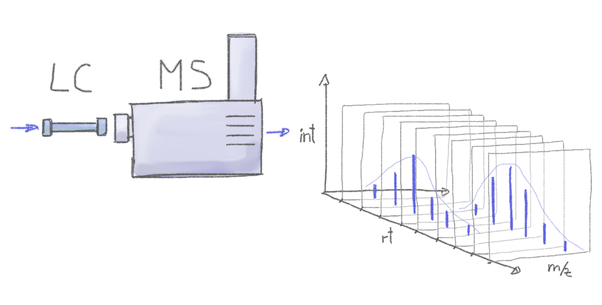

```{r style, message = FALSE, echo = FALSE, warning = FALSE, results = "asis"}
library("BiocStyle")
library("knitr")
library("rmarkdown")
opts_chunk$set(message = FALSE, error = FALSE, warning = FALSE,
               cache = FALSE, fig.width = 7, fig.height = 7)
```

# Abstract

In this document we discuss liquid chromatography (LC) mass spectrometry (MS)
data handling and exploration using the `r Biocpkg("MsExperiment")` and `r
Biocpkg("Spectra")` Bioconductor packages and perform the preprocessing of a
small LC-MS data set using the `r Biocpkg("xcms")` package. In addition we use
functionality from the `r Biocpkg("MetaboCoreUtils")` and `r
Biocpkg("MsCoreUtils")` packages for general tasks frequently performed in
metabolomics data analysis. The first part of the workflow is focused on data
import, access and visualization which is followed by the description of a
simple data centroiding approach and finally the *xcms*-based LC-MS data
preprocessing that comprises chromatographic peak detection, alignment and
correspondence. Data normalization procedures, compound identificatoin and
differential abundance analysis analysis are not covered. Particular emphasis is
given on deriving and defining data-set dependent values for the most crucial
parameters of popular preprocessing methods. The present workflow is only for
illustration purposes, the infrastructure provided by the R packages would allow
to implement custom, data set tailored workflows.


# Introduction

Preprocessing is the first step in the analysis of *untargeted* LC-MS or gas
chromatography (GC)-MS data. The aim of the preprocessing is the quantification
of signals from ions measured in a sample, adjusting for any potential retention
time drifts between samples and the matching of the quantified signal across
samples within an experiment. The resulting two-dimensional matrix with
abundances of the so called *LC-MS features* in all samples can then be further
processed, e.g. by normalizing the data to remove differences due to sample
processing, batch effects or injection order-dependent signal drifts. After
preprocessing, the LC-MS features that are usually only characterized by their
mass-to-charge ration (m/z) and retention time, have to be annotated to the
actual ions and metabolites they represent. Data normalization and annotation
are not covered in this document.


## Mass spectrometry

Mass spectrometry allows to measure abundances of charged molecules (ions) in a
sample. Abundances are determined as ion counts for a specific mass-to-charge
ratio m/z. The measured signal is represented as a spectrum: intensities along
m/z.


Many ions will result, when measured with MS alone, in a very similar m/z making
it difficult or impossible to discriminate them. MS is thus frequently coupled
with a second technology to separate them prior quantification based on
properties other than their mass (e.g. based on their polarity). Common choices
are gas chromatography (GC) or liquid chromatography (LC). In a typical LC-MS
setup a samples gets injected into the system, molecules are separated in the LC
column while the MS instruments continuously (at discrete time points) continues
to measure all ions that get generated from the molecules eluting at
different time points from the LC-column. Molecules get thus separated on two
different dimensions, the retention time dimension (from the LC) and the
mass-to-charge dimension (from the MS) making it easier to measure and identify
molecules in more complex samples.



In such GC/LC-MS based untargeted metabolomics experiments the data is analyzed
along the retention time dimension and *chromatographic* peaks (which are
supposed to represent the signal from ions of a certain type of molecule) are
quantified.


## Definitions and common naming convention

Naming conventions and terms used in this document are:

- *chromatographic peak*: peak containing the signal from an ion in retention
  time dimension (different from a *mass* peak that represents the signal along
  the m/z dimension within a spectrum).
- *chromatographic peak detection*: process in which chromatographic peaks are
  identified within each file.
- *alignment*: process that adjusts for retention time differences
  (i.e. possible signal drifts from the LC) between measurements/files.
- *correspondence*: grouping of chromatographic peaks (presumably from the same
  ion) across files.
- *feature* (or *LC-MS features*): entity representing signal from the same type
  of ion/molecule, characterized by its specific retention time and
  m/z. In *xcms*, features represent identified chromatographic peaks grouped
  across files/samples.


# Data import and exploration

The example data set of this workflow consists of two files in mzML format with
signals from pooled human serum samples measured with a ultra high performance
liquid chromatography (UHPLC) system (Agilent 1290) coupled with a Q-TOF MS
(TripleTOF 5600+ AB Sciex) instrument. Chromatographic separation was based on
hydrophilic interaction liquid chromatography (HILIC) separating metabolites
depending on their polarity. The input files contain all signals measured by
the MS instrument (so called *profile mode* data). To reduce file sizes, the
data set was restricted to an m/z range from 105 to 134 and retention times from
0 to 260 seconds.

In the code block below we first load all required libraries and define the
location of the mzML files, which are part of the *msdata* R package. We also
define a `data.frame` with the names of the mzML files, an arbitrary sample
name, the index in which the respective sample was measured within the LC-MS run
and the sample group of the samples. It is generally suggested to provide all
experiment-relevant phenotypic and technical information through such a data
frame, that could also imported e.g. from an xls sheet using the `read_xlsx`
function from the *readxl* R package, to the `readMsExperiment` function. All
this information will be available, along with the MS data, in the resulting
`MsExperiment` object.

```{r load-data}
library(xcms)
library(MsExperiment)
library(Spectra)

## Define the file names.
fls <- dir(system.file("sciex", package = "msdata"), full.names = TRUE)

## Define a data.frame with additional information on the files.
pd <- data.frame(file = basename(fls),
                 sample = c("POOL_1", "POOL_2"),
                 injection_index = c(1, 19),
                 group = "POOL")
data <- readMsExperiment(fls, sampleData = pd)
data
```

The MS data of the experiment is now *represented* by an `MsExperiment`
object. Phenotype information can be retrieved with the `sampleData` function
from that object.

```{r show-pData}
#' Access phenotype information
sampleData(data)

```

The MS data is stored as a `Spectra` object within the `MsExperiment` and can be
accessed using the `spectra` function.

```{r show-fData}
#' Access the MS data
spectra(data)

```

This `Spectra` object represents the full LC-MS data of the experiment. Each
element in this object is a spectrum (in one sample/file) with all information
provided by the respective original data (mzML) file.


# Basic data access

In this section we explain how the experimental data is represented and how the
MS data can be accessed and visualized.

The whole experimental data, including sample annotations as well as the MS
data, is represented by the `MsExperiment` object. The `length` of such an
object is equal to the number of samples for which data is available in the
object.

```{r general-access}
length(data)

```

Subset the `MsExperiment` will restrict (all) data within the object to the
selected sample(s). To restrict to data from the second sample we use:

```{r}
#' Subset the data
data_2 <- data[2]
data_2
```

This thus subsetted the full data, including sample information and spectra data
to those of the second file.

```{r}
#' Extract sample information
sampleData(data_2)
```

The spectra (and hence MS) data within the object can be accessed with the
`spectra` function.

```{r}
#' Access MS data
spectra(data)
```

In the updated data representation MS data are thus represented with a `Spectra`
object from the `r Biocpkg("Spectra")` package. In the next few examples we
briefly explain the `Spectra` object and illustrate the use of such objects
using some simple examples. More information on `Spectra` objects can be found
in the package's [documentation](https://RforMassSpectrometry.github.io/Spectra)
or the [SpectraTutorials](https://jorainer.github.io/SpectraTutorials). Usage of
`Spectra` in *xcms* has several advantages and adds flexibility to the later
described *xcms*-based data preprocessing. Besides the peak data (*m/z* and
intensity values) also additional spectra variables (metadata) are
available. These can be listed using the `spectraVariables` function. , for
example by listing all available spectra variables using the `spectraVariables`
function. To avoid nested function calls and hence improve the readability of
the code, we use the R pipe operator `|>` that allows to concatenate consecutive
calls in a more readable fashion.

```{r}
#' List available spectra variables
spectra(data) |>
    spectraVariables()
```

For most of these spectra variables dedicated accessor functions are available
(such as `msLevel`, `rtime`) and in addition it is possible to access any
variable using `$` and the name of the variable (like accessing the columns of
a `data.frame`). As an example we extract below the `msLevel` spectra variable
and use the `table` function on that to get an overview of the number of
spectra from different MS levels available in the object.

```{r}
#' List number of spectra per MS level
spectra(data) |>
    msLevel() |>
    table()
```

The present data set contains thus 1,862 spectra, all from MS level 1. In
`Spectra` objects, MS spectra are organized in a linear fashion, i.e. as a
single long list of spectra. The `Spectra` thus contains spectra from both data
files, first all spectra from the first file and then from the second, all in
the order in which they are provided in the original data files (hence generally
ordered by retention time). To access spectra from a specific sample we either
subset the `MsExperiment` to that particular sample or we use the `fromFile`
function that returns the indices of the file within the `MsExperiment` to which
each spectra belongs. Below we subset our object to the first data file, extract
the retention times of the spectra from that file and, by using the `head`
function, display the first 6 of them.

```{r}
#' Display the first 6 retention times of spectra from the first sample
data[1] |>
    spectra() |>
    rtime() |>
    head()
```

Such basic data summaries can be helpful for a first initial quality assessment
to potentially identify problematic data files with e.g. a unexpected low number
of spectra or sparse spectra (i.e. spectra with very few mass peaks). As an
example we list below the number of spectra per file in the present data set
using `fromFile` that, as described above, returns for each spectrum in the data
set the index of the sample/file to which it belongs to.

```{r}
#' Count the number of spectra per file
data |>
    fromFile() |>
    table()
```

We could also check the number of peaks per spectrum in the different data
sets. We use for that the `lengths` function that returns for each spectrum the
number of peaks,

```{r}
#' Get the distribution of peak counts per file
spectra(data) |>
    lengths() |>
    split(fromFile(data)) |>
    lapply(quantile)

```

Thus, for the present data set, the number of spectra and also the number of
peaks per spectra are comparable.

Individual MS spectra can be accessed by subsetting the `Spectra` object
returned by `spectra`. As an example we below subset the data to the second
sample, extract the spectra from that sample and subset to the spectrum number
123.

```{r}
#' Extract one spectrum from the second file
sp <- spectra(data[2])[123]
sp
```

*m/z* and intensity values can be extracted from a `Spectra` using the `mz` and
`intensity` functions that (always) return a list of `numeric` vectors with the
respective values:

```{r}
#' Extract m/z values
mz(sp)
#' Extract intensity values
intensity(sp)
```


# Data visualization

Visualization is crucial for inspection and quality assessment of MS data. For
LC-MS data visualizing a base peak chromatogram (BPC) or total ion chromatogram
(TIC) would for example allow to evaluate the performance of the liquid
chromatography of the various samples in an experiment. To create such a plot we
below extract the BPC from our data. The BPC extracts the maximum peak signal
from each spectrum in a data file and plots this information (on the y-axis)
against the retention time for that spectrum. The BPC can be extracted using the
`chromatogram` function. With parameter `aggregationFun = "max"` we define to
report the maximum signal per spectrum (setting `aggregationFun = "sum"` would
for example sum up all intensities of a spectrum and hence create a TIC).

```{r}
#' Extract and plot a BPC
bpc <- chromatogram(data, aggregationFun = "max")
plot(bpc)
```

This plot hence shows the BPC for each of the two data files (each line
representing one sample) and provides the information at what retention times
signal was measured (thus at what retention times compounds eluted from the LC
column).

The BPC collapsed the 3-dimensional LC-MS data (*m/z* by retention time by
intensity) into 2 dimensions (retention time by intensity). An orthogonal
visualization to this would be a *base peak spectrum* (BPS) that collapses the
data in retention time dimension. Such a visualization could provide information
on the most abundant masses (or rather mass-to-charge values) in the data set
(regardless of the retention time in which they are measured). In contrast to
the BPC it is however not straight forward to create such a visualization: mass
peaks, even if representing signal from the same ion, will never be identical
between consecutive spectra, but will slightly differ based on the measurement
error/resolution of the instrument.

Below we plot the spectra for 2 consecutive scans.

```{r, fig.cap = "Spectra from two consecutive scan of the first file"}
plotSpectra(spectra(data)[123:124], xlim = c(105, 130))
```

These two spectra could now be merged by reporting for each m/z the maximal
signal observed. In *Spectra*, such an operation can be performed with the
`combineSpectra` function. By default, this function will combine spectra in
sets of spectra (that can be defined with parameter `f`) creating an union of
the peaks present in these spectra. For mass peaks with a similar *m/z* value
(depending on parameter `ppm`) the peaks' intensieties are aggregated using the
`intensityFun` function and only one peak is reported. With the setting below we
combine all spectra from one file (by using `f = fromFile(data)`) into a single
spectrum containing mass peaks present in any of the spectra. For mass
peaks with a difference in their *m/z* smaller than `ppm` (parts-per-million of
the *m/z* value) the maximal intensity is reported.

```{r, fig.cap = "Base peak spectrum for each of the two samples."}
bps <- combineSpectra(spectra(data), f = fromFile(data),
                      intensityFun = max, ppm = 10)
plotSpectra(bps)
```

These BPS thus show the most common ions present in each of the two
samples. Apparently there is some overlap in ion content between the two files,
but also some quite distinct signals.

Apart from such general data overview it is also possible (and also suggeested)
to explore the data in more detail. To this end we next focus on a specific
subset of the data were we expect signal for a compound that should be present
in serum samples (such as ions of the molecule serine). With the particular
LC-MS setup used for the present samples, ions for this metabolite are expected
to elute at about 180 seconds. We thus filter below the spectra data using the
`filterRt` function extracting only spectra measured between 180 and 181
seconds.

```{r}
sps <- spectra(data) |>
filterRt(c(180, 181))
sps
```

For the present data set there are `r length(sps)` spectra measured within this
one second in the two samples. By extracting the data as a `Spectra` object we
have however lost now the direct (inherent) association between spectra and
samples of the experiment. We could extract the name of the original data file
from which the data was imported (see example below) and use that to determine
the originating sample, but that would involve additional R code.

```{r}
basename(dataOrigin(sps))
```

Alternatively, we could use the `filterRt` function also directly on the
`MsExperiment` which would subset the `MsExperiment` and hence the link between
samples and spectra would remain intact. Note however that only few filter and
subset functions are at present available for `MsExperiment` objects while a
large variety of useful filters are available for `Spectra`.

```{r}
#' subset the whole MsExperiment
data_sub <- filterRt(data, rt = c(180, 181))
#' extract spectra from the subset for the first sample
spectra(data_sub[1L])
```

For the present purpose it is however not important to keep the sample
association intact and we thus proceed to plot the previously extracted spectra.

```{r, fig.cap = "MS1 spectra measured between 180 and 181 seconds"}
plotSpectra(sps)
```

We can immediately spot several mass peaks in the spectrum, with the largest one
at an m/z of about 130 and the second largest at about 106, which could
represent signal for an ion of
[Serine](https://en.wikipedia.org/wiki/Serine). Below we calculate the exact
(monoisotopic) mass for serine from its chemical formula *C3H7NO3* using the
`calculateMass` function from the `r Biocpkg("MetaboCoreUtils")` package.

```{r}
library(MetaboCoreUtils)
mass_serine <- calculateMass("C3H7NO3")
mass_serine
```

The *native* serine molecule is however uncharged and can thus not be measured
by mass spectrometry. In order to be detectable, molecules need to be first
ionized before being injected in an MS instrument. While different ions can (and
will) be generated for a molecule, one of the most commonly created ions in
positive polarity is the *[M+H]+* ion (protonated ion). To calculate the m/z
values for specific ions/adducts of molecules, we can use the `mass2mz`
function, also from the *MetaboCoreUtils* package. Below we calculate the m/z
for the *[M+H]+* ion of serine providing the monoisotopic mass of that molecule
and specifying the ion we are interested in. Also other types of adducts are
supported. These could be listed with the `adductNames` function
(`adductNames()` for all positively charged and `adductNames("negative")` for
all negatively charge ions).

```{r}
serine_mz <- mass2mz(mass_serine, "[M+H]+")
serine_mz
```

The `mass2mz` function **always** returns a `matrix` with columns reporting the
m/z for the requested adducts of the molecules which are available in the
rows. Since we requested a single ion we reduce this `matrix` to a single
`numeric` value.

```{r}
serine_mz <- serine_mz[1, 1]
```

We can now use this information to subset the MS data to the signal recorded for
all ions with that particular m/z. We use again the `chromatogram` function and
provide the m/z range of interest with the `mz` parameter.

```{r, fig.cap = "Ion trace for an ion of serine"}
#' Extract an full RT chromatogram for ions with an m/z similar than serine
serine_chr <- chromatogram(data, mz = serine_mz + c(-0.05, 0.05))
plot(serine_chr)
```

A strong signal is visible around a retention time of 180 seconds which very
likely represents signal for the *[M+H]+* ion of serine. Note that, if the
retention time of a molecule for a specific LC-MS setup is not known beforehand,
extracting such chromatograms for the m/z of interest and the full retention
time range can help determining its likely retention time.

The object returned by the `chromatogram` function arranges the individual
`Chromatogram` objects (one per sample) in a two-dimensional array, columns
being samples (files) and rows data slices (i.e. m/z - rt ranges). This type of
data representation is likely to be replaced in future with a more efficient and
flexible data structure similar to `Spectra`. Data from the individual
chromatograms can be accessed using the `intensity` and `rtime` functions
(similar to the `mz` and `intensity` functions for a `Spectra` object).

```{r chromatogram}
#' get intensity and retention times for the chromatogram of the first
#' sample
ints <- intensity(serine_chr[1, 1])
head(ints)

rts <- rtime(serine_chr[1, 1])
head(rts)
```

At last we further focus on the tentative signal of serine extracting the ion
chromatogram restricting on the retention time range containing its
signal. While we could also pass the retention time and m/z range with
parameters `rt` and `mz` to the `chromatogram` function we instead filter the
whole experiment by retention time and m/z before calling `chromatogram` on the
such created data subset. With the example code below we thus create an
extracted ion chromatogram (EIC, sometimes also referred to as XIC) for the
*[M+H]+* ion of serine.

```{r, fig.cap = "Extracted ion chromatogram for serine."}
#' Create an EIC for serine
data |>
filterRt(rt = c(175, 189)) |>
filterMz(mz = serine_mz + c(-0.05, 0.05)) |>
chromatogram() |>
plot()
```

The area of such a chromatographic peak is supposed to be proportional to the
amount of the corresponding ion in the respective sample and identification and
quantification of such peaks is one of the goals of the LC-MS data
preprocessing. This workflow could be repeated on several expected ions as an
initial data inspection step.


# Centroiding of profile MS data

MS instruments allow to export data in profile or centroid mode. Profile data
contains the signal for all discrete m/z values (and retention times) for which
the instrument collected data [@Smith:2014di]. MS instruments continuously
sample and record signals and a mass peak for a single ion in one spectrum will
thus consist of a multiple intensities at discrete m/z values. Centroiding is
the process to reduce these mass peaks to a single representative signal, the
centroid. This results in much smaller file sizes, without loosing too much
information. *xcms*, specifically the *centWave* chromatographic peak detection
algorithm, was designed for centroided data, thus, prior to data analysis,
profile data, such as the example data used here, should be centroided.

Below we inspect the profile data for one of the spectra extracted above and
focus on the mass peak for serine.

```{r}
sps[1] |>
    filterMzRange(c(106.02, 106.07)) |>
    plotSpectra()
```

Instead of a single peak, several mass peaks were recorded by the MS instrument
with an m/z very close to the theoretical one for the *[M+H]+* ion of serine. We
can also visualize this information in a different fashion: the `plot` function
for `MsExperiment` generates a two-dimensional visualization of the
three-dimensional LC-MS data: peaks are drawn at their respective location in
the two-dimensional *m/z* *vs* retention time plane with their intensity being
color coded. Below we subset the data to the *m/z* - retention time region
containing signal for serine and visualize the full MS data measured for that
region in both data files.

```{r serine-profile-mode-data, fig.cap = "Profile data for Serine.", fig.width = 10, fig.height = 5, fig.pos = "h!"}
data |>
filterRt(rt = c(175, 189)) |>
filterMz(mz = c(106.02, 106.07)) |>
plot()
```

The lower panel of the plot shows all mass peaks measured by the instrument,
each *column* of data points representing the signal measured at one discrete
time point (i.e. from one spectrum) with the intensities encoded with a color
scale (blue representing low, yellow high intensity). The upper panel of the
plot shows a chromatographic visualization of the data from the lower panel,
i.e., for each retention time (spectrum) the sum of intensities is shown.

Note that, while it would be possible to create such a plot for the full MS data
of an experiment, this type of visualization works best for subsets of the data.

Next we *smooth* the data in each spectrum using a Savitzky-Golay filter, which
usually improves data quality by reducing noise. Subsequently we perform the
centroiding of the data based on a simple peak-picking strategy that reports the
maximum signal for each mass peak in each spectrum and replace the spectra data
in our data (`MsExperiment`) object. Finally, we create the previous data
visualization also on the such centroided data.

```{r centroiding, fig.cap = "Centroided data for Serine.", fig.width = 10, fig.height = 5, fig.pos = "h!"}
#' Smooth and centroid the spectra data
sps_cent <- spectra(data) |>
smooth(method = "SavitzkyGolay", halfWindowSize = 6L) |>
pickPeaks(halfWindowSize = 2L)

#' replace spectra
spectra(data) <- sps_cent

#' Plot the centroided data for Serine
data |>
filterRt(rt = c(175, 189)) |>
filterMz(mz = c(106.02, 106.07)) |>
plot()
```

The impact of the centroiding is clearly visible: each signal for an ion in a
spectrum was reduced to a single data point. For more advanced centroiding
options that can also fine-tune the *m/z* value of the reported centroid see the
documentation of the `pickPeaks` function or the centroiding vignette of the `r
Biocpkg("MSnbase")` package.

While we could now simply proceed with the data analysis, we below save the
centroided MS data to mzML files to also illustrate how the *Spectra* package
can be used to export MS data.

```{r export-centroided-prepare, echo = FALSE, results = "hide"}
#' Silently removing exported mzML files if they do already exist.
lapply(basename(unique(dataOrigin(spectra(data)))), function (z) {
    if (file.exists(z))
        file.remove(z)
})
```

We use the `export` function on our centroided `Spectra` object, defining the
output format with `backend = MsBackendMzR()` to export the data to files in
mzML format. With the additional parameter `file` we provide the names
of these files. For the present example we simply use the file names (without
path) of the input file names, hence exporting the data to files located in the
current working directory.

```{r export-centroided}
#' Export the centroided data to new mzML files.
export(spectra(data), backend = MsBackendMzR(),
       file = basename(dataOrigin(spectra(data))))

```

We can then import the centroided data again from the newly generated mzML
files and proceed with the analysis.

```{r}
#' Re-import the centroided data.
fls <- basename(fls)

#' Read the centroided data.
data <- readMsExperiment(fls, sampleData = pd)
```


# Preprocessing of LC-MS data

Preprocessing of (untargeted) LC-MS data aims at detecting and quantifying the
signal from ions generated from all molecules present in a sample. It consists
of the 3 main steps *chromatographic peak detection*, *alignment* (also called
retention time correction) and *correspondence* (also called peak grouping). The
resulting matrix of feature abundances can then be used as an input in
downstream analyses including data normalization, identification of features of
interest and annotation of features to metabolites.


## Chromatographic peak detection

Chromatographic peak detection aims to identify peaks along the retention time
axis that represent the signal from individual compounds' ions. This involves
identifying and quantifying such signals as shown in the sketch below.


Such peak detection can be performed with the *xcms* package using its
`findChromPeaks` function. Several peak detection algorithms are available that
can be selected and configured with their specific parameter objects:

- `MatchedFilterParam` to perform peak detection as described in the original
  *xcms* article [@Smith:2006ic],
- `CentWaveParam` to perform a continuous wavelet transformation (CWT)-based
  peak detection [@Tautenhahn:2008fx] and
- `MassifquantParam` to perform a Kalman filter-based peak detection
  [@Conley:2014ha].

Additional peak detection algorithms for direct injection data are also
available in *xcms*, but not discussed here.

In our example we use the *centWave* algorithm that performs peak detection in
two steps: first it identifies *regions of interest* in the *m/z* - retention
time space and subsequently detects peaks in these regions using a continuous
wavelet transform (see the original publication [@Tautenhahn:2008fx] for more
details). The algorithm can be configured with several parameters (see
`?CentWaveParam`), with the most important being `peakwidth` and
`ppm`. `peakwidth` defines the minimal and maximal expected width of the peak in
retention time dimension and depends thus on the setup of the employed LC-MS
system making this parameter highly data set dependent. `ppm` on the other hand
depends on the precision of the MS instrument. In this section we describe how
settings for these parameters can be empirically determined for a data set.

Generally, it is strongly discouraged to blindly use the default parameters for
any of the peak detection algorithms. To illustrate this we below extract the
EIC for serine and run a *centWave*-based peak detection on that data using
*centWave*'s default settings.

```{r centWave-default}
#' Get the EIC for serine in all files
serine_chr <- chromatogram(data, rt = c(164, 200),
                           mz = serine_mz + c(-0.05, 0.05),
                           aggregationFun = "max")

#' Get default centWave parameters
cwp <- CentWaveParam()

#' "dry-run" peak detection on the EIC.
res <- findChromPeaks(serine_chr, param = cwp)
chromPeaks(res)
```

The peak matrix returned by `chromPeaks` is empty, thus, with the default
settings *centWave* failed to identify any chromatographic peak in the EIC for
serine. These default values are shown below.

```{r centWave-default-parameters}
cwp
```

In particularl the default value for `peakwidth` does not fit our data. The
default for this parameter expects chromatographic peaks between 20 and 50
seconds wide. The LC-MS setup used to create the present data set results
however in much shorter chromatographic peaks:

```{r, fig.cap = "Extracted ion chromatogram for serine."}
plot(serine_chr)
```

For serine, the chromatographic peak is thus about 5 seconds wide. We thus adapt
the `peakwidth` for the present data set and repeat the peak detection using
these settings. In general, the lower and upper peak width should be set to
include most of the chromatographic peak widths. For the present data set we set
the values to 2 to 10 seconds. In addition, by setting `integrate = 2`, we
select a different peak boundary estimation algorithm. This works particularly
well for non-gaussian peak shapes and ensures that also signal from peak's tail
is integrated (eventually re-run the code with the default `integrate = 1` to
compare the two approaches).

```{r centWave-adapted, fig.cap = "EIC for Serine with detected chromatographic peak", results = "hide"}
cwp <- CentWaveParam(peakwidth = c(2, 10), integrate = 2)

serine_chr <- findChromPeaks(serine_chr, param = cwp)

#' Plot the data and higlight identified peak area
plot(serine_chr)
```

Acceptable values for parameter `peakwidth` can thus be derived through visual
inspection of EICs for ions known to be present in the sample (e.g. of internal
standards). Ideally, this should be done for several compounds/ions.

With our data set-specific `peakwidth` we were able to detect the peak for
serine (highlighted in grey in the plot above). We can now use the `chromPeaks`
function to extract the information on identified chromatographic peaks from our
object.

```{r chromPeaks-chromatogram}
chromPeaks(serine_chr)
```

The result is returned as a `matrix` with each row representing one identified
chromatographic peak. The retention time and m/z ranges of the peaks are
provided in columns `"rtmin"`, `"rtmax"`, `"mzmin"` and `"mzmax"`, the
integrated peak area (i.e., the *abundance* of the ion) in column `"into"`, the
maximal signal of the peak in column `"maxo"` and the signal to noise ratio in
column`"sn"`. With our adapted settings we were thus able to identify a
chromatographic peak for the serine ion in each of the two samples.

The second important parameter for *centWave* is `ppm` which is used in the
initial definition of the *regions of interest* (ROI) in which the actual peak
detection is then performed. To define these ROI, the algorithm evaluates for
each mass peak in a spectrum whether a mass peak with a similar *m/z* (and a
reasonable high intensity) is also found in the following spectrum. For this,
only mass peaks with a difference in their *m/z* smaller than `ppm` in
consecutive scans are considered. To illustrate this, we plot again the full
MS data for the data subset containing signal for serine.

```{r Serine-mz-scattering-plot}
#' Restrict the data to signal from Serine
srn <- data |>
filterRt(rt = c(179, 186)) |>
filterMz(mz = c(106.04, 106.07))

#' Plot the data
plot(srn)
```

We can observe some scattering of the data points around an *m/z* of 105.05 in
the lower panel of the above plot. This scattering also decreases with
increasing signal intensity (as for many MS instruments the precision of the
signal increases with the intensity). To investigate the observed differences in
*m/z* values for the signal of serine we below first subset the data to the
first file and then restrict the *m/z* range further to values between 106.045
and 106.055.

```{r}
#' Reduce the data set to signal of the [M+H]+ ion of serine
srn_1 <- srn[1] |>
    filterMzRange(c(106.045, 106.055)) |>
    spectra()
```

This restricted the MS data to spectra with a single mass peak per spectrum
(presumably representing signal from the serine ion).

```{r}
lengths(srn_1)
```

We next extract the *m/z* values of the peaks from the consecutive scans and
calculate the absolute difference between them.

```{r}
#' Calculate the difference in m/z values between scans
mz_diff <- srn_1 |>
    mz() |>
    unlist() |>
    diff() |>
    abs()
mz_diff
```

We can also express these differences in ppm (parts per million) of the average
m/z of the peaks.

```{r}
mz_diff * 1e6 / mean(unlist(mz(srn_1)))
```

The difference in *m/z* values for the serine data is thus between 0 and 27
ppm. The maximum value could then be used for centWave's `ppm`
parameter. Ideally, this should be evaluated for several ions and could be set
to a value that allows to capture the full chromatographic peaks for most of the
tested ions. We can next perform the peak detection on the full data set using
our settings for the `ppm` and `peakwidth` parameters.

```{r findPeaks-centWave}
#' Perform peak detection
cwp <- CentWaveParam(peakwidth = c(2, 10), ppm = 30, integrate = 2)
data <- findChromPeaks(data, param = cwp)
```

The results form the chromatographic peak detection were added by the
`findChromPeaks` to our `data` variable which now is an
`XcmsExperiment` object that, by extending the `MsExperiment` class inherits all
of its functionality and properties, but in addition contains also all *xcms*
preprocessing results.

```{r}
data
```

We can extract the results from the peak detection step (as above) with the
`chromPeaks` function. The optional parameters `rt` and `mz` would allow in
addition to extract peak detection results for a specific *m/z* - retention time
region. In our example we extract all chromatographic peaks between a *m/z*
range from 106 to 108 and a retention time from 150 to 190.

```{r xcmsnexp}
#' Access the peak detection results from a specific m/z - rt area
chromPeaks(data, mz = c(106, 108), rt = c(150, 190))
```

Again, each row in this matrix contains one identified chromatographic peak with
columns `"mz"`, `"mzmin"`, `"mzmax"`, `"rt"`, `"rtmin"` and `"rtmax"` defining
it's *position* (and size) in the *m/z*-rt plane and `"into"` and `"maxo"` its
(integrated and maximum) intensity. Column `"sample"` indicates in which of our
samples (data files) the peak was identified.

The chromatographic peak table above contains pairs of peaks with similar
retention times and a difference in *m/z* values of about one. Together with the
observed differences in intensities, this could indicate that one of the peaks
represents the carbon 13 isotope and one the monoisotopic *main* peak. This is
frequently observed in untargeted metabolomics.

As a general overview of the peak detection results it can also be helpful to
determine (and eventually) plot the number of identified chromatographic peaks
per sample. Below we count the number of peaks per sample.

```{r}
chromPeaks(data)[, "sample"] |>
    table()
```

About the same number of peaks was identified, which is to be expected since
both files contain measurements from the same QC sample pool.

As an additional visual quality assessment, we can also plot the location of the
identified chromatographic peaks in the *m/z*-retention time space for each data
file using the `plotChromPeaks` function.

```{r plotChromPeaks, fig.cap = "Location of the identified chromatographic peaks in the m/z - rt space.", fig.height = 7, fig.width = 12}
par(mfrow = c(1, 2))
plotChromPeaks(data, 1)
plotChromPeaks(data, 2)
```

Again, similar pattern are expected to be present for the two data files.

After chromatographic peak detection it is generally a good idea to visually
inspect individual chromatographic peaks to evaluate the performance of the peak
detection step. This could be done by plotting EICs of known compounds/ions in
the data or by randomly selected chromatographic peaks. To illustrate this we
define below a matrix with *m/z* and retention time ranges for a set of
(pre)selected peaks. The same matrix could also be created for randomly selected
peaks or it could also be defined manually. For our example we further expand
the retention time and *m/z* ranges of the peaks, extract the EICs with the
`chromatogram` function and finally plot these. Identified chromatographic peaks
within the plotted regions will by default be highlighted in a semitransparent
grey color.

```{r}
#' Extract m/z-rt regions for selected peaks
mz_rt <- chromPeaks(data)[c("CP172", "CP100", "CP325", "CP618"),
                          c("rtmin", "rtmax", "mzmin", "mzmax")]
#' Expand the rt range by 10 seconds on both sides
mz_rt[, "rtmin"] <- mz_rt[, "rtmin"] - 10
mz_rt[, "rtmax"] <- mz_rt[, "rtmax"] + 10
#' Expand the m/z range by 0.005 on both sides
mz_rt[, "mzmin"] <- mz_rt[, "mzmin"] - 0.005
mz_rt[, "mzmax"] <- mz_rt[, "mzmax"] + 0.005

#' Extract the EICs
eics <- chromatogram(data, rt = mz_rt[, c("rtmin", "rtmax")],
                     mz = mz_rt[, c("mzmin", "mzmax")])
#' Plot the EICs
plot(eics)
```

While the peak detection worked nicely for the signals in the upper row, it
failed to define chromatographic peaks containing the full signal in the lower
row. In both cases, the signal was split into separate chromatographic
peaks. This is a common problem with *centWave* on noisy and broad signals. We
could either try to adapt the *centWave* settings and repeat the chromatographic
peak detection or use the `refineChromPeaks` function that allows to
post-process peak detection results and fix problems such as those observed
above (see also the documentation of the `refineChromPeaks` function for all
possible refinement options). To fuse the wrongly split peaks in the second row,
we use the `MergeNeighboringPeaksParam` algorithm and configure it to merge all
chromatographic peaks with a similar *m/z* that are less than 8 seconds apart
from each other on the retention time axis (parameter `expandRt = 4`, distance
tail to head of the peaks should thus be less than `2 * expandRt`) and for which
the signal (intensity) between the two peaks is higher than 75% of the smaller
apex intensity of the two peaks (parameter `minProp = 0.75`). We below apply
these settings on the EICs and evaluate the result of this post-processing.

```{r}
#' Define the setting for the peak refinement
mpp <- MergeNeighboringPeaksParam(expandRt = 4, minProp = 0.75)

#' Perform the peak refinement on the EICs
eics <- refineChromPeaks(eics, param = mpp)

#' Plot the result
plot(eics)
```

The peak post-processing was able to fuse the signal for the neighboring peaks
in the lower panel, while keeping the peaks for the different isomers present in
the top right plot separate. We thus next apply the peak refinement on the full
data set.

```{r}
data <- refineChromPeaks(data, param = mpp)
```


## Alignment

While chromatography helps to better discriminate between analytes it is also
affected by variances that lead to shifts in retention times between measurement
runs. Such differences can usually already be seen in a base peak chromatogram
or total ion chromatogram. We thus extract and plot below the BPC for our data
set. In the `chromatogram` call, we set the optional parameter `chromPeaks =
"none"` to avoid the additional extraction of all identified chromatographic
peaks.

```{r alignment-bpc-raw, fig.cap = "BPC of all files.", fig.width = 8, fig.height = 4}
#' Extract base peak chromatograms
bpc_raw <- chromatogram(data, aggregationFun = "max", chromPeaks = "none")
plot(bpc_raw, peakType = "none")
```

Small drifts are visible in the BPC of the two files. These were also already
visible in the EIC for serine, that we plot again below.

```{r}
plot(serine_chr, xlim = c(175, 190))
grid()
```

For the serine signal, there seems to be a retention time shift of about 1
second. The alignment step aims to minimize these retention time differences
between all samples within an experiment.


In *xcms*, the alignment can be performed with the `adjustRtime` function and
one of the available alignment algorithms, that can be selected, and configured,
with the respective parameter objects:

- `PeakGroupsParam`: the *peakGroups* [@Smith:2006ic] method aligns samples
  based on the retention times of a set of so called *hook peaks* (or
  housekeeping peaks) in the different samples of an experiment. These peaks are
  supposed to represent signal from ions expected to be present in most samples
  and the method aligns the samples by minimizing the present differences
  between the retention times of these peaks.

- `ObiwarpParam`: *obiwarp* [@Prince:2006jj] performs retention time adjustment
  based on the full *m/z* - retention time data. See the documentation for
  `ObiwarpParam` or the *xcms*
  [vignette](https://bioconductor.org/packages/release/bioc/vignettes/xcms/inst/doc/xcms.html)
  for more information.

While, by default, retention time shifts are estimated on the full data set, it
would also be possible to estimate them on a subset of samples, such as
repeatedly measured QC samples (e.g. sample pools) and adjust the full
experiment based on these. See the alignment section in the *xcms*
[vignette](https://bioconductor.org/packages/release/bioc/vignettes/xcms/inst/doc/xcms.html)
for more information on this subset-based alignment.

For our example we use the *peakGroups* method that, as mentioned above, aligns
samples based on the retention times of *hook peaks* (or housekeeping peaks). To
define these we need however to first group detected chromatographic peaks
across samples using an initial correspondence analysis. Below we use the
*peakDensity* method for correspondence. Details about this method and
explanations on the choices of its parameters are provided in the next
section. In brief, parameter `sampleGroups` defines to which sample group of the
experiment individual samples belong to, and parameter `minFraction` specifies
the proportion of samples (of one sample group) in which a chromatographic peak
needs to be identified (for a particular *m/z* - retention time region) to group
them into an LC-MS feature. For our example we use the sample group definition
in `sampleData` of our `data` variable for parameter `sampleGroups` and set
`minFraction = 1` requiring thus a chromatographic peak to be identified in both
samples to define a feature. If a subset alignment is performed on
e.g. repeatedly measured QC samples, the `minFraction` parameter could be set as
high as 0.8 or 0.9 while otherwise lower values might be advisable. Since the
aim of this initial correspondence is to define some (presumably well separated)
groups of chromatographic peaks across the samples, its settings don't need to
be fully optimized.

```{r}
#' Define the settings for the initial peak grouping - details for
#' choices in the next section.
pdp <- PeakDensityParam(sampleGroups = sampleData(data)$group, bw = 1.8,
                        minFraction = 1, binSize = 0.02)
data <- groupChromPeaks(data, pdp)
```

This step now grouped chromatographic peaks across samples and defined so called
LC-MS features (or simply features). We can thus now run the alignment using the
*peakGroups* algorithm. Parameter `minFraction` can be used to control the
selection of the hook peaks. By setting `minFraction = 1` all features with
identified chromatographic peaks in every sample will be used as hook peaks. The
algorithm will minimize the between sample differences in retention time for all
of these peaks. Parameter `span` defines the degree of smoothing of the loess
function that is used to allow different regions along the retention time axis
to be adjusted by a different factor. A value of 0 will most likely cause
overfitting, while 1 would cause all retention times of a sample to be shifted
by a constant value. Values between 0.4 and 0.6 seem to be reasonable for most
experiments.

```{r alignment-correspondence}
#' Define settings for the alignment
pgp <- PeakGroupsParam(minFraction = 1, span = 0.6)
data <- adjustRtime(data, param = pgp)
```

Alignment did not only adjust retention times of the individual (MS1) spectra of
all files, but also adjusted the retention times of the identified
chromatographic peaks, as well as the retention times of possibly present MS2
spectra. The adjusted retention times are stored as a new spectra variable
`"rtime_adjusted"` in the result object's `Spectra`. The `rtime` function on the
result object will also by default return these values.

After alignment it is suggested to evaluate its results using the
`plotAdjustedRtime` function. This function plots the differences between
adjusted and raw retention times for each sample on the y-axis along the
adjusted retention times on the x-axis. Points indicate the position of
individual hook peaks along the retention time axis, with a dotted line
connecting the peaks belonging to the same feature (for which the algorithm
minimized the difference in retention times).

```{r alignment-result, fig.width = 8, fig.height = 4, fig.cap = "Alignment results."}
#' Plot the difference between raw and adjusted retention times
plotAdjustedRtime(data)
grid()
```

As a rule of thumb, the differences between raw and adjusted retention
times in the plot above should be reasonable. Also, if possible, hook peaks
should be present along a wide span of the retention time range, to avoid
the need for extrapolation (which usually results in a too strong adjustment).

For our example, the largest adjustments are between 1 and 2 seconds, which is
reasonable given that the two samples were measured on the same day. Also,
features used for the alignment (i.e. hook peaks) are spread across the full
retention time range. To evaluate the impact of the alignment we next also plot
the BPC before and after alignment.

```{r bpc-raw-adjusted, fig.cap = "BPC before (top) and after (bottom) alignment.", fig.width = 10, fig.height = 8}
par(mfrow = c(2, 1))
#' Plot the raw base peak chromatogram
plot(bpc_raw)
grid()
#' Plot the BPC after alignment
plot(chromatogram(data, aggregationFun = "max", chromPeaks = "none"))
grid()
```

The base peak chromatograms are nicely aligned after retention time
adjustment. In addition to this general assessment, the alignment result should
also be evaluated for selected compounds (or internal standards). We thus below
plot the EIC for the *[M+H]+* ion for serine before and after alignment.

```{r serine-xic-adjusted, fig.cap = "EIC for Serine before (left) and after (right) alignment", fig.width = 10, fig.height = 4}
par(mfrow = c(1, 2), mar = c(4, 4.5, 1, 0.5))
plot(serine_chr)
grid()
#' EIC after alignment
serine_chr_adj <- chromatogram(data, rt = c(164, 200),
                               mz = serine_mz + c(-0.05, 0.05),
                               aggregationFun = "max")
plot(serine_chr_adj)
grid()
```

The serine peaks are also nicely aligned after retention time adjustment.


## Correspondence

The final step of the LC-MS preprocessing with *xcms* is the correspondence
analysis, in which chromatographic peaks from the same types of ions (compounds)
are grouped across samples to form a so called *LC-MS features*.


In *xcms*, correspondence is performed using the `groupChromPeaks` function. The
correspondence algorithm can be selected and configured with the respective
parameter objects:

- `NearestPeaksParam`: performs peak grouping based on the proximity of
  chromatographic peaks from different samples in the *m/z* - retention time
  space, similar to the original correspondence method of *mzMine*
  [@Katajamaa:2006jh].

- `PeakDensityParam`: performs a simple and fast correspondence analysis based
  on the density of chromatographic peaks (from different samples) along the
  retention time axis within slices of small *m/z* ranges [@Smith:2006ic].

Both methods group chromatographic peaks from different samples with similar
*m/z* and retention times into features. For our example we use the *peak
density* method. This algorithm iterates through small slices along the *m/z*
dimension and groups within each slice chromatographic peaks with similar
retention times. The grouping depends on the distribution (density) of
chromatographic peaks from all samples along the retention time axis. Peaks with
similar retention time will result in a higher peak density at a certain
retention time and are thus grouped together. The grouping depends on the
*smoothness* of the density curve and can be configured with parameter `bw`.

An illustration of this is shown in the sketch below.


Settings for this type correspondence algorithm can be tested and evaluated in
EICs. We thus below extract a chromatgram for a *m/z* slice containing signal
for a *[M+H]+* ion of serine and evaluate the correspondence on that slice using
the `plotChromPeakDensity` function with default parameters for the
*peakDensity* method and using the sample group assignment defined in
`sampleData`.

```{r}
#' Extract a chromatogram for a m/z range containing serine
chr_1 <- chromatogram(data, mz = serine_mz + c(-0.005, 0.005))

#' Default parameters for peak density; bw = 30
pdp <- PeakDensityParam(sampleGroups = sampleData(data)$group, bw = 30)

#' Test these settings on the extracted slice
plotChromPeakDensity(chr_1, param = pdp)
```

The upper panel in the plot above shows the chromatographic data with the
identified peaks. The lower panel plots the retention time of identified
chromatographic peaks on the x-axis against the index of the sample in which the
peak was identified. Each chromatographic peak is thus indicated with a point in
that plot. In our example there was one chromatographic peak identified in each
sample at a retention time of about 180 seconds and these two peaks are thus
shown. The black solid line represents the density estimation (distribution) of
the identified chromatographic peaks along the retention time. The smoothness of
this curve (which is created with the base R `density` function) is configured
with the parameter `bw`. The *peakDensity* algorithm assigns all chromatographic
peaks within the same *peak* of this density estimation curve to the same
feature. Chromatographic peaks assigned to the same feature are indicated with a
grey rectangle in that plot (for the present example, because retention times of
the two chromatographic peaks are very similar, this rectangle is very narrow
and looks more like a vertical line). The default settings thus seem to
correctly define features. It is however advisable to evaluate settings on
multiple, not a single example slice. We thus below extract a chromatogram for
an *m/z* slice containing signal for known isomers betaine and valine.

```{r correspondence-bw, fig.cap = "Correspondence analysis with default settings on an m/z slice containing signal from multiple ions.", fig.width = 10, fig.height = 7}
#' Plot the chromatogram for an m/z slice containing betaine and valine
mzr <- 118.08625 + c(-0.01, 0.01)
chr_2 <- chromatogram(data, mz = mzr, aggregationFun = "max")

#' Correspondence in that slice using default settings
plotChromPeakDensity(chr_2, param = pdp)
```

This slice contains signal from several ions resulting in multiple
chromatographic peaks along the retention time axis. With the default settings,
in particular `bw = 30`, all these peaks were however assigned to the same
feature (indicated with the grey rectangle). We repeat the analysis below with a
strongly reduced value for parameter `bw`.

```{r correspondence-bw-fix, fig.cap = "Correspondence analysis with reduced bw setting on a m/z slice containing signal from multiple ions.", fig.width = 10, fig.height = 7}
#' Reducing the bandwidth
pdp <- PeakDensityParam(sampleGroups = sampleData(data)$group, bw = 1.8)
plotChromPeakDensity(chr_2, param = pdp)
```

The `bw = 1.8` strongly reduced the smoothness of the density curve resulting in
a higher number of density *peaks* and hence a nice grouping of (aligned)
chromatographic peaks into separate features. Note that the height of the peaks
of the density curve are not considered for the grouping. By having defined a
`bw` appropriate for our data set we proceed and perform the correspondence
analysis on the full data set. Other parameters of *peakDensity* are `binSize`
and `minFraction`. The former defines the *m/z* widths of the slices along the
*m/z* dimension the algorithm will iterate through. This value depends on the
resolution (and noise) of the instrument, and should not be set to a too small
value, but also not too large (to avoid peaks from different ions, with slightly
different *m/z* but similar retention times, to be grouped into the same
feature). The `minFraction` parameter (already discussed above) defines the
proportion of samples within at least one sample group in which chromatographic
peaks need to be identified in order to define a feature. For our example we use
a `binSize = 0.02` hence grouping chromatographic peaks, with similar retention
time, and with a difference in their *m/z* which is smaller than 0.02 into the
same feature and `minFraction = 0.4` thus features will be defined if a
chromatographic peak was identified in 50% of the samples (hence in at least on
for the present data set).

```{r correspondence-analysis}
#' Define settings
pdp <- PeakDensityParam(sampleGroups = sampleData(data)$group, bw = 1.8,
                        minFraction = 0.4, binSize = 0.02)

#' Perform the correspondence analysis
data <- groupChromPeaks(data, param = pdp)
data
```

Over 300 features were thus identified in the present data set. Again, it is
suggested to evaluate the results again for selected compounds/ions. We thus
extract below again a chromatogram for an *m/z* range containing signals for
betaine and valine (and several additional ions). After a correspondence
analysis also features are extracted by the `chromatogram` call and we can show
the results from the actual correspondence analysis (based also on the settings
that were used) by setting `simulate = FALSE` in the `plotChromPeakDensity`
call.

```{r correspondence-evaluate, fig.cap = "Result of correspondence on a slice containing the isomers valine and betaine.", fig.width = 10, fig.heigt = 7}
#' Extract chromatogram including signal for betaine and valine
chr_2 <- chromatogram(data, mz = 118.08625 + c(-0.01, 0.01),
                      aggregationFun = "max")
plotChromPeakDensity(chr_2, simulate = FALSE)

```

We evaluate the results also on a different slice containing signal for ions
from isomers leucine and isoleucine.

```{r correspondence-evaluate-2, fig.cap = "Result of correspondence on a slice containing the isomers leucine and isoleucine.", fig.width = 10, fig.heigt = 7}
#' Extract chromatogram with signal for isomers leucine and isoleucine
chr_3 <- chromatogram(data, mz = 132.10191 + c(-0.01, 0.01),
                      aggregationFun = "max")
plotChromPeakDensity(chr_3, simulate = FALSE)
```

Despite being very close, chromatographic peaks of the two isomers were
successfully grouped into separate features. Even the partially overlapping
signal from a third ion eluting at about the same time and hence partially
overlapping with the peak at a retention time of about 152 seconds was grouped
into its own feature. It is at the discretion of the data analysts to define how
fine or coarse the feature grouping should be. Especially for larger
experiments, with more samples and also larger variation in retention time it
might not always be possible to completely separate all closely eluting ions
from each other and sometimes it might be acceptable to group them into a single
feature (keeping in mind that it could however represent signal from different
ions/compounds).

Similar to the peak detection and alignment results, also the results from the
correspondence analysis were added to the `XcmsExperiment` object. These
can be extracted with the `featureDefinitions` function, that extracts the
*definition* of the LC-MS features and the `featureValues` function that
extracts the numerical matrix with the feature abundances (in all
samples). Below we extract the definition of the features and display the first
6 rows

```{r correspondence-featureDefinitions}
#' Definition of the features
featureDefinitions(data) |> head()
```

Each row defines one feature and provides information on it's *m/z* (column
`"mzmed"`) and retention time (column `"rtmed"`). Additional columns list the
number of chromatographic peaks that were assigned to the feature and the MS
level. Column `"peakidx"` provides the indices of the chromatographic peaks in
the `chromPeaks` matrix that were assigned to the feature - but generally users
will not need or extract that information. The feature abundance matrix, which
is the final result of the *xcms* preprocessing, can be extracted with the
`featureValues` function. By default, with parameter `method = "maxint"`, it
returns for each feature the integrated peak signal of the chromatographic peak
with the highest signal per sample. Note that this has only an effect for
features with more than one chromatographic peak per sample (i.e., if multiple
chromatographic peaks in the **same** sample were grouped into the same feature
because of their closeness in retention time). An alternative to the above
mentioned default would be to set `method = "sum"` that would sum the
intensities for such multi-peak features. Below we extract the feature
abundances and show the first 6 rows.

```{r}
featureValues(data, method = "sum") |> head()
```

We could now use this feature matrix for any downstream analysis. Such feature
matrix might however, as can also be seen for the second row (feature *FT002*),
contain missing values. These represent features for which no chromatographic
peak was identified in one (or more) sample(s). While a number of methods exist
to deal with such missing values, it might be sometimes more advisable to
*rescue* signal instead of imputing it. This will be explained in the next
section.


## Gap filling

Missing values in feature matrices from an *xcms*-based preprocessing represent
cases in which, in a particular sample, no chromatographic peak was identified
in the *m/z* - retention time region of the feature. This could happen because
the ion might simply not present in that sample, or because the peak
detection algorithm failed to identify a chromatographic peak in that sample,
either because the signal was too noisy, or too low (or a combination of both).

To illustrate this we below extract the *m/z* - retention time region for
selected features, extract their EICs and plot them (using a different color for
each sample).

```{r gap-filling-example, fig.width = 10, fig.height = 8, fig.cap = "Examples of features for which a peak was only identified in one sample."}
#' Extract the m/z-rt region for selected peaks
mz_rt <- featureArea(data, features = c("FT026", "FT028", "FT246", "FT306"))
mz_rt[, "rtmin"] <- mz_rt[, "rtmin"] - 2
mz_rt[, "rtmax"] <- mz_rt[, "rtmax"] + 2

#' Extract their EICs and plot them
chrs <- chromatogram(data, mz = mz_rt[, c("mzmin", "mzmax")],
                     rt = mz_rt[, c("rtmin", "rtmax")])
plot(chrs, col = c("red", "blue"), lwd = 2)
```

For all these feature, chromatographic peak detection failed to identify a peak
in one of the two samples. For the features in the upper panel, the signal was
most likely too low, while for the bottom left feature the signal was likely too
noisy, and for the bottom right too sparse (i.e. to few data points to properly
detect a peak). In all cases, however, some signal from presumably the same ion
was measured in both samples, but in only one of the two a peak was
identified. The aim of the *gap filling* is now to rescue signal for these
features by integrating the intensities measured within the feature's *m/z* -
retention time area in the sample in which no chromatographic peak was
detected. In *xcms* this can be done with the `fillChromPeaks` function and the
`ChromPeakAreaParam` to configure this step. Below we perform this gap filling
showing also the number of missing values before and after running
`fillChromPeaks`.

```{r fillChromPeaks}
#' Number of missing values
sum(is.na(featureValues(data)))

#' Perform gap filling
data <- fillChromPeaks(data, param = ChromPeakAreaParam())

#' How many missing values after
sum(is.na(featureValues(data)))
```

With `fillChromPeaks` we could thus *rescue* signal for all but 26
features. Below we extract the EICs for these and visually inspect some of them.

```{r gap-filling-missing, fig.width = 10, fig.height = 10, fig.cap = "Features with missing values even after gap-filling."}
#' Identify features with missing values
fts <- rownames(featureValues(data))[is.na(rowSums(featureValues(data)))]

#' Define m/z - rt regions for these features
mz_rt <- featureArea(data, features = fts)

#' Expand the retention time by 1 second on both sides
mz_rt[, "rtmin"] <- mz_rt[, "rtmin"] - 1
mz_rt[, "rtmax"] <- mz_rt[, "rtmax"] + 1

chrs_na <- chromatogram(data, mz = mz_rt[, c("mzmin", "mzmax")],
                        rt = mz_rt[, c("rtmin", "rtmax")])

plot(chrs_na, col = c("red", "blue"), lwd = 2)
```

For these features indeed no signal was measured in the second sample and the
signal for most of them is also very low in the sample in which a
chromatographic peak was detected.

In contrast, for the 4 example features from above a signal was *rescued*. Below
we visualize the gap-filled chromatographic peaks for these.

```{r gap-filling-example-2, fig.width = 10, fig.height = 8}
#' Extract the m/z-rt region for selected peaks
mz_rt <- featureArea(data, features = c("FT026", "FT028", "FT246", "FT306"))
mz_rt[, "rtmin"] <- mz_rt[, "rtmin"] - 2
mz_rt[, "rtmax"] <- mz_rt[, "rtmax"] + 2

#' Extract their EICs and plot them
chrs <- chromatogram(data, mz = mz_rt[, c("mzmin", "mzmax")],
                     rt = mz_rt[, c("rtmin", "rtmax")])
plot(chrs, col = c("red", "blue"), lwd = 2)
```

A nice way to check that gap-filling was able to correctly *rescue* signals is
to plot, for features with at least one missing value, the average detected
against the average filled-in signal. Ideally, this should be done on QC samples
or other repeatedly measured samples were no difference in abundance between
features is expected. The code below extracts first only the detected feature
values (by setting `filled = FALSE` in the `featureValues` call), then the
detected and filled-in signal in which the detected signal is subsequently
replaced with `NA`. Finally, after calculating the row averages for both
matrices (excluding missing values), the values are plotted against each
other.

```{r comparison-detected-filled, fig.width = 8, fig.height = 8, fig.cap = "Detected (x-axis) against filled (y-axis) signal. The black solid line represents the identity line."}
#' Define matrices with detected or filled-in feature values
vals_detect <- featureValues(data, filled = FALSE)
vals_filled <- featureValues(data)
vals_filled[!is.na(vals_detect)] <- NA

#' Identify features with at least one filled peak
has_filled <- is.na(rowSums(vals_detect))

#' Calculate row averages
avg_detect <- rowMeans(vals_detect, na.rm = TRUE)
avg_filled <- rowMeans(vals_filled, na.rm = TRUE)

#' Restrict to features with at least one filled peak
avg_detect <- avg_detect[has_filled]
avg_filled <- avg_filled[has_filled]

#' plot the values against each other (in log2 scale)
plot(log2(avg_detect), log2(avg_filled),
     xlim = range(log2(c(avg_detect, avg_filled)), na.rm = TRUE),
     ylim = range(log2(c(avg_detect, avg_filled)), na.rm = TRUE))
grid()
abline(0, 1)
```

As expected, detected signal is generally higher than filled-in signal. For the
biggest part (in particular for higher intensities), filled-in and detected
feature values are similar suggesting that the gap-filling step indeed rescued
signal.


## Preprocessing result

The *xcms* preprocessing results are all stored within an `XcmsExperiment`
object. This includes the identified chromatographic peaks, the alignment
results as well as the correspondence results. In addition, this result object
keeps track of all performed processing steps and contains also the individual
parameter objects used in the various preprocessing results. These can be
extracted with the `processHistory` function:

```{r}
#' Process history
processHistory(data)
```

An individual parameter object can be extracted as follows:

```{r}
#' Peak detection parameters
processHistory(data)[[1]]@param
```

As described above, values for the individual features can be extracted from the
result object with the `featureValues` function and the definition of the
features (which could be used for an initial annotation of the features based on
their *m/z* and/or retention times) using the `featureDefinitions` function. In
addition, the `XcmsExperiment` result object, through the internal `Spectra`
object, keeps a *link* to the full MS data used for the analysis. For downstream
analyses, that don't need access to these MS data anymore the preprocessing
results could be represented equally well using a `SummarizedExperiment` object,
which is Bioconductor's standard container for large scale omics data. *xcms*
provides with the `quantify` function a convenience function to extract all
results from an `XcmsExperiment` result object and return it as a
`SummarizedExperiment`. This function takes the same parameters than the
`featureValues`, which is internally used to extract the feature value matrix.

```{r}
#' Extract results as a SummarizedExperiment
library(SummarizedExperiment)
res <- quantify(data, method = "sum")
```

The sample annotations can now be accessed with the `colData` function and the
feature definitions (i.e. annotation for individual rows/features) with the
`rowData` function:

```{r}
#' Get sample annotations
colData(res)

#' Get feature annotations
rowData(res)
```

The feature values are stored as an *assay* within the object. To access that we
simply use the `assay` function.

```{r}
#' Get feature values
assay(res) |> head()
```


## What next?

After preprocessing, the data could be normalized or scaled to remove any
technical variances from the data. While a simple e.g. median scaling could be
done with a few lines of R code also more advanced (but not always needed)
normalization algorithms are available in e.g. Bioconductor's
`r Biocpkg("preprocessCore")` package.

Differential abundance analysis could be performed using the `r
Biocpkg("limma")` package or with any of the other packages or methods
available in R.

As mentioned above, many chromatographic peaks (and subsequently also features)
in untargeted metabolomics data sets will represent isotopes or also different
ions/adducts of the same compound. The `r Biocpkg("CAMERA")` package aimed to
identify and group such features in a data set. Such feature grouping
(compounding) can also be done for preprocessing results from newer versions of
*xcms* using the `r Biocpkg("MsFeatures")` package, that enables grouping of
features through a variety of different properties. See also the [feature
grouping
vignette](https://sneumann.github.io/xcms/articles/LC-MS-feature-grouping.html)
in *xcms* for more details.

Finally, the `r Biocpkg("MetaboAnnotation")` provides functions to assist
in the annotation of features from LC-MS as well as LC-MS/MS experiments. These
allow to either perform an initial annotation based on *m/z* values or through a
combination of *m/z* and retention time values. In addition, also annotations
based on fragment spectra (if available) are supported (with or without
considering in addition the features' retention times. More information is
provided in the [MetaboAnnotation
vignette](https://rformassspectrometry.github.io/MetaboAnnotation/articles/MetaboAnnotation.html)
or [MetaboAnnotation
tutorial](https://jorainer.github.io/MetaboAnnotationTutorials/articles/annotation-use-cases.html).

For more information on general MS data analysis in R or spectra similarity
calculations can be found in the [RforMassSpectrometry
book](https://rformassspectrometry.github.io/book/) or in the various
workshops/tutorials at
[SpectraTutorials](https://jorainer.github.io/SpectraTutorials).


# Appendix

## Additional visualizations

Visualization is key to understand the signal measured by the MS instrument and
also to evaluate the performance (and quality) of the . LC-MS data is
particularly difficult to visualize because its 3-dimensional nature. Focusing
on specific *m/z* retention time ranges (EICs) can help. In this section we
provide some additional possibilities how such data can be visualized. In
particular, we show how multiple EICs can be combined in a single plot.

TODO: continue here:

- `plotChromPeaks`
- extract chromatograms for a specific rt range and full m/z.
- visualize that as a stacked plot.


As an alternative, is it also possible to visualize the two EICs in a combined
plot using the `plotChromatogramsOverlay` functions. This allows an immediate
visual comparison of the peak shapes which, for isotope peaks, are expected to
be highly similar. In the `plotChromatogramsOverlay` function below we set
`stacked = 0.1` which causes the EICs to be drawn slightly shifted along the
y-axis (hence the EICs are being stacked). This gives a little 3-dimensional
impression of the data. The `plotChromatogramsOverlay` also returns the
y-positions of each EIC which we can then use to draw a horizontal line and
indicate the *m/z* for each of the EICs.

```{r, eval = FALSE}
y <- plotChromatogramsOverlay(chrs, stacked = 0.1, bty = "n")
abline(h = y[[1]], col = "grey")
mzs <- format(rowMeans(mz(chrs)), digits = 5)
text(x = c(175, 175), y = y[[1]],
     labels = paste0("m/z = ", mzs), pos = 1)
```


## Bonus material - peak detection fun

In this section we apply the lessons learned from previous sections, in
particular how to adapt peak detection setting on a rather noisy
*chromatographic* data. Below we load the example data from a text file.

```{r peaks-load}
data <- read.table(
    system.file("txt", "chromatogram.txt", package = "xcmsTutorials"),
    sep = "\t", header = TRUE)
head(data)
```

Our data has two columns, one with *retention times* and one with
*intensities*. We can now create a `Chromatogram` object from that and plot the
data.

```{r peaks-plot, fig.width = 12, fig.height = 2.15}
chr <- Chromatogram(rtime = data$rt, intensity = data$intensity)
par(mar = c(2, 2, 0, 0))
plot(chr)
```

There are two peaks present in the data, with the signal from the latter being
particularly noisy. The goal is now to perform the peak detection and to
identify the two peaks. A first try with the default settings for *centWave*
clearly shows that we have to tune the parameters (note that the setting of `sn
= 0` is required for the present data set as there are not enough *background*
data points for the algorithm to estimate the noise level properly).

Which parameter would you now adapt to the data? What would be your choices? Go
ahead and try different settings or setting combination to see if you can
succeed in detecting the two peaks. Eventually you might even try a different
peak detection algorithm (e.g. `MatchedFilterParam`).

```{r peaks-fail, fig.width = 12, fig.height = 2.35}
xchr <- findChromPeaks(chr, param = CentWaveParam(sn = 0))
par(mar = c(2, 2, 0, 0))
plot(xchr)
```

With the default parameters centWave clearly failed to identify the two large
peaks, defining only smaller fragments of them as potential peaks. Especially
the second peak with its peculiar tri-forked shape seems to cause troubles. This
would be even for a hydrophilic liquid interaction chromatography (HILIC), known
to potentially result in noisy odd-shaped peaks, a rather unusual peak shape. In
fact, the signal we were analyzing here is not of chromatographic origin:

```{r peaks-solution, fig.width = 12, fig.height = 2.35, echo = FALSE, warning = FALSE}
library(png)
library(RColorBrewer)
img <- readPNG("Paternkofel_DreiZinnen.png")
par(mar = c(0, 0, 0, 0))
plot(3, 3, pch = NA, xlim = range(rtime(chr)), ylim = c(0, 235))
rasterImage(img, 200, 0, 1200, 235)

par(new = TRUE)
xchr <- findChromPeaks(
    chr, param = CentWaveParam(sn = 0, peakwidth = c(200, 600)))
plot(xchr, ylim = c(0, 235), peakCol = "grey", lwd = 2,
     peakBg = paste0(brewer.pal(3, "Set1")[c(1, 3)], 30))

```

Our example data represents a panorama picture featuring mountains from the
Dolomites, the [*Paternkofel*](https://en.wikipedia.org/wiki/Paternkofel) (left
peak, colored red) and the famous [*Drei
Zinnen*](https://en.wikipedia.org/wiki/Tre_Cime_di_Lavaredo) (right tri-forked
peak colored green).


# Additional things


Below we extract the EICs for
two of these peaks using the `chromPeakChromatograms` function. This is a
convenience function for easier and faster extraction of EICs for selected peaks
(in a specific sample). The sam data (but for all samples) could also be
extracted with the `chromatogram` function specifying the *m/z* and retention
time range of the chromatographic peak. In the call below we provide the IDs
(row names) of the chromatographic peaks with parameter `peaks` and expand the
retention time range from which to extract the data by 5 seconds (on either side
of the peak) by setting `expandRt = 5`.

```{r}
#' Extract EIC for two identified chromatographic peaks
chrs <- chromPeakChromatograms(data, peaks = c("CP499", "CP520"), expandRt = 5)
```

We next plot these chromatograms. The identified chromatographic peaks are
automatically highlighted, if present, with a grey color.

```{r}
plot(chrs)
```


# Session information

```{r}
sessionInfo()
```

# Acknowledgments

Thank you to [Philippine Louail](https://github.com/philouail) for fixing typos
and suggesting improvements.


# References
